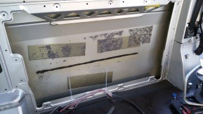
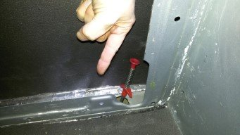
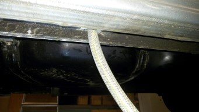
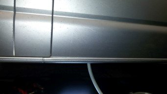
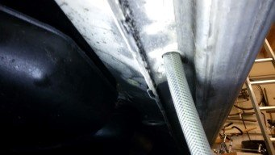
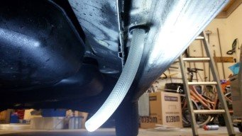

# T5 L2 ombouw 9 persoons naar 5 persoons / 2 slaap camper

> Gearchiveerd vanaf [het originele forumtopic](https://www.weetjewel.nl/phpbb3/viewtopic.php?t=65821).

## ewoudwijma — 2020-12-13

### [T5 L2 ombouw 9 persoons naar 5 persoons / 2 slaap camper](https://www.weetjewel.nl/phpbb3/viewtopic.php?p=475626#p475626)

* [Wijzig](https://www.weetjewel.nl/phpbb3/posting.php?mode=edit&p=475626 "Wijzig bericht")
* [Rapporteer](https://www.weetjewel.nl/phpbb3/app.php/post/475626/report "Meld dit bericht")
* [Citeer](https://www.weetjewel.nl/phpbb3/posting.php?mode=quote&p=475626 "Reageer met citaat")

[Bericht](https://www.weetjewel.nl/phpbb3/viewtopic.php?p=475626#p475626 "Bericht")
door **[ewoudwijma](https://www.weetjewel.nl/phpbb3/memberlist.php?mode=viewprofile&u=15453)** » zo dec 13, 2020 16:02

Deze week mijn personenauto ingeruild voor een 9 persoons verlengde (L2) T5 uit 2012.

[ 5741 keer bekeken")](https://www.weetjewel.nl/phpbb3/download/file.php?id=52279&mode=view)

De komende maanden zal ik hem ombouwen als camper. In dit topic wil ik hiervan verslag doen. Hopelijk ter inspiratie voor anderen, en hopelijk om feedback van anderen te ontvangen.  
  
Randvoorwaarden

* Goedgekeurd om meer dan 2 personen te vervoeren

* Te gebruiken als camper, maar ook voor normale autoritjes

* Moet er van buiten uitzien als een normale bus zodat hij in de straat geparkeerd kan worden

* Modulair van opzet: om niet in 1 keer alles te hoeven aanpakken wil ik eerst het minimale doen en later verder uitbreiden

Ervaring

* In het verleden veel met hout gewerkt, oa zelf kasten / bureau / bed etc gemaakt

* Zeilboot gehad en daar een keuken in gemaakt, ook veel aan electriciteit / electronica gedaan en het onderhoud van de diesel motor gedaan

* Geen ervaring met auto techiek / onderhoud

Tot forums   
Ewoud, 53 jaar, Den Haag  
  
Inhoudsopgave (klik op pijltje om naar post te gaan):
> [ewoudwijma](https://www.weetjewel.nl/phpbb3/memberlist.php?mode=viewprofile&u=15453) schreef: ma dec 14, 2020 21:29
> **Van camperplannen naar T5**

> [ewoudwijma](https://www.weetjewel.nl/phpbb3/memberlist.php?mode=viewprofile&u=15453) schreef: di dec 15, 2020 20:15
> **Ontwerp**:

> [ewoudwijma](https://www.weetjewel.nl/phpbb3/memberlist.php?mode=viewprofile&u=15453) schreef: do dec 17, 2020 19:34
> **Vorderingen bedbox**

> [ewoudwijma](https://www.weetjewel.nl/phpbb3/memberlist.php?mode=viewprofile&u=15453) schreef: vr dec 18, 2020 20:22
> Even wat anders gedaan vandaag.Heel belangrijk voor een camper, een goede 'radio’

> [ewoudwijma](https://www.weetjewel.nl/phpbb3/memberlist.php?mode=viewprofile&u=15453) schreef: di dec 22, 2020 16:31
> Op de een na kortste dag van het jaar is het toch gelukt op een duurzame manier een koud biertje te krijgen

> [ewoudwijma](https://www.weetjewel.nl/phpbb3/memberlist.php?mode=viewprofile&u=15453) schreef: ma dec 28, 2020 17:19
> intussen al aardig opgeschoten met het keukenblok.

> [ewoudwijma](https://www.weetjewel.nl/phpbb3/memberlist.php?mode=viewprofile&u=15453) schreef: di dec 29, 2020 16:36
> Vandaag de laatste alubitumen geplaatst voor het ontdempen van de auto.

> [ewoudwijma](https://www.weetjewel.nl/phpbb3/memberlist.php?mode=viewprofile&u=15453) schreef: zo jan 03, 2021 16:34
> Hier een sneak preview van welke richting het op gaat (en de armaflex XG 19mm zit er ook in, 6mm voor de overige witte delen komt nog):

> [ewoudwijma](https://www.weetjewel.nl/phpbb3/memberlist.php?mode=viewprofile&u=15453) schreef: za jan 09, 2021 10:02
> Gisteren de bus weer opgehaald bij <https://www.hekkemakampeerauto.nl/>.

> [ewoudwijma](https://www.weetjewel.nl/phpbb3/memberlist.php?mode=viewprofile&u=15453) schreef: zo jan 10, 2021 20:02
> Ik ben eerst met een trekveer van binnen naar buiten gegaan, daarna de slang om de trekveer geschoven en deze er door geduwd.

> [ewoudwijma](https://www.weetjewel.nl/phpbb3/memberlist.php?mode=viewprofile&u=15453) schreef: wo jan 13, 2021 11:15
> Plafond en zijwanden zijn nu geisoleerd met alu bitumen en armaflex xg 19 mm

> [ewoudwijma](https://www.weetjewel.nl/phpbb3/memberlist.php?mode=viewprofile&u=15453) schreef: za jan 16, 2021 10:52
> Ben er toch nog niet helemaal uit hoe ik de opbergruimte vast ga zetten.

> [ewoudwijma](https://www.weetjewel.nl/phpbb3/memberlist.php?mode=viewprofile&u=15453) schreef: za jan 16, 2021 15:49
> ... en tegelijkertijd bezig met het electriciteitsplan.

> [ewoudwijma](https://www.weetjewel.nl/phpbb3/memberlist.php?mode=viewprofile&u=15453) schreef: zo jan 24, 2021 18:17
> Hierdoor ook begonnen met nadenken hoe diefstalbestendig de bus is.

> [ewoudwijma](https://www.weetjewel.nl/phpbb3/memberlist.php?mode=viewprofile&u=15453) schreef: wo jan 27, 2021 10:52
> Electriciteit update: Keukenblok geplaatst en verankerd in de bus. Accu geplaatst, schakelbord zoals hierboven genoemd, ontworpen, gebouwd en geplaatst.

> [ewoudwijma](https://www.weetjewel.nl/phpbb3/memberlist.php?mode=viewprofile&u=15453) schreef: za jan 30, 2021 20:40 ging het gloeidraadje (Stroring in motorregeling) knipperen. ook het motorblok lampje (Storing in katalysator) branden.

> [ewoudwijma](https://www.weetjewel.nl/phpbb3/memberlist.php?mode=viewprofile&u=15453) schreef: za feb 06, 2021 21:45
> Intussen ben ik er uit en vorderen de plafondkasten al behoorlijk:

> [ewoudwijma](https://www.weetjewel.nl/phpbb3/memberlist.php?mode=viewprofile&u=15453) schreef: vr feb 19, 2021 15:25
> Tussen al de andere werkzaamheden is de bedbox ook aardig opgeschoten.

> [ewoudwijma](https://www.weetjewel.nl/phpbb3/memberlist.php?mode=viewprofile&u=15453) schreef: ma mar 01, 2021 18:05
> Een van de laatste grote projecten: het stookhok.

> [ewoudwijma](https://www.weetjewel.nl/phpbb3/memberlist.php?mode=viewprofile&u=15453) schreef: di mar 02, 2021 12:49
> Ik heb 2 flexibele zonnepanelen besteld die ik op het hefdak wil monteren.

Laatst gewijzigd door [ewoudwijma](https://www.weetjewel.nl/phpbb3/memberlist.php?mode=viewprofile&u=15453) op wo mar 10, 2021 12:03, 22 keer totaal gewijzigd.

## Snautzer — 2020-12-13

### [Re: T5 L2 ombouw 9 persoons naar 5 persoons / 2 slaap camper](https://www.weetjewel.nl/phpbb3/viewtopic.php?p=475627#p475627)

* [Rapporteer](https://www.weetjewel.nl/phpbb3/app.php/post/475627/report "Meld dit bericht")
* [Citeer](https://www.weetjewel.nl/phpbb3/posting.php?mode=quote&p=475627 "Reageer met citaat")

[Bericht](https://www.weetjewel.nl/phpbb3/viewtopic.php?p=475627#p475627 "Bericht")
door **[Snautzer](https://www.weetjewel.nl/phpbb3/memberlist.php?mode=viewprofile&u=10387)** » zo dec 13, 2020 16:11

Veel plezier met bouwen.

## moosev — 2020-12-13

### [Re: T5 L2 ombouw 9 persoons naar 5 persoons / 2 slaap camper](https://www.weetjewel.nl/phpbb3/viewtopic.php?p=475645#p475645)

* [Rapporteer](https://www.weetjewel.nl/phpbb3/app.php/post/475645/report "Meld dit bericht")
* [Citeer](https://www.weetjewel.nl/phpbb3/posting.php?mode=quote&p=475645 "Reageer met citaat")

[Bericht](https://www.weetjewel.nl/phpbb3/viewtopic.php?p=475645#p475645 "Bericht")
door **[moosev](https://www.weetjewel.nl/phpbb3/memberlist.php?mode=viewprofile&u=11468)** » zo dec 13, 2020 19:13

Mooi busje, benieuwd naar je toekomstige indeling. Ga je boven slapen?  
Gr  
René

\_\_\_\_\_\_\_\_\_\_\_\_\_\_\_\_\_\_\_\_\_\_\_\_\_\_\_  
[Klik -----> Ombouw T5GP LWB Camper project 2017 en diverse aanpassingen 2018 <------](http://www.weetjewel.nl/phpbb3/viewtopic.php?f=13&t=55800)

## ewoudwijma — 2020-12-13

### [Re: T5 L2 ombouw 9 persoons naar 5 persoons / 2 slaap camper](https://www.weetjewel.nl/phpbb3/viewtopic.php?p=475647#p475647)

* [Wijzig](https://www.weetjewel.nl/phpbb3/posting.php?mode=edit&p=475647 "Wijzig bericht")
* [Rapporteer](https://www.weetjewel.nl/phpbb3/app.php/post/475647/report "Meld dit bericht")
* [Citeer](https://www.weetjewel.nl/phpbb3/posting.php?mode=quote&p=475647 "Reageer met citaat")

[Bericht](https://www.weetjewel.nl/phpbb3/viewtopic.php?p=475647#p475647 "Bericht")
door **[ewoudwijma](https://www.weetjewel.nl/phpbb3/memberlist.php?mode=viewprofile&u=15453)** » zo dec 13, 2020 20:49

. Ik ga niet boven slapen, zie het ontwerp bij dit bericht (nog niet gelukt om via de iPhone een afbeelding toe te voegen...ontwerp komt nog): er komt in eerste instantie een keukenblok en een slaapblok. Via het slaapblok kun je gebruik makend van de achterbank zowel een 1 als 2 persoons bed creëren.  
  
Ik zal nog een berichtje maken waarin ik uitleg welke omzwervingen ik heb gemaakt op autosites en campersites voordat ik bij de transporter en dit ontwerp uitgekomen ben.

## krekwakwol — 2020-12-13

### [Re: T5 L2 ombouw 9 persoons naar 5 persoons / 2 slaap camper](https://www.weetjewel.nl/phpbb3/viewtopic.php?p=475656#p475656)

* [Rapporteer](https://www.weetjewel.nl/phpbb3/app.php/post/475656/report "Meld dit bericht")
* [Citeer](https://www.weetjewel.nl/phpbb3/posting.php?mode=quote&p=475656 "Reageer met citaat")

[Bericht](https://www.weetjewel.nl/phpbb3/viewtopic.php?p=475656#p475656 "Bericht")
door **[krekwakwol](https://www.weetjewel.nl/phpbb3/memberlist.php?mode=viewprofile&u=10825)** » zo dec 13, 2020 22:09

Veel succes met de ombouw, er staat hier veel informatie over zelf ombouw.  
Hier heb ik ook veel voordeel van gehad bij mijn ombouw naar camperbus.

Groet, Arnold  
T5 2.5TDI 96kw bj 2008

## Multivan Generation — 2020-12-13

### [Re: T5 L2 ombouw 9 persoons naar 5 persoons / 2 slaap camper](https://www.weetjewel.nl/phpbb3/viewtopic.php?p=475660#p475660)

* [Rapporteer](https://www.weetjewel.nl/phpbb3/app.php/post/475660/report "Meld dit bericht")
* [Citeer](https://www.weetjewel.nl/phpbb3/posting.php?mode=quote&p=475660 "Reageer met citaat")

[Bericht](https://www.weetjewel.nl/phpbb3/viewtopic.php?p=475660#p475660 "Bericht")
door **[Multivan Generation](https://www.weetjewel.nl/phpbb3/memberlist.php?mode=viewprofile&u=252)** » zo dec 13, 2020 22:30

Lees ook even dit bericht..  
[http://www.weetjewel.nl/phpbb3/viewtopi ... 24&t=65791](http://www.weetjewel.nl/phpbb3/viewtopic.php?f=24&t=65791)  
  
beetje hetzelfde geld voor Atrion platte hefdaken..  
  
Doe er je voordeel mee..

...have you ever noticed that some people never have the money to do it right, but can always find the money to do it twice?...

## ewoudwijma — 2020-12-13

### [Re: T5 L2 ombouw 9 persoons naar 5 persoons / 2 slaap camper](https://www.weetjewel.nl/phpbb3/viewtopic.php?p=475663#p475663)

* [Wijzig](https://www.weetjewel.nl/phpbb3/posting.php?mode=edit&p=475663 "Wijzig bericht")
* [Rapporteer](https://www.weetjewel.nl/phpbb3/app.php/post/475663/report "Meld dit bericht")
* [Citeer](https://www.weetjewel.nl/phpbb3/posting.php?mode=quote&p=475663 "Reageer met citaat")

[Bericht](https://www.weetjewel.nl/phpbb3/viewtopic.php?p=475663#p475663 "Bericht")
door **[ewoudwijma](https://www.weetjewel.nl/phpbb3/memberlist.php?mode=viewprofile&u=15453)** » zo dec 13, 2020 23:28

Dank je voor de tip! Ben aan het kijken of <https://www.hekkemakampeerauto.nl> een geschikt dak heeft. Ik zoek een plat hefdak om aan mijn derde randvoorwaarde te voldoen: moet eruit zien als een normale bus. Ik zal de vraag mbt L2 aan ze voorleggen.

Laatst gewijzigd door [ewoudwijma](https://www.weetjewel.nl/phpbb3/memberlist.php?mode=viewprofile&u=15453) op za dec 19, 2020 11:57, 2 keer totaal gewijzigd.

## Multivan Generation — 2020-12-14

### [Re: T5 L2 ombouw 9 persoons naar 5 persoons / 2 slaap camper](https://www.weetjewel.nl/phpbb3/viewtopic.php?p=475669#p475669)

* [Rapporteer](https://www.weetjewel.nl/phpbb3/app.php/post/475669/report "Meld dit bericht")
* [Citeer](https://www.weetjewel.nl/phpbb3/posting.php?mode=quote&p=475669 "Reageer met citaat")

[Bericht](https://www.weetjewel.nl/phpbb3/viewtopic.php?p=475669#p475669 "Bericht")
door **[Multivan Generation](https://www.weetjewel.nl/phpbb3/memberlist.php?mode=viewprofile&u=252)** » ma dec 14, 2020 7:36

Hilo heeft wel een kwalitatief goed plat hefdak..

...have you ever noticed that some people never have the money to do it right, but can always find the money to do it twice?...

## ewoudwijma — 2020-12-14

### [Re: T5 L2 ombouw 9 persoons naar 5 persoons / 2 slaap camper](https://www.weetjewel.nl/phpbb3/viewtopic.php?p=475674#p475674)

* [Wijzig](https://www.weetjewel.nl/phpbb3/posting.php?mode=edit&p=475674 "Wijzig bericht")
* [Rapporteer](https://www.weetjewel.nl/phpbb3/app.php/post/475674/report "Meld dit bericht")
* [Citeer](https://www.weetjewel.nl/phpbb3/posting.php?mode=quote&p=475674 "Reageer met citaat")

[Bericht](https://www.weetjewel.nl/phpbb3/viewtopic.php?p=475674#p475674 "Bericht")
door **[ewoudwijma](https://www.weetjewel.nl/phpbb3/memberlist.php?mode=viewprofile&u=15453)** » ma dec 14, 2020 8:31

Met een vanaf prijs wat voor mij niet helemaal in verhouding is met de prijs van een 2de hands transporter. Kan dat niet in mijn budget verantwoorden helaas. Ik heb even gekeken. Zeker een mooi dak

## ewoudwijma — 2020-12-14

### [Re: T5 L2 ombouw 9 persoons naar 5 persoons / 2 slaap camper](https://www.weetjewel.nl/phpbb3/viewtopic.php?p=475720#p475720)

* [Wijzig](https://www.weetjewel.nl/phpbb3/posting.php?mode=edit&p=475720 "Wijzig bericht")
* [Rapporteer](https://www.weetjewel.nl/phpbb3/app.php/post/475720/report "Meld dit bericht")
* [Citeer](https://www.weetjewel.nl/phpbb3/posting.php?mode=quote&p=475720 "Reageer met citaat")

[Bericht](https://www.weetjewel.nl/phpbb3/viewtopic.php?p=475720#p475720 "Bericht")
door **[ewoudwijma](https://www.weetjewel.nl/phpbb3/memberlist.php?mode=viewprofile&u=15453)** » ma dec 14, 2020 20:59

Goed argument voor de financiering van alle toekomstige projecten .  
Dank je, ik zal zeker foto's sturen!  
(zojuist berichtje geplaatst met de 'voorgeschiedenis'. Hierna komen berichtjes met foto's van het project!)

Laatst gewijzigd door [ewoudwijma](https://www.weetjewel.nl/phpbb3/memberlist.php?mode=viewprofile&u=15453) op ma dec 14, 2020 21:30, 1 keer totaal gewijzigd.

## ewoudwijma — 2020-12-14

### [Re: T5 L2 ombouw 9 persoons naar 5 persoons / 2 slaap camper](https://www.weetjewel.nl/phpbb3/viewtopic.php?p=475723#p475723)

* [Wijzig](https://www.weetjewel.nl/phpbb3/posting.php?mode=edit&p=475723 "Wijzig bericht")
* [Rapporteer](https://www.weetjewel.nl/phpbb3/app.php/post/475723/report "Meld dit bericht")
* [Citeer](https://www.weetjewel.nl/phpbb3/posting.php?mode=quote&p=475723 "Reageer met citaat")

[Bericht](https://www.weetjewel.nl/phpbb3/viewtopic.php?p=475723#p475723 "Bericht")
door **[ewoudwijma](https://www.weetjewel.nl/phpbb3/memberlist.php?mode=viewprofile&u=15453)** » ma dec 14, 2020 21:29

**Van camperplannen naar T5**  
  
Ik heb de afgelopen maanden het volgende proces doorgemaakt  
  
Idee 1: Deze camper overnemen van vrienden

[ 5583 keer bekeken")](https://www.weetjewel.nl/phpbb3/download/file.php?id=52304&mode=view)

=> deze zal in stalling moeten dus niet handig als je hem ook als normaal vervoersmiddel wilt gebruiken =>  
  
Idee 2: Auto inruilen voor T5 L2 personenbus  
=> er moet nog veel gebeuren voordat het een camper is. Hoogte 'slechts' 1m40. Advies gekregen om niet al te overhaast te werk te gaan en er nog even goed over na te denken =>  
  
Idee 3: Op zoek naar hogere bussen, bijv Fiat Ducato

[ 5583 keer bekeken")](https://www.weetjewel.nl/phpbb3/download/file.php?id=52306&mode=view)

=> L2 vaak niet te vinden, Verwijderen vaak aanwezige dubbele cabine te rigoreus, of geen ramen aanwezig. Niet straatvriendelijk =>  
  
Idee 4a: Bus die al omgebouwd is tot camper  
=> vaak oud (binnen mijn budget) waardoor diesel emissie probleem kan worden, inrichting net niet hoe ik het wil, niet goedgekeurd voor meer dan 2 personen => idee 4b  
  
Idee 4b: 4a maar dan meer dan 2 personen bijv Transporter Multivan of Mercedes Viano

[ 5583 keer bekeken")](https://www.weetjewel.nl/phpbb3/download/file.php?id=52307&mode=view)

=> Super-de-luxe! Geen L2 gevonden, slapen en wonen toch erg krap, vaak oud =>  
  
Terug naar idee 2: De T5 L2 personenbus. Uiteindelijk viel alles op zijn plaats: Oa van de multivan/ viano geleerd om meer dan 2 personen te kunnen vervoeren en hoe een camperbus er straatvriendelijk uit kan zien, maar dan wel ietsje langer (L2). En inmiddels een verder uitgewerkt plan om er iets moois van te maken.

## Renew — 2020-12-15

### [Re: T5 L2 ombouw 9 persoons naar 5 persoons / 2 slaap camper](https://www.weetjewel.nl/phpbb3/viewtopic.php?p=475742#p475742)

* [Rapporteer](https://www.weetjewel.nl/phpbb3/app.php/post/475742/report "Meld dit bericht")
* [Citeer](https://www.weetjewel.nl/phpbb3/posting.php?mode=quote&p=475742 "Reageer met citaat")

[Bericht](https://www.weetjewel.nl/phpbb3/viewtopic.php?p=475742#p475742 "Bericht")
door **[Renew](https://www.weetjewel.nl/phpbb3/memberlist.php?mode=viewprofile&u=12678)** » di dec 15, 2020 13:07

Voor een idee voor meer leefruimte kijk ook eens bij;  
  
<https://weetjewel.nl/phpbb3/viewtopic.php?f=13&t=61045>  
  
Verder zijn er hier op het forum nog allerlei andere mooie oplossingen te vinden

## ewoudwijma — 2020-12-15

### [Re: T5 L2 ombouw 9 persoons naar 5 persoons / 2 slaap camper](https://www.weetjewel.nl/phpbb3/viewtopic.php?p=475746#p475746)

* [Wijzig](https://www.weetjewel.nl/phpbb3/posting.php?mode=edit&p=475746 "Wijzig bericht")
* [Rapporteer](https://www.weetjewel.nl/phpbb3/app.php/post/475746/report "Meld dit bericht")
* [Citeer](https://www.weetjewel.nl/phpbb3/posting.php?mode=quote&p=475746 "Reageer met citaat")

[Bericht](https://www.weetjewel.nl/phpbb3/viewtopic.php?p=475746#p475746 "Bericht")
door **[ewoudwijma](https://www.weetjewel.nl/phpbb3/memberlist.php?mode=viewprofile&u=15453)** » di dec 15, 2020 13:28

Hoi Renew,  
Ik had je project al gezien. Ziet er goed uit! Bed is heel creatief bedacht! Out of the bus denken (of was die grap al gemaak ). De stijl van je inrichting lijkt op mijn plannen. Ik loop een paar dagen voor met klussen tov van mijn berichten hier, maar foto’s volgen binnenkort !  
Groet, Ewoud

## Multivan Generation — 2020-12-15

### [Re: T5 L2 ombouw 9 persoons naar 5 persoons / 2 slaap camper](https://www.weetjewel.nl/phpbb3/viewtopic.php?p=475750#p475750)

* [Rapporteer](https://www.weetjewel.nl/phpbb3/app.php/post/475750/report "Meld dit bericht")
* [Citeer](https://www.weetjewel.nl/phpbb3/posting.php?mode=quote&p=475750 "Reageer met citaat")

[Bericht](https://www.weetjewel.nl/phpbb3/viewtopic.php?p=475750#p475750 "Bericht")
door **[Multivan Generation](https://www.weetjewel.nl/phpbb3/memberlist.php?mode=viewprofile&u=252)** » di dec 15, 2020 14:15

Laat voor als je naar de RDW-keuring gaat in ieder geval een bank op de originele positie staan.  
Anders kan het wel eens afkeur betekenen.

...have you ever noticed that some people never have the money to do it right, but can always find the money to do it twice?...

## sjozti — 2020-12-15

### [Re: T5 L2 ombouw 9 persoons naar 5 persoons / 2 slaap camper](https://www.weetjewel.nl/phpbb3/viewtopic.php?p=475754#p475754)

* [Rapporteer](https://www.weetjewel.nl/phpbb3/app.php/post/475754/report "Meld dit bericht")
* [Citeer](https://www.weetjewel.nl/phpbb3/posting.php?mode=quote&p=475754 "Reageer met citaat")

[Bericht](https://www.weetjewel.nl/phpbb3/viewtopic.php?p=475754#p475754 "Bericht")
door **[sjozti](https://www.weetjewel.nl/phpbb3/memberlist.php?mode=viewprofile&u=14951)** » di dec 15, 2020 16:52

Dat ziet er goed uit. Ben zelf in mei begonnen met dezelfde basis (T5 L2, maar dan Benzine/CNG)   
  
Heb het dak bij Hekkema laten plaatsen (SCA 192), niet geheel onzichtbaar dus.  
  
Zelf worstel ik met de 2e AC-verwarmingsunit. Deze wil ik eruit halen, maar nog niemand gevonden die dit voor me wil doen.   
  
Heb jij deze ook? Wat zijn je plannen er mee?  
  
Groeten uit Den Haag

## ewoudwijma — 2020-12-15

### [Re: T5 L2 ombouw 9 persoons naar 5 persoons / 2 slaap camper](https://www.weetjewel.nl/phpbb3/viewtopic.php?p=475755#p475755)

* [Wijzig](https://www.weetjewel.nl/phpbb3/posting.php?mode=edit&p=475755 "Wijzig bericht")
* [Rapporteer](https://www.weetjewel.nl/phpbb3/app.php/post/475755/report "Meld dit bericht")
* [Citeer](https://www.weetjewel.nl/phpbb3/posting.php?mode=quote&p=475755 "Reageer met citaat")

[Bericht](https://www.weetjewel.nl/phpbb3/viewtopic.php?p=475755#p475755 "Bericht")
door **[ewoudwijma](https://www.weetjewel.nl/phpbb3/memberlist.php?mode=viewprofile&u=15453)** » di dec 15, 2020 17:27

Hallo sjozti,  
Wat leuk om te horen! Ik heb een dak bij Hekkema besteld. Ik zou graag een keer komen kijken, aangezien je ook in Den Haag woont. Uiteraard is mijn werk (in uitvoering) ook te bezichtigen.  
Ik ben tijdens het strippen de A-C unit ook tegengekomen. Wil hem er wel laten, mogelijk beetje ‘restylen’ als dat mogelijk is.

## ewoudwijma — 2020-12-15

### [Re: T5 L2 ombouw 9 persoons naar 5 persoons / 2 slaap camper](https://www.weetjewel.nl/phpbb3/viewtopic.php?p=475757#p475757)

* [Wijzig](https://www.weetjewel.nl/phpbb3/posting.php?mode=edit&p=475757 "Wijzig bericht")
* [Rapporteer](https://www.weetjewel.nl/phpbb3/app.php/post/475757/report "Meld dit bericht")
* [Citeer](https://www.weetjewel.nl/phpbb3/posting.php?mode=quote&p=475757 "Reageer met citaat")

[Bericht](https://www.weetjewel.nl/phpbb3/viewtopic.php?p=475757#p475757 "Bericht")
door **[ewoudwijma](https://www.weetjewel.nl/phpbb3/memberlist.php?mode=viewprofile&u=15453)** » di dec 15, 2020 17:58

> [Multivan Generation](https://www.weetjewel.nl/phpbb3/memberlist.php?mode=viewprofile&u=252) schreef: di dec 15, 2020 14:15
> Laat voor als je naar de RDW-keuring gaat in ieder geval een bank op de originele positie staan.  
> Anders kan het wel eens afkeur betekenen.

De achterste 3-zits bank blijft staan. Ik heb de RDW vorige week gebeld en mijn plannen met ze besproken. De persoon waar ik mee sprak was erg hulpvaardig. Zo hoop ik niet voor keuringsverrassingen komen te staan.

## Multivan Generation — 2020-12-15

### [Re: T5 L2 ombouw 9 persoons naar 5 persoons / 2 slaap camper](https://www.weetjewel.nl/phpbb3/viewtopic.php?p=475759#p475759)

* [Rapporteer](https://www.weetjewel.nl/phpbb3/app.php/post/475759/report "Meld dit bericht")
* [Citeer](https://www.weetjewel.nl/phpbb3/posting.php?mode=quote&p=475759 "Reageer met citaat")

[Bericht](https://www.weetjewel.nl/phpbb3/viewtopic.php?p=475759#p475759 "Bericht")
door **[Multivan Generation](https://www.weetjewel.nl/phpbb3/memberlist.php?mode=viewprofile&u=252)** » di dec 15, 2020 18:35

> [sjozti](https://www.weetjewel.nl/phpbb3/memberlist.php?mode=viewprofile&u=14951) schreef: di dec 15, 2020 16:52
>   
> Zelf worstel ik met de 2e AC-verwarmingsunit. Deze wil ik eruit halen, maar nog niemand gevonden die dit voor me wil doen.

> [ewoudwijma](https://www.weetjewel.nl/phpbb3/memberlist.php?mode=viewprofile&u=15453) schreef: di dec 15, 2020 17:27
> Ik ben tijdens het strippen de A-C unit ook tegengekomen. Wil hem er wel laten, mogelijk beetje ‘restylen’ als dat mogelijk is.

Er uit halen is best eenvoudig.  
zie ook dit project..  
<https://weetjewel.nl/phpbb3/viewtopic.php?f=25&t=64627>

...have you ever noticed that some people never have the money to do it right, but can always find the money to do it twice?...

## ewoudwijma — 2020-12-15

### [Re: T5 L2 ombouw 9 persoons naar 5 persoons / 2 slaap camper](https://www.weetjewel.nl/phpbb3/viewtopic.php?p=475763#p475763)

* [Wijzig](https://www.weetjewel.nl/phpbb3/posting.php?mode=edit&p=475763 "Wijzig bericht")
* [Rapporteer](https://www.weetjewel.nl/phpbb3/app.php/post/475763/report "Meld dit bericht")
* [Citeer](https://www.weetjewel.nl/phpbb3/posting.php?mode=quote&p=475763 "Reageer met citaat")

[Bericht](https://www.weetjewel.nl/phpbb3/viewtopic.php?p=475763#p475763 "Bericht")
door **[ewoudwijma](https://www.weetjewel.nl/phpbb3/memberlist.php?mode=viewprofile&u=15453)** » di dec 15, 2020 19:53

> [Multivan Generation](https://www.weetjewel.nl/phpbb3/memberlist.php?mode=viewprofile&u=252) schreef: di dec 15, 2020 18:35
> Er uit halen is best eenvoudig.  
> zie ook dit project..  
> <https://weetjewel.nl/phpbb3/viewtopic.php?f=25&t=64627>

Dank je. Goed om te weten!

## ewoudwijma — 2020-12-15

### [Re: T5 L2 ombouw 9 persoons naar 5 persoons / 2 slaap camper](https://www.weetjewel.nl/phpbb3/viewtopic.php?p=475764#p475764)

* [Wijzig](https://www.weetjewel.nl/phpbb3/posting.php?mode=edit&p=475764 "Wijzig bericht")
* [Rapporteer](https://www.weetjewel.nl/phpbb3/app.php/post/475764/report "Meld dit bericht")
* [Citeer](https://www.weetjewel.nl/phpbb3/posting.php?mode=quote&p=475764 "Reageer met citaat")

[Bericht](https://www.weetjewel.nl/phpbb3/viewtopic.php?p=475764#p475764 "Bericht")
door **[ewoudwijma](https://www.weetjewel.nl/phpbb3/memberlist.php?mode=viewprofile&u=15453)** » di dec 15, 2020 20:15

**Ontwerp**:  
  
Ik ben het volgende van plan met de bus:  

[ 2586 keer bekeken")](https://www.weetjewel.nl/phpbb3/download/file.php?id=52326&mode=view)

* **3 zits bank**: 2 \* 2 persoons bankjes zijn verwijderd. De vrijgekomen montagepunten op de vloer ga ik gebruiken om bed box en keukenblok mee vast te zetten (5 stuks herbruik, 3 wil ik met een slijptol verwijderen). De achterste 3-zits bank heb ik laten staan, zodat deze meegekeurd / geschouwd wordt door de RDW. Hierdoor kunnen nog 3 extra personen meerijden. Onder de bank is nog opbergruimte, wordt mogelijk deels gebruikt door watertanks

* **Keuken**: Voorzien van koelkast, 2 gaspitjes en spoelbak kraan. 1 la voor bestek, 1 diepe la voor pannen etc en een kast onder waarin o.a. 2de accu in komt en mogelijk standkachel (of kan die in de motorkap verwerkt worden?). 70 cm hoog. Schoon en vuil water, en gas komen achter de 3-zits bank te staan.

* **Bed box / tafel**: Overdag 40 cm hoog. Met mogelijkheid om de bovenplaat te verhogen tot tafel hoogte. In de box ruimte voor bagage / camping toilet. 's Nachts via extra plankjes, mogelijk gescharnierd aan de bovenplaat, uit te breiden tot 1 persoons bed of (met nog meer verbindingsplankjes) tot 2 persoons bed. Het zit gedeelte van de 3 zits bank zal bij het bed betrokken worden

Verder is het plan om bovenin de bus over de lengte zowel links en rechts een **opbergplank** te monteren. Zal dus ongeveer 2m80 lang worden en afhankelijk van de hoogte die bereikt kan worden (nog verder uit te zoeken, ik hoop dat ongeveer 20 cm hoog gehaald kan worden). Bovenop de plank bagageruimte. Onder de plank ruimte voor verlichting en eventueel gordijnrails / ophangen jaloezien. Mogelijk achterin, tussen de planken links en rechts opslag matrassen.  
  
**Isoleren** wil ik voorlopig niet doen. Nadat ik de bus had ging ik zelfbouw instructies op Youtube bekijken en ik kreeg het 'Waar ben ik aan begonnen' gevoel omdat de meeste instructies beginnen met isoleren. Heb niet echt zin om de hele bus te strippen en nog minder om hem van binnen totaal in te pakken. Ik heb toen bedacht de bus modulair in te richten. Met andere woorden, alles wat je hierboven ziet is er uit te halen. Ik kan dus altijd nog gaan isoleren. Wel heb ik intussen ontdekt dat de zij-schotten er makkelijk uit gaan en lijkt het erop dat reflextrix achter de zij-schotten plaatsen een quick-win is. Het zal niet de koudebruggen eruit halen dus zo goed als de volledige stripactie wordt het niet. Denk er ook over om wollen dekens als gordijnen op te hangen als het echt koud is.   
Ga de zijschotten ook vervangen door houten exemplaren zodat ze bij de rest van het hout passen.  
  
Ik hoor graag wat jullie hiervan vinden. Kan mij voorstellen dat de meningen verdeeld zijn over sommige onderwerpen, bijv. isolatie, of het bed. Misschien zijn er anderen die soortgelijke oplossingen bedacht hebben (ik heb nog lang niet alles hier bekeken). Vind het ook wel weer leuk dat hiermee ook weer een uniek exemplaar gemaakt wordt.

## Multivan Generation — 2020-12-15

### [Re: T5 L2 ombouw 9 persoons naar 5 persoons / 2 slaap camper](https://www.weetjewel.nl/phpbb3/viewtopic.php?p=475771#p475771)

* [Rapporteer](https://www.weetjewel.nl/phpbb3/app.php/post/475771/report "Meld dit bericht")
* [Citeer](https://www.weetjewel.nl/phpbb3/posting.php?mode=quote&p=475771 "Reageer met citaat")

[Bericht](https://www.weetjewel.nl/phpbb3/viewtopic.php?p=475771#p475771 "Bericht")
door **[Multivan Generation](https://www.weetjewel.nl/phpbb3/memberlist.php?mode=viewprofile&u=252)** » di dec 15, 2020 22:21

> [ewoudwijma](https://www.weetjewel.nl/phpbb3/memberlist.php?mode=viewprofile&u=15453) schreef: di dec 15, 2020 20:15
>
> * **3 zits bank**: 2 \* 2 persoons bankjes zijn verwijderd. De vrijgekomen montagepunten op de vloer ga ik gebruiken om bed box en keukenblok mee vast te zetten (5 stuks herbruik, 3 wil ik met een slijptol verwijderen).

Is geen goed idee, er zitten een paar beugels boven de tank, als je die gaat wegslijpen, en ze zijn nog warm, kan je tank beschadigen. De beugels zitten met 2 moeren onder de auto vast.  
De achterste 3-zits bank heb ik laten staan, zodat deze meegekeurd / geschouwd wordt door de RDW. Hierdoor kunnen nog 3 extra personen meerijden. Onder de bank is nog opbergruimte, wordt mogelijk deels gebruikt door watertanks[/list]  
  
Laat die mensen maar op de bank zitten en schuif dan de meubels, dus met de verticale zijwanden er maar in, die mensen zullen niet prettig gaan zitten door gebruik aan knie ruimte verwacht ik.  
  
> [ewoudwijma](https://www.weetjewel.nl/phpbb3/memberlist.php?mode=viewprofile&u=15453) schreef: di dec 15, 2020 20:15
>
> * **Keuken**: Voorzien van koelkast, 2 gaspitjes en spoelbak kraan. 1 la voor bestek, 1 diepe la voor pannen etc en een kast onder waarin o.a. 2de accu in komt en mogelijk standkachel (of kan die in de motorkap verwerkt worden?). 70 cm hoog. Schoon en vuil water, en gas komen achter de 3-zits bank te staan.

Een standkachel in de motorkap verwerken? lijkt mij praktisch onuitvoerbaar, want je wilt af en toe toch ook de motorkap openen en olie peilen, en dan gaat de standkachel mee naar boven? Kun je bijvoorbeeld wel onder de bijrijders stoel monteren.  
Ook wil je vuil water naar achter over een behoorlijke lengte transporteren. Dat bevordert zeker niet het wegstromen van het water in de spoelbak en duurt erg lang voordat die leeg is.  
  
> [ewoudwijma](https://www.weetjewel.nl/phpbb3/memberlist.php?mode=viewprofile&u=15453) schreef: di dec 15, 2020 20:15
> Verder is het plan om bovenin de bus over de lengte zowel links en rechts een **opbergplank** te monteren. Zal dus ongeveer 2m80 lang worden en afhankelijk van de hoogte die bereikt kan worden (nog verder uit te zoeken, ik hoop dat ongeveer 20 cm hoog gehaald kan worden). Bovenop de plank bagageruimte. Onder de plank ruimte voor verlichting en eventueel gordijnrails / ophangen jaloezien. Mogelijk achterin, tussen de planken links en rechts opslag matrassen.

20 cm lijkt me wat ver naar beneden komen en het uitzicht naar buiten beperken.. Ik heb een lange opbergruimte als jij in gedachten hebt, met ingebouwde verlichting, kan wel een foto toevoegen als je wilt.  
  
> [ewoudwijma](https://www.weetjewel.nl/phpbb3/memberlist.php?mode=viewprofile&u=15453) schreef: di dec 15, 2020 20:15
> **Isoleren** wil ik voorlopig niet doen. Nadat ik de bus had ging ik zelfbouw instructies op Youtube bekijken en ik kreeg het 'Waar ben ik aan begonnen' gevoel omdat de meeste instructies beginnen met isoleren. Heb niet echt zin om de hele bus te strippen en nog minder om hem van binnen totaal in te pakken. Ik heb toen bedacht de bus modulair in te richten. Met andere woorden, alles wat je hierboven ziet is er uit te halen. Ik kan dus altijd nog gaan isoleren. Wel heb ik intussen ontdekt dat de zij-schotten er makkelijk uit gaan en lijkt het erop dat reflextrix achter de zij-schotten plaatsen een quick-win is. Het zal niet de koudebruggen eruit halen dus zo goed als de volledige stripactie wordt het niet. Denk er ook over om wollen dekens als gordijnen op te hangen als het echt koud is.   
> Ga de zijschotten ook vervangen door houten exemplaren zodat ze bij de rest van het hout passen.

Isoleren met schapenwol kost je een halve dag en is echt heel eenvoudig te doen, de laatste keer heeft onze dochter de helft van de bus gedaan.  
Modulair inrichten is prima, verwijderen een no go; mag niet van de Belastingdienst !   
> [ewoudwijma](https://www.weetjewel.nl/phpbb3/memberlist.php?mode=viewprofile&u=15453) schreef: di dec 15, 2020 20:15
> Ik hoor graag wat jullie hiervan vinden. Kan mij voorstellen dat de meningen verdeeld zijn over sommige onderwerpen, bijv. isolatie, of het bed. Misschien zijn er anderen die soortgelijke oplossingen bedacht hebben (ik heb nog lang niet alles hier bekeken). Vind het ook wel weer leuk dat hiermee ook weer een uniek exemplaar gemaakt wordt.

  
Zie ook eens hier voor wat inspiratie:  
<https://weetjewel.nl/phpbb3/viewtopic.php?f=25&t=64627>  
  
Groeten Peter

...have you ever noticed that some people never have the money to do it right, but can always find the money to do it twice?...

## ewoudwijma — 2020-12-16

### [Re: T5 L2 ombouw 9 persoons naar 5 persoons / 2 slaap camper](https://www.weetjewel.nl/phpbb3/viewtopic.php?p=475799#p475799)

* [Wijzig](https://www.weetjewel.nl/phpbb3/posting.php?mode=edit&p=475799 "Wijzig bericht")
* [Rapporteer](https://www.weetjewel.nl/phpbb3/app.php/post/475799/report "Meld dit bericht")
* [Citeer](https://www.weetjewel.nl/phpbb3/posting.php?mode=quote&p=475799 "Reageer met citaat")

[Bericht](https://www.weetjewel.nl/phpbb3/viewtopic.php?p=475799#p475799 "Bericht")
door **[ewoudwijma](https://www.weetjewel.nl/phpbb3/memberlist.php?mode=viewprofile&u=15453)** » wo dec 16, 2020 14:23

Dank je wel Peter voor deze extreem nuttige feedback! Ben helemaal blij met dit forum   
  
Mijn reactie op je reactie:
> [Multivan Generation](https://www.weetjewel.nl/phpbb3/memberlist.php?mode=viewprofile&u=252) schreef: di dec 15, 2020 22:21
> Is geen goed idee, er zitten een paar beugels boven de tank, als je die gaat wegslijpen, en ze zijn nog warm, kan je tank beschadigen. De beugels zitten met 2 moeren onder de auto vast.

Je hebt mij gered van een super vervelend probleem. Thx man! Ik zag al dat de tank eronder zat, kun je aan die kant (rechter zijde) bij de schroeven dan? Aan de linkerzijde zou wel moeten lukken. Ik ga eens onder de auto kijken!  
> [Multivan Generation](https://www.weetjewel.nl/phpbb3/memberlist.php?mode=viewprofile&u=252) schreef: di dec 15, 2020 22:21
> Laat die mensen maar op de bank zitten en schuif dan de meubels, dus met de verticale zijwanden er maar in, die mensen zullen niet prettig gaan zitten door gebruik aan knie ruimte verwacht ik.

Er is ongeveer een halve meter ruimte, ze moeten het er maar mee doen ;-). Kan de RDW nog moeilijk doen over de keuken die voor de linkerstoel is, ik heb al bedacht dat ik de rand van het keukenblok (70cm hoog) rond met een straal van rond de 15cm ga maken, zodat de scherpte er voor die passagier af is. Aan de linkerkant zit het blok op 40cm hoogte dus geen probleem lijkt mij.  
> [Multivan Generation](https://www.weetjewel.nl/phpbb3/memberlist.php?mode=viewprofile&u=252) schreef: di dec 15, 2020 22:21
> Een standkachel in de motorkap verwerken? lijkt mij praktisch onuitvoerbaar, want je wilt af en toe toch ook de motorkap openen en olie peilen, en dan gaat de standkachel mee naar boven? Kun je bijvoorbeeld wel onder de bijrijders stoel monteren.

Ik heb vandaag ontdekt dat er al een standkachel van Webasto in zit .

[ 2527 keer bekeken")](https://www.weetjewel.nl/phpbb3/download/file.php?id=52343&mode=view)

Zie ook [viewtopic.php?f=3&t=65606](https://www.weetjewel.nl/phpbb3/viewtopic.php?f=3&t=65606) of  [https://www.vwt4forum.co.uk/threads/we ... -c.191447/](https://www.vwt4forum.co.uk/threads/webasto-thermo-top-c.191447/). Klopt het dat je dan zonder draaiende moter gebruik makend van Diessel (en wat accuspanning neem ik aan) verwarming hebt? En ook nog via de verwarmnig bij het rechter achterwiel? Zie wel dat de oplossing die hier via Danhag.de wordt beschreven via sms bediening gaat met ook nog gps mogelijkheid??? Dat laatste kun je voor nog geen 2 tientjes bij Ali kopen en heb ik hier al liggen, wil ik niet met verwarmen mengen. Heb het idee dat ze [https://www.cum-cartec-shop.de/Volkswag ... -T6/T5-7E/](https://www.cum-cartec-shop.de/Volkswagen/T4-T5--T6/T5-7E/) iets verkopen met gewoon een display in de camper, klinkt beter mijns inziens. Iemand hier ervaringen mee?  
> [Multivan Generation](https://www.weetjewel.nl/phpbb3/memberlist.php?mode=viewprofile&u=252) schreef: di dec 15, 2020 22:21
> Ook wil je vuil water naar achter over een behoorlijke lengte transporteren. Dat bevordert zeker niet het wegstromen van het water in de spoelbak en duurt erg lang voordat die leeg is.

Goed om te weten. Ik denk er nog even over na. Zag ergen anders dat iemand een pvc buis van 16cm doorsnee onder de auto had gemonteerd voor vuil water (link volgt). Dan ook makkelijk te legen boven een put. Dat lijkt mij de ultieme oplossing. Maar dan moet er gat onder de keuken geboord worden en daar zit de diesel tank... is wel een toekomstig plan.  
> [Multivan Generation](https://www.weetjewel.nl/phpbb3/memberlist.php?mode=viewprofile&u=252) schreef: di dec 15, 2020 22:21
> 20 cm lijkt me wat ver naar beneden komen en het uitzicht naar buiten beperken.. Ik heb een lange opbergruimte als jij in gedachten hebt, met ingebouwde verlichting, kan wel een foto toevoegen als je wilt.

Ja graag! Ben benieuwd!!  
> [Multivan Generation](https://www.weetjewel.nl/phpbb3/memberlist.php?mode=viewprofile&u=252) schreef: di dec 15, 2020 22:21
> Isoleren met schapenwol kost je een halve dag en is echt heel eenvoudig te doen, de laatste keer heeft onze dochter de helft van de bus gedaan.

Klinkt goed, ga ik mij in verdiepen! Dan ook nog ontdreun spul monteren? En het metaal wat binnen zichtbaar is met armaflex afplakken?  
> [Multivan Generation](https://www.weetjewel.nl/phpbb3/memberlist.php?mode=viewprofile&u=252) schreef: di dec 15, 2020 22:21
> Modulair inrichten is prima, verwijderen een no go; mag niet van de Belastingdienst !

Daar ga ik niet echt de nadruk op leggen ;-) Is bovendien ook niet de bedoeling, anders dan bij onderhoudswerkzaamheden.  
> [Multivan Generation](https://www.weetjewel.nl/phpbb3/memberlist.php?mode=viewprofile&u=252) schreef: di dec 15, 2020 22:21
> Zie ook eens hier voor wat inspiratie:  
> <https://weetjewel.nl/phpbb3/viewtopic.php?f=25&t=64627>  
>   
> Groeten Peter

Heb het al bijna helemaal bekeken. Is zeker al inspiratiebron voor mij! Nogmaals dank Peter!!!   
Groeten Ewoud

## Multivan Generation — 2020-12-16

### [Re: T5 L2 ombouw 9 persoons naar 5 persoons / 2 slaap camper](https://www.weetjewel.nl/phpbb3/viewtopic.php?p=475803#p475803)

* [Rapporteer](https://www.weetjewel.nl/phpbb3/app.php/post/475803/report "Meld dit bericht")
* [Citeer](https://www.weetjewel.nl/phpbb3/posting.php?mode=quote&p=475803 "Reageer met citaat")

[Bericht](https://www.weetjewel.nl/phpbb3/viewtopic.php?p=475803#p475803 "Bericht")
door **[Multivan Generation](https://www.weetjewel.nl/phpbb3/memberlist.php?mode=viewprofile&u=252)** » wo dec 16, 2020 16:11

> [ewoudwijma](https://www.weetjewel.nl/phpbb3/memberlist.php?mode=viewprofile&u=15453) schreef: wo dec 16, 2020 14:23
> Dank je wel Peter voor deze extreem nuttige feedback! Ben helemaal blij met dit forum   
>   
> Mijn reactie op je reactie:
> > [Multivan Generation](https://www.weetjewel.nl/phpbb3/memberlist.php?mode=viewprofile&u=252) schreef: di dec 15, 2020 22:21
> > Is geen goed idee, er zitten een paar beugels boven de tank, als je die gaat wegslijpen, en ze zijn nog warm, kan je tank beschadigen. De beugels zitten met 2 moeren onder de auto vast.
>
> Je hebt mij gered van een super vervelend probleem. Thx man! Ik zag al dat de tank eronder zat, kun je aan die kant (rechter zijde) bij de schroeven dan? Aan de linkerzijde zou wel moeten lukken. Ik ga eens onder de auto kijken!  
>   
> Tank zit aan bestuurderszijde   
> > [Multivan Generation](https://www.weetjewel.nl/phpbb3/memberlist.php?mode=viewprofile&u=252) schreef: di dec 15, 2020 22:21
> > Laat die mensen maar op de bank zitten en schuif dan de meubels, dus met de verticale zijwanden er maar in, die mensen zullen niet prettig gaan zitten door gebruik aan knie ruimte verwacht ik.
>
> Er is ongeveer een halve meter ruimte, ze moeten het er maar mee doen ;-). Kan de RDW nog moeilijk doen over de keuken die voor de linkerstoel is, ik heb al bedacht dat ik de rand van het keukenblok (70cm hoog) rond met een straal van rond de 15cm ga maken, zodat de scherpte er voor die passagier af is. Aan de linkerkant zit het blok op 40cm hoogte dus geen probleem lijkt mij.  
>   
> Maakt mijnsinziens niet uit, werkhoogte waaraan je moet voldoen, staat bij de eisen van de Belastingdienst genoemd.  
> > [Multivan Generation](https://www.weetjewel.nl/phpbb3/memberlist.php?mode=viewprofile&u=252) schreef: di dec 15, 2020 22:21
> > Een standkachel in de motorkap verwerken? lijkt mij praktisch onuitvoerbaar, want je wilt af en toe toch ook de motorkap openen en olie peilen, en dan gaat de standkachel mee naar boven? Kun je bijvoorbeeld wel onder de bijrijders stoel monteren.
>
> Ik heb vandaag ontdekt dat er al een standkachel van Webasto in zit . IMG\_6179.jpg Zie ook [viewtopic.php?f=3&t=65606](https://www.weetjewel.nl/phpbb3/viewtopic.php?f=3&t=65606) of  [https://www.vwt4forum.co.uk/threads/we ... -c.191447/](https://www.vwt4forum.co.uk/threads/webasto-thermo-top-c.191447/). Klopt het dat je dan zonder draaiende moter gebruik makend van Diessel (en wat accuspanning neem ik aan) verwarming hebt? En ook nog via de verwarmnig bij het rechter achterwiel? Zie wel dat de oplossing die hier via Danhag.de wordt beschreven via sms bediening gaat met ook nog gps mogelijkheid??? Dat laatste kun je voor nog geen 2 tientjes bij Ali kopen en heb ik hier al liggen, wil ik niet met verwarmen mengen. Heb het idee dat ze [https://www.cum-cartec-shop.de/Volkswag ... -T6/T5-7E/](https://www.cum-cartec-shop.de/Volkswagen/T4-T5--T6/T5-7E/) iets verkopen met gewoon een display in de camper, klinkt beter mijns inziens. Iemand hier ervaringen mee?  
>   
> Dat is een waterstandkachel, dus voor de motor, dan wil je het interieur dus via het dashboard gaan vervangen. Niet heel effectief en vreet stroom van de startaccu. MGA1600 heeft het zo gedaan, met een setje van Danhag  
> > [Multivan Generation](https://www.weetjewel.nl/phpbb3/memberlist.php?mode=viewprofile&u=252) schreef: di dec 15, 2020 22:21
> > Ook wil je vuil water naar achter over een behoorlijke lengte transporteren. Dat bevordert zeker niet het wegstromen van het water in de spoelbak en duurt erg lang voordat die leeg is.
>
> Goed om te weten. Ik denk er nog even over na. Zag ergen anders dat iemand een pvc buis van 16cm doorsnee onder de auto had gemonteerd voor vuil water (link volgt). Dan ook makkelijk te legen boven een put. Dat lijkt mij de ultieme oplossing. Maar dan moet er gat onder de keuken geboord worden en daar zit de diesel tank... is wel een toekomstig plan.  
> Je kunt zonder boren met een slang van 19 mm naar buiten en onder de auto uitkomen  
> > [Multivan Generation](https://www.weetjewel.nl/phpbb3/memberlist.php?mode=viewprofile&u=252) schreef: di dec 15, 2020 22:21
> > 20 cm lijkt me wat ver naar beneden komen en het uitzicht naar buiten beperken.. Ik heb een lange opbergruimte als jij in gedachten hebt, met ingebouwde verlichting, kan wel een foto toevoegen als je wilt.
>
> Ja graag! Ben benieuwd!!  
>   
> Komt vanavond (zit nu op werk)  
> > [Multivan Generation](https://www.weetjewel.nl/phpbb3/memberlist.php?mode=viewprofile&u=252) schreef: di dec 15, 2020 22:21
> > Isoleren met schapenwol kost je een halve dag en is echt heel eenvoudig te doen, de laatste keer heeft onze dochter de helft van de bus gedaan.
>
> Klinkt goed, ga ik mij in verdiepen! Dan ook nog ontdreun spul monteren? En het metaal wat binnen zichtbaar is met armaflex afplakken?  
>   
> Wat je wilt..  
> > [Multivan Generation](https://www.weetjewel.nl/phpbb3/memberlist.php?mode=viewprofile&u=252) schreef: di dec 15, 2020 22:21
> > Modulair inrichten is prima, verwijderen een no go; mag niet van de Belastingdienst !
>
> Daar ga ik niet echt de nadruk op leggen ;-) Is bovendien ook niet de bedoeling, anders dan bij onderhoudswerkzaamheden.  
>   
> Je zult ten alle tijden aan de inrichtingseisen van de Belastingdienst moeten voldoen..  
> > [Multivan Generation](https://www.weetjewel.nl/phpbb3/memberlist.php?mode=viewprofile&u=252) schreef: di dec 15, 2020 22:21
> > Zie ook eens hier voor wat inspiratie:  
> > <https://weetjewel.nl/phpbb3/viewtopic.php?f=25&t=64627>  
> >   
> > Groeten Peter
>
> Heb het al bijna helemaal bekeken. Is zeker al inspiratiebron voor mij! Nogmaals dank Peter!!!   
> Groeten Ewoud

  
Groetjes Peter

...have you ever noticed that some people never have the money to do it right, but can always find the money to do it twice?...

## Multivan Generation — 2020-12-16

### [Re: T5 L2 ombouw 9 persoons naar 5 persoons / 2 slaap camper](https://www.weetjewel.nl/phpbb3/viewtopic.php?p=475819#p475819)

* [Rapporteer](https://www.weetjewel.nl/phpbb3/app.php/post/475819/report "Meld dit bericht")
* [Citeer](https://www.weetjewel.nl/phpbb3/posting.php?mode=quote&p=475819 "Reageer met citaat")

[Bericht](https://www.weetjewel.nl/phpbb3/viewtopic.php?p=475819#p475819 "Bericht")
door **[Multivan Generation](https://www.weetjewel.nl/phpbb3/memberlist.php?mode=viewprofile&u=252)** » wo dec 16, 2020 19:47

Opbergruimte in langsrichting.  
  
Lengte 1 meter 55  
Breedte kun je zien.  
Hoogte is 13 cm  
Hoogte van zijruit waar je nog door kunt kijken 45 cm hoogte.  
  
Dimbare ledstrip is in de onderzijde ingewerkt.  
  
Dak is een SCA 192 comfort..  
  
Groetjes Peter

[ 2493 keer bekeken")](https://www.weetjewel.nl/phpbb3/download/file.php?id=52346&mode=view)
[ 2493 keer bekeken")](https://www.weetjewel.nl/phpbb3/download/file.php?id=52345&mode=view)
[ 2493 keer bekeken")](https://www.weetjewel.nl/phpbb3/download/file.php?id=52344&mode=view)

...have you ever noticed that some people never have the money to do it right, but can always find the money to do it twice?...

## ewoudwijma — 2020-12-16

### [Re: T5 L2 ombouw 9 persoons naar 5 persoons / 2 slaap camper](https://www.weetjewel.nl/phpbb3/viewtopic.php?p=475829#p475829)

* [Wijzig](https://www.weetjewel.nl/phpbb3/posting.php?mode=edit&p=475829 "Wijzig bericht")
* [Rapporteer](https://www.weetjewel.nl/phpbb3/app.php/post/475829/report "Meld dit bericht")
* [Citeer](https://www.weetjewel.nl/phpbb3/posting.php?mode=quote&p=475829 "Reageer met citaat")

[Bericht](https://www.weetjewel.nl/phpbb3/viewtopic.php?p=475829#p475829 "Bericht")
door **[ewoudwijma](https://www.weetjewel.nl/phpbb3/memberlist.php?mode=viewprofile&u=15453)** » wo dec 16, 2020 21:37

> [Multivan Generation](https://www.weetjewel.nl/phpbb3/memberlist.php?mode=viewprofile&u=252) schreef: wo dec 16, 2020 19:47
> Opbergruimte in langsrichting.  
>   
> Lengte 1 meter 55  
> Breedte kun je zien.  
> Hoogte is 13 cm  
> Hoogte van zijruit waar je nog door kunt kijken 45 cm hoogte.  
>   
> Dimbare ledstrip is in de onderzijde ingewerkt.  
>   
> Dak is een SCA 192 comfort..  
>   
> Groetjes Peter

Mooi gedaan! Zoiets zit ik dus aan te denken . Hoe heb je de opbergruimte vastgemaakt aan het dak?

## ewoudwijma — 2020-12-17

### [Re: T5 L2 ombouw 9 persoons naar 5 persoons / 2 slaap camper](https://www.weetjewel.nl/phpbb3/viewtopic.php?p=475863#p475863)

* [Wijzig](https://www.weetjewel.nl/phpbb3/posting.php?mode=edit&p=475863 "Wijzig bericht")
* [Rapporteer](https://www.weetjewel.nl/phpbb3/app.php/post/475863/report "Meld dit bericht")
* [Citeer](https://www.weetjewel.nl/phpbb3/posting.php?mode=quote&p=475863 "Reageer met citaat")

[Bericht](https://www.weetjewel.nl/phpbb3/viewtopic.php?p=475863#p475863 "Bericht")
door **[ewoudwijma](https://www.weetjewel.nl/phpbb3/memberlist.php?mode=viewprofile&u=15453)** » do dec 17, 2020 19:34

**Vorderingen bedbox**  
  
Betere naam kan ik er nog niet voor verzinnen ;-). Vanuit deze box kun je een 1 of 2 persoonsbed opbouwen van 60/120 \* 200 cm. Had eerst bedacht om vanuit een grote plank ter grootte van de box, kleinere plankjes 'aan te schuiven', eventueel gescharnierd. Vandaag echter beter idee gekregen: 2 planken van 60 \* 120 (de derde is kleiner omdat de achterste stoelenrij meedoet als bed). Deze 60 \* 120 planken zijn in de lengte te leggen voor 1 persoons en in de breedte voor 2 persoons. Veel simpeler.  

[ 2444 keer bekeken")](https://www.weetjewel.nl/phpbb3/download/file.php?id=52358&mode=view)

The devil is in the detail. Om de box passend te maken moeter er meerdere stukjes uitgezaagd worden, voor de bevestigingspunten, en voor de zijkant van de bus.

[ 2444 keer bekeken")](https://www.weetjewel.nl/phpbb3/download/file.php?id=52359&mode=view)

De schroefhaak die je ziet liggen wordt gebruikt voor bevestiging aan de bevestigingspunten op de vloer. De schroefhaak is verbonden met een koppelmoer en een bout, alles 8mm. In het hout gaten geboord van 13mm zodat de koppelmoer er in past. Moet nog een borgmoer toevoegen die de koppelmoer op zijn plaats houdt.

## ewoudwijma — 2020-12-18

### [Re: T5 L2 ombouw 9 persoons naar 5 persoons / 2 slaap camper](https://www.weetjewel.nl/phpbb3/viewtopic.php?p=475922#p475922)

* [Wijzig](https://www.weetjewel.nl/phpbb3/posting.php?mode=edit&p=475922 "Wijzig bericht")
* [Rapporteer](https://www.weetjewel.nl/phpbb3/app.php/post/475922/report "Meld dit bericht")
* [Citeer](https://www.weetjewel.nl/phpbb3/posting.php?mode=quote&p=475922 "Reageer met citaat")

[Bericht](https://www.weetjewel.nl/phpbb3/viewtopic.php?p=475922#p475922 "Bericht")
door **[ewoudwijma](https://www.weetjewel.nl/phpbb3/memberlist.php?mode=viewprofile&u=15453)** » vr dec 18, 2020 20:22

Even wat anders gedaan vandaag.Heel belangrijk voor een camper, een goede 'radio'   
Bovendien zat er nog een taximeter ingebouwd, die moest er ook uit.  
  
Oude situatie:

[ 2396 keer bekeken")](https://www.weetjewel.nl/phpbb3/download/file.php?id=52368&mode=view)

In deze video een hele positieve review over een alleskunner die past in de T5:  
<https://www.youtube.com/watch?v=lnhLsQ56Rxw>  
Hier te koop: [https://www.joyingauto.eu/joying-vw-sea ... odule.html](https://www.joyingauto.eu/joying-vw-seat-skoda-car-radio-replacement-9-inch-android-10-head-unit-with-4g-module.html)  
Niet alleen radio, maar ook navigatie, android en iphone carplay, en gekoppeld aan de canbus van de auto, zodat je ook nog meer info over de auto krijgt dan dat je op het dashboard ziet (tot en met bijv accuspanning). Oude radio en taximeter uitbouwen en inbouwen was zo gebeurd:

[ 2396 keer bekeken")](https://www.weetjewel.nl/phpbb3/download/file.php?id=52369&mode=view)

En heeft ook een achteruitrijcamera. Die aangaat als je achteruit gaat rijden en zelfs reageert op stuurbewegingen, dankzij de canbus interface:

[ 2396 keer bekeken")](https://www.weetjewel.nl/phpbb3/download/file.php?id=52370&mode=view)

Mocht je nog een radio update willen doen dan is dit naar mijn idee een vette aanrader.  
  
Nu moeten de speakers ook nog aangepakt worden. De standaard speakers zijn erg slecht en het geluid komt onder uit de portieren. Er zijn roosters voor tweeters op het dashboard. Ik zit te denken aan Eton UG VW T5 F3.1. Hier een goede review en inbouwinstructies:   
<https://www.youtube.com/watch?v=chicCcvkyFk&t=761s>.  
  
Lijkt mij ook erg prettig om ook achter in de bus muziek te hebben, moet je je budget verdelen over voor en achter speakers of kun je voor goede doen en dan bijv. 2 tweeters achter?  
  
Hebben jullie nog goede tips voor speaker keuze of geluid achter? Ik heb deze link al gevonden: [viewtopic.php?f=3&t=65716](https://www.weetjewel.nl/phpbb3/viewtopic.php?f=3&t=65716). Al even vluchtig bekeken, zal deze de komende dagen doorspitten.

## ewoudwijma — 2020-12-19

### [Re: T5 L2 ombouw 9 persoons naar 5 persoons / 2 slaap camper](https://www.weetjewel.nl/phpbb3/viewtopic.php?p=475946#p475946)

* [Wijzig](https://www.weetjewel.nl/phpbb3/posting.php?mode=edit&p=475946 "Wijzig bericht")
* [Rapporteer](https://www.weetjewel.nl/phpbb3/app.php/post/475946/report "Meld dit bericht")
* [Citeer](https://www.weetjewel.nl/phpbb3/posting.php?mode=quote&p=475946 "Reageer met citaat")

[Bericht](https://www.weetjewel.nl/phpbb3/viewtopic.php?p=475946#p475946 "Bericht")
door **[ewoudwijma](https://www.weetjewel.nl/phpbb3/memberlist.php?mode=viewprofile&u=15453)** » za dec 19, 2020 11:47

> [ewoudwijma](https://www.weetjewel.nl/phpbb3/memberlist.php?mode=viewprofile&u=15453) schreef: wo dec 16, 2020 21:37
> > [Multivan Generation](https://www.weetjewel.nl/phpbb3/memberlist.php?mode=viewprofile&u=252) schreef: wo dec 16, 2020 19:47
> > Opbergruimte in langsrichting.
>
> Mooi gedaan! Zoiets zit ik dus aan te denken . Hoe heb je de opbergruimte vastgemaakt aan het dak?

[ 2362 keer bekeken")](https://www.weetjewel.nl/phpbb3/download/file.php?id=52376&mode=view)

Sommige antwoorden wijzen zich vanzelf . Vanochtend de plafondplaten verwijderd. Genoeg bevestigingsmogelijkheden !  
  
En nog meer gestript:

[ 2360 keer bekeken")](https://www.weetjewel.nl/phpbb3/download/file.php?id=52377&mode=view)

Die ventilatie is ook wel mooier weg te werken. Ipv dat verlengstuk is het plan nu om dit met flexibele slang (10cm denk ik) onder de achterbank naar voren de laten blazen.
> [ewoudwijma](https://www.weetjewel.nl/phpbb3/memberlist.php?mode=viewprofile&u=15453) schreef: di dec 15, 2020 20:15
> **Isoleren** wil ik voorlopig niet doen. Nadat ik de bus had ging ik zelfbouw instructies op Youtube bekijken en ik kreeg het 'Waar ben ik aan begonnen' gevoel omdat de meeste instructies beginnen met isoleren. Heb niet echt zin om de hele bus te strippen en nog minder om hem van binnen totaal in te pakken.

Tsja... voortschrijdend inzicht ... De bus is al behoorlijk gestript...
> [Multivan Generation](https://www.weetjewel.nl/phpbb3/memberlist.php?mode=viewprofile&u=252) schreef: di dec 15, 2020 22:21
> Isoleren met schapenwol kost je een halve dag en is echt heel eenvoudig te doen, de laatste keer heeft onze dochter de helft van de bus gedaan.

Dit maar eens even gaan overwegen ;-). Edit: het gaat Armafflex XG worden. Vanwege handiger monteren en geen risico/maatregelen nemen om ingezakt schapenwol te krijgen

Laatst gewijzigd door [ewoudwijma](https://www.weetjewel.nl/phpbb3/memberlist.php?mode=viewprofile&u=15453) op di dec 22, 2020 16:35, 1 keer totaal gewijzigd.

## ewoudwijma — 2020-12-22

### [Re: T5 L2 ombouw 9 persoons naar 5 persoons / 2 slaap camper](https://www.weetjewel.nl/phpbb3/viewtopic.php?p=476082#p476082)

* [Wijzig](https://www.weetjewel.nl/phpbb3/posting.php?mode=edit&p=476082 "Wijzig bericht")
* [Rapporteer](https://www.weetjewel.nl/phpbb3/app.php/post/476082/report "Meld dit bericht")
* [Citeer](https://www.weetjewel.nl/phpbb3/posting.php?mode=quote&p=476082 "Reageer met citaat")

[Bericht](https://www.weetjewel.nl/phpbb3/viewtopic.php?p=476082#p476082 "Bericht")
door **[ewoudwijma](https://www.weetjewel.nl/phpbb3/memberlist.php?mode=viewprofile&u=15453)** » di dec 22, 2020 16:31

Op de een na kortste dag van het jaar is het toch gelukt op een duurzame manier een koud biertje te krijgen   
  
Bestelling van <https://www.amperewinkel.nl/> was vandaag geleverd. Voorbereidend op inbouw al even aangesloten  

[ 2281 keer bekeken")](https://www.weetjewel.nl/phpbb3/download/file.php?id=52427&mode=view)

Zonnepaneel set: [https://www.amperewinkel.nl/product/bea ... aneel-12v/](https://www.amperewinkel.nl/product/beaut-solar-set-100w-zonnepaneel-daglichtpaneel-12v/). Dmv sikaflex kan deze op het dak geplakt worden. Dat leek mij qua montage het eenvoudigst. Anderen hier ervaring mee? Hoop niet dat dit van het dak af waait

[ 2281 keer bekeken")](https://www.weetjewel.nl/phpbb3/download/file.php?id=52428&mode=view)

Zonnepaneel controller en schakelbordje ([https://www.amazon.nl/gp/product/B0894N ... UTF8&psc=1](https://www.amazon.nl/gp/product/B0894NNDB2/ref=ppx_yo_dt_b_asin_title_o05_s00?ie=UTF8&psc=1)). Op de achtergrond de 2e accu ([https://www.amperewinkel.nl/product/sem ... y-12-volt/](https://www.amperewinkel.nl/product/semi-tractie-accu-12v-180-ah-heavy-duty-12-volt/))

[ 2281 keer bekeken")](https://www.weetjewel.nl/phpbb3/download/file.php?id=52429&mode=view)

Koelkast: [https://www.amperewinkel.nl/product/com ... -42-liter/](https://www.amperewinkel.nl/product/compressor-koelkast-indel-webasto-12v-24v-inbouw-42-liter/), Doordat het compressor gedeelte los van de koelkast geplaatst kan worden is dit de enige koelkast die ik gevonden heb die in het 40 cm diepe keukenblok geplaatst kan worden.

## krekwakwol — 2020-12-22

### [Re: T5 L2 ombouw 9 persoons naar 5 persoons / 2 slaap camper](https://www.weetjewel.nl/phpbb3/viewtopic.php?p=476092#p476092)

* [Rapporteer](https://www.weetjewel.nl/phpbb3/app.php/post/476092/report "Meld dit bericht")
* [Citeer](https://www.weetjewel.nl/phpbb3/posting.php?mode=quote&p=476092 "Reageer met citaat")

[Bericht](https://www.weetjewel.nl/phpbb3/viewtopic.php?p=476092#p476092 "Bericht")
door **[krekwakwol](https://www.weetjewel.nl/phpbb3/memberlist.php?mode=viewprofile&u=10825)** » di dec 22, 2020 19:52

Sikaflex 252 schijnt goed te werken.  
Ik heb de panelen met TEC7 op het dak vastgekit , maar ik heb eerst nog polycarbonaat kanaalplaten op het dak gekit en daar de zonnepanelen op, dan heb je gelijk een vlakke basis om de platen op vast te maken.  
Zelfs bij 140 km/u blijven ze liggen waar ze horen.  
De PC platen ertussen voor de koeling , want ze kunnen erg heet worden vin de bakkende zon en zo kan er wat lucht tussen door waaien.  
  
[viewtopic.php?f=24&t=63791&start=90](https://www.weetjewel.nl/phpbb3/viewtopic.php?f=24&t=63791&start=90)

Groet, Arnold  
T5 2.5TDI 96kw bj 2008

## ewoudwijma — 2020-12-28

### [Re: T5 L2 ombouw 9 persoons naar 5 persoons / 2 slaap camper](https://www.weetjewel.nl/phpbb3/viewtopic.php?p=476326#p476326)

* [Wijzig](https://www.weetjewel.nl/phpbb3/posting.php?mode=edit&p=476326 "Wijzig bericht")
* [Rapporteer](https://www.weetjewel.nl/phpbb3/app.php/post/476326/report "Meld dit bericht")
* [Citeer](https://www.weetjewel.nl/phpbb3/posting.php?mode=quote&p=476326 "Reageer met citaat")

[Bericht](https://www.weetjewel.nl/phpbb3/viewtopic.php?p=476326#p476326 "Bericht")
door **[ewoudwijma](https://www.weetjewel.nl/phpbb3/memberlist.php?mode=viewprofile&u=15453)** » ma dec 28, 2020 17:04

Hoi Arnold,  
  
Dank voor je reactie. Klinkt interessant! Ik heb je post bekeken en met name je foto's bestudeerd. Ik kan niet zo heel goed zien hoe alles uiteindelijk vast zit. Wel nog even gegoogled op zonnepaneel / kanaalplaat maar zie niet zo veel bruikbaars. Hoe ben je op het idee gekomen? En is het hierbij nodig dat je zonnepaneel flexibel is? (Dat is die van mij niet)  
En gebruik je hierbij geen hoeksteunen. Ik heb deze klaar liggen: [https://www.amperewinkel.nl/product/mon ... el-op-dak/](https://www.amperewinkel.nl/product/montageset-hoekspoilers-tbv-montage-zonnepaneel-op-dak/) maar moet hierbij ook nog puzzzelen hoe ik met het relief op het dak rekening houd.

## ewoudwijma — 2020-12-28

### [Re: T5 L2 ombouw 9 persoons naar 5 persoons / 2 slaap camper](https://www.weetjewel.nl/phpbb3/viewtopic.php?p=476329#p476329)

* [Wijzig](https://www.weetjewel.nl/phpbb3/posting.php?mode=edit&p=476329 "Wijzig bericht")
* [Rapporteer](https://www.weetjewel.nl/phpbb3/app.php/post/476329/report "Meld dit bericht")
* [Citeer](https://www.weetjewel.nl/phpbb3/posting.php?mode=quote&p=476329 "Reageer met citaat")

[Bericht](https://www.weetjewel.nl/phpbb3/viewtopic.php?p=476329#p476329 "Bericht")
door **[ewoudwijma](https://www.weetjewel.nl/phpbb3/memberlist.php?mode=viewprofile&u=15453)** » ma dec 28, 2020 17:19

Door de lockdown is het lastiger om aan materialen te komen. Met name de houtaanvoer stagneert. Daarom vorige week armaflex en alubitumen besteld. Alibitumen zit er deels in. Armaflex hopelijk deze week binnen.  
  
Was intussen al aardig opgeschoten met het keukenblok. Vandaag de laden eruit gezaagd (beslag komt ook snel hoop ik). Doordat ik zoveel mogelijk de scherpe randjes eraf wil halen en rekening moet houden met de vorm van de bus voelt het meer als beeldhouwen dan als meubelmaken ;-)  

[ 1871 keer bekeken")](https://www.weetjewel.nl/phpbb3/download/file.php?id=52485&mode=view)

[ 1871 keer bekeken")](https://www.weetjewel.nl/phpbb3/download/file.php?id=52484&mode=view)

Door de lockdown omstandigheden meer aan het multitasken dan de bedoeling was: isoleren / betimmeren / keuken apparatuur / audio / stroomvoorziening / vloerbedekking loopt allemaal tegelijk.

## krekwakwol — 2020-12-28

### [Re: T5 L2 ombouw 9 persoons naar 5 persoons / 2 slaap camper](https://www.weetjewel.nl/phpbb3/viewtopic.php?p=476330#p476330)

* [Rapporteer](https://www.weetjewel.nl/phpbb3/app.php/post/476330/report "Meld dit bericht")
* [Citeer](https://www.weetjewel.nl/phpbb3/posting.php?mode=quote&p=476330 "Reageer met citaat")

[Bericht](https://www.weetjewel.nl/phpbb3/viewtopic.php?p=476330#p476330 "Bericht")
door **[krekwakwol](https://www.weetjewel.nl/phpbb3/memberlist.php?mode=viewprofile&u=10825)** » ma dec 28, 2020 17:42

> [ewoudwijma](https://www.weetjewel.nl/phpbb3/memberlist.php?mode=viewprofile&u=15453) schreef: ma dec 28, 2020 17:04
> Hoi Arnold,  
>   
> Dank voor je reactie. Klinkt interessant! Ik heb je post bekeken en met name je foto's bestudeerd. Ik kan niet zo heel goed zien hoe alles uiteindelijk vast zit. Wel nog even gegoogled op zonnepaneel / kanaalplaat maar zie niet zo veel bruikbaars. Hoe ben je op het idee gekomen? En is het hierbij nodig dat je zonnepaneel flexibel is? (Dat is die van mij niet)  
> En gebruik je hierbij geen hoeksteunen. Ik heb deze klaar liggen: [https://www.amperewinkel.nl/product/mon ... el-op-dak/](https://www.amperewinkel.nl/product/montageset-hoekspoilers-tbv-montage-zonnepaneel-op-dak/) maar moet hierbij ook nog puzzzelen hoe ik met het relief op het dak rekening houd.

Ik heb het idee geleend van Michel Moen.  
Ik heb eerst de kanaalplaten op maat gemaakt , rondom iets groter dan de zonnepanelen.deze op het dak gelijmd, daarna de panelen er op gelijmd, beide met TEC 7.  
De kanaalplaten bij de Hornbach gekocht met een dikte van 4.5mm.  
Ik heb flexibele panelen omdat die veel dunner zijn en ik eigenlijk niet boven de 2 meter uit wou komen, nu is de luifel het hoogste punt, dus dat is wel mislukt. Maar door ze in het geheel te lijmen zitten ze goed vast op het dak en ik hoef geen gaten te boren in de cabine uitsparing in het dak..  
  
Zie ook deze link naar de blogspot van Michel Moen.  
[https://mickelmoen.blogspot.com/2012/12 ... l.html?m=1](https://mickelmoen.blogspot.com/2012/12/zonnepaneel.html?m=1)

Groet, Arnold  
T5 2.5TDI 96kw bj 2008

## ewoudwijma — 2020-12-28

### [Re: T5 L2 ombouw 9 persoons naar 5 persoons / 2 slaap camper](https://www.weetjewel.nl/phpbb3/viewtopic.php?p=476337#p476337)

* [Wijzig](https://www.weetjewel.nl/phpbb3/posting.php?mode=edit&p=476337 "Wijzig bericht")
* [Rapporteer](https://www.weetjewel.nl/phpbb3/app.php/post/476337/report "Meld dit bericht")
* [Citeer](https://www.weetjewel.nl/phpbb3/posting.php?mode=quote&p=476337 "Reageer met citaat")

[Bericht](https://www.weetjewel.nl/phpbb3/viewtopic.php?p=476337#p476337 "Bericht")
door **[ewoudwijma](https://www.weetjewel.nl/phpbb3/memberlist.php?mode=viewprofile&u=15453)** » ma dec 28, 2020 18:28

Ha Arnold, dank je wel voor je reactie en het linkje. Heb de blog van Michel Moen bekeken. Heel uitgebreid! Zo te zien gebruiken jullie flexibele panelen, had ik misschien achteraf ook moeten doen maar heb nu gewone liggen. Maar ga kijken of ik de kanaalplaat ook kan gebruiken voor strakkere montage op het dak.  
Groeten, Ewoud.

## ewoudwijma — 2020-12-28

### [Re: T5 L2 ombouw 9 persoons naar 5 persoons / 2 slaap camper](https://www.weetjewel.nl/phpbb3/viewtopic.php?p=476338#p476338)

* [Wijzig](https://www.weetjewel.nl/phpbb3/posting.php?mode=edit&p=476338 "Wijzig bericht")
* [Rapporteer](https://www.weetjewel.nl/phpbb3/app.php/post/476338/report "Meld dit bericht")
* [Citeer](https://www.weetjewel.nl/phpbb3/posting.php?mode=quote&p=476338 "Reageer met citaat")

[Bericht](https://www.weetjewel.nl/phpbb3/viewtopic.php?p=476338#p476338 "Bericht")
door **[ewoudwijma](https://www.weetjewel.nl/phpbb3/memberlist.php?mode=viewprofile&u=15453)** » ma dec 28, 2020 18:34

> [Multivan Generation](https://www.weetjewel.nl/phpbb3/memberlist.php?mode=viewprofile&u=252) schreef: wo dec 16, 2020 16:11
> Je kunt zonder boren met een slang van 19 mm naar buiten en onder de auto uitkomen

Hoi Peter, ik herinnerde mij deze opmerking nog van je. Kun je vertellen waar de slang dan van binnen naar buiten gaat?  
Groeten, Ewoud.

## Multivan Generation — 2020-12-28

### [Re: T5 L2 ombouw 9 persoons naar 5 persoons / 2 slaap camper](https://www.weetjewel.nl/phpbb3/viewtopic.php?p=476340#p476340)

* [Rapporteer](https://www.weetjewel.nl/phpbb3/app.php/post/476340/report "Meld dit bericht")
* [Citeer](https://www.weetjewel.nl/phpbb3/posting.php?mode=quote&p=476340 "Reageer met citaat")

[Bericht](https://www.weetjewel.nl/phpbb3/viewtopic.php?p=476340#p476340 "Bericht")
door **[Multivan Generation](https://www.weetjewel.nl/phpbb3/memberlist.php?mode=viewprofile&u=252)** » ma dec 28, 2020 18:47

Vertellen heb je denk ik niet zo veel aan   
Met plaatjes zal ik het proberen.  
Je moet zijn achter de B-stijl, een cm of 10 a 15 zit er daar een gat in het gootje

*net achter de B-stijl aan de bestuurderszijde*

Stop in dat gat een hele stugge draad, bijvoorbeeld installatiedraad, en duw dat in de wijsrichting naar beneden

*Let op de richting van mijn vinger, die is bepalend*

Je komt dan in een soort van kokerruimte en het jammere is dat de gaten niet recht onder elkaar zitten, maar dat het onderste gat, naar mijn idee ongeveer een cm of 3 verder naar achter zit en een cm naar buiten.  
  
Ga naar de buitenzijde en haal op je gevoel op die positie de rubberen stop los en er uit, en doe dat ook een positie verder naar voor en verder naar achter.  
Zet een sterke lamp tegen de carrosserie en laat hem in het gat schijnen zodat je wat meer indicatie krijgt welke richting je op moet.  

*hier kom je er dan uit..*

...have you ever noticed that some people never have the money to do it right, but can always find the money to do it twice?...

## Multivan Generation — 2020-12-28

### [Re: T5 L2 ombouw 9 persoons naar 5 persoons / 2 slaap camper](https://www.weetjewel.nl/phpbb3/viewtopic.php?p=476341#p476341)

* [Rapporteer](https://www.weetjewel.nl/phpbb3/app.php/post/476341/report "Meld dit bericht")
* [Citeer](https://www.weetjewel.nl/phpbb3/posting.php?mode=quote&p=476341 "Reageer met citaat")

[Bericht](https://www.weetjewel.nl/phpbb3/viewtopic.php?p=476341#p476341 "Bericht")
door **[Multivan Generation](https://www.weetjewel.nl/phpbb3/memberlist.php?mode=viewprofile&u=252)** » ma dec 28, 2020 18:50

Voor een betere indicatie nog een iets gemakkelijker plaatje.  

Bewerk de afwerkdop en je kunt de slang er strak doorheen steken  

succes   
  
Laat je even weten of het gelukt is?  
  
Groetjes Peter

...have you ever noticed that some people never have the money to do it right, but can always find the money to do it twice?...

## ewoudwijma — 2020-12-28

### [Re: T5 L2 ombouw 9 persoons naar 5 persoons / 2 slaap camper](https://www.weetjewel.nl/phpbb3/viewtopic.php?p=476342#p476342)

* [Wijzig](https://www.weetjewel.nl/phpbb3/posting.php?mode=edit&p=476342 "Wijzig bericht")
* [Rapporteer](https://www.weetjewel.nl/phpbb3/app.php/post/476342/report "Meld dit bericht")
* [Citeer](https://www.weetjewel.nl/phpbb3/posting.php?mode=quote&p=476342 "Reageer met citaat")

[Bericht](https://www.weetjewel.nl/phpbb3/viewtopic.php?p=476342#p476342 "Bericht")
door **[ewoudwijma](https://www.weetjewel.nl/phpbb3/memberlist.php?mode=viewprofile&u=15453)** » ma dec 28, 2020 19:19

Wauw wat een topuitleg! Ik laat het je weten! Dat multitask ik er nog wel even bij

Laatst gewijzigd door [ewoudwijma](https://www.weetjewel.nl/phpbb3/memberlist.php?mode=viewprofile&u=15453) op ma dec 28, 2020 19:40, 1 keer totaal gewijzigd.

## krekwakwol — 2020-12-28

### [Re: T5 L2 ombouw 9 persoons naar 5 persoons / 2 slaap camper](https://www.weetjewel.nl/phpbb3/viewtopic.php?p=476343#p476343)

* [Rapporteer](https://www.weetjewel.nl/phpbb3/app.php/post/476343/report "Meld dit bericht")
* [Citeer](https://www.weetjewel.nl/phpbb3/posting.php?mode=quote&p=476343 "Reageer met citaat")

[Bericht](https://www.weetjewel.nl/phpbb3/viewtopic.php?p=476343#p476343 "Bericht")
door **[krekwakwol](https://www.weetjewel.nl/phpbb3/memberlist.php?mode=viewprofile&u=10825)** » ma dec 28, 2020 19:26

> [ewoudwijma](https://www.weetjewel.nl/phpbb3/memberlist.php?mode=viewprofile&u=15453) schreef: ma dec 28, 2020 18:28
> Ha Arnold, dank je wel voor je reactie en het linkje. Heb de blog van Michel Moen bekeken. Heel uitgebreid! Zo te zien gebruiken jullie flexibele panelen, had ik misschien achteraf ook moeten doen maar heb nu gewone liggen. Maar ga kijken of ik de kanaalplaat ook kan gebruiken voor strakkere montage op het dak.  
> Groeten, Ewoud.

Als jij vaste panelen hebt zit er waarschijnlijk ook een aluminium rand omheen, en heb je ruime tussen je paneel en de onderzijde van de rand. Ik weet niet of de kanaal plaat nog iets toevoegt voor jou.

[ 1851 keer bekeken")](https://www.weetjewel.nl/phpbb3/download/file.php?id=52494&mode=view)
Heb jij een paneel als deze?

Groet, Arnold  
T5 2.5TDI 96kw bj 2008

## ewoudwijma — 2020-12-28

### [Re: T5 L2 ombouw 9 persoons naar 5 persoons / 2 slaap camper](https://www.weetjewel.nl/phpbb3/viewtopic.php?p=476344#p476344)

* [Wijzig](https://www.weetjewel.nl/phpbb3/posting.php?mode=edit&p=476344 "Wijzig bericht")
* [Rapporteer](https://www.weetjewel.nl/phpbb3/app.php/post/476344/report "Meld dit bericht")
* [Citeer](https://www.weetjewel.nl/phpbb3/posting.php?mode=quote&p=476344 "Reageer met citaat")

[Bericht](https://www.weetjewel.nl/phpbb3/viewtopic.php?p=476344#p476344 "Bericht")
door **[ewoudwijma](https://www.weetjewel.nl/phpbb3/memberlist.php?mode=viewprofile&u=15453)** » ma dec 28, 2020 19:36

> [krekwakwol](https://www.weetjewel.nl/phpbb3/memberlist.php?mode=viewprofile&u=10825) schreef: ma dec 28, 2020 19:26
> Als jij vaste panelen hebt zit er waarschijnlijk ook een aluminium rand omheen, en heb je ruime tussen je paneel en de onderzijde van de rand. Ik weet niet of de kanaal plaat nog iets toevoegt voor jou.

Ha Arnold, zo een heb ik idd. Die rand zit vastlijmen in de weg dan. In dit geval zal ik het met die hoekmontage blokken moeten doen

## krekwakwol — 2020-12-28

### [Re: T5 L2 ombouw 9 persoons naar 5 persoons / 2 slaap camper](https://www.weetjewel.nl/phpbb3/viewtopic.php?p=476351#p476351)

* [Rapporteer](https://www.weetjewel.nl/phpbb3/app.php/post/476351/report "Meld dit bericht")
* [Citeer](https://www.weetjewel.nl/phpbb3/posting.php?mode=quote&p=476351 "Reageer met citaat")

[Bericht](https://www.weetjewel.nl/phpbb3/viewtopic.php?p=476351#p476351 "Bericht")
door **[krekwakwol](https://www.weetjewel.nl/phpbb3/memberlist.php?mode=viewprofile&u=10825)** » ma dec 28, 2020 21:51

Hopelijk is de profilering van je dak zo dat je de hoekjes volledig kunt vast kitten.  
Er zijn genoeg campers die de panelen ook zo vast hebben, dus dan zal het wel los lopen.

Groet, Arnold  
T5 2.5TDI 96kw bj 2008

## ewoudwijma — 2020-12-29

### [Re: T5 L2 ombouw 9 persoons naar 5 persoons / 2 slaap camper](https://www.weetjewel.nl/phpbb3/viewtopic.php?p=476388#p476388)

* [Wijzig](https://www.weetjewel.nl/phpbb3/posting.php?mode=edit&p=476388 "Wijzig bericht")
* [Rapporteer](https://www.weetjewel.nl/phpbb3/app.php/post/476388/report "Meld dit bericht")
* [Citeer](https://www.weetjewel.nl/phpbb3/posting.php?mode=quote&p=476388 "Reageer met citaat")

[Bericht](https://www.weetjewel.nl/phpbb3/viewtopic.php?p=476388#p476388 "Bericht")
door **[ewoudwijma](https://www.weetjewel.nl/phpbb3/memberlist.php?mode=viewprofile&u=15453)** » di dec 29, 2020 16:36

Vandaag de laatste alubitumen geplaatst voor het ontdempen van de auto.

[ 1803 keer bekeken")](https://www.weetjewel.nl/phpbb3/download/file.php?id=52508&mode=view)

Meteen van de gelegenheid gebruik gemaakt om wat meer demping te veroorzaken Volgens deze instructie geplaatst: <https://www.youtube.com/watch?v=chicCcvkyFk&t=889s>. Geinspireerd door:
> [BosscheBol](https://www.weetjewel.nl/phpbb3/memberlist.php?mode=viewprofile&u=5682) schreef: za dec 05, 2020 19:01
> Gisteren en vandaag aan het klussen geweest, helaas vergeten foto's te maken   
> Met wat hulp van Peter / Multivan Generation...

[ 1803 keer bekeken")](https://www.weetjewel.nl/phpbb3/download/file.php?id=52509&mode=view)

En vandaag 2 dozen Armaflex XG geleverd - to be continued...

## ewoudwijma — 2020-12-31

### [Re: T5 L2 ombouw 9 persoons naar 5 persoons / 2 slaap camper](https://www.weetjewel.nl/phpbb3/viewtopic.php?p=476509#p476509)

* [Wijzig](https://www.weetjewel.nl/phpbb3/posting.php?mode=edit&p=476509 "Wijzig bericht")
* [Rapporteer](https://www.weetjewel.nl/phpbb3/app.php/post/476509/report "Meld dit bericht")
* [Citeer](https://www.weetjewel.nl/phpbb3/posting.php?mode=quote&p=476509 "Reageer met citaat")

[Bericht](https://www.weetjewel.nl/phpbb3/viewtopic.php?p=476509#p476509 "Bericht")
door **[ewoudwijma](https://www.weetjewel.nl/phpbb3/memberlist.php?mode=viewprofile&u=15453)** » do dec 31, 2020 16:53

> [Multivan Generation](https://www.weetjewel.nl/phpbb3/memberlist.php?mode=viewprofile&u=252) schreef: ma dec 28, 2020 18:50
> Laat je even weten of het gelukt is?  
>   
> Groetjes Peter

Hoi Peter,  
Van binnen zie je dit:

[ 1750 keer bekeken")](https://www.weetjewel.nl/phpbb3/download/file.php?id=52540&mode=view)

Met trekstang geprobeerd gat schuin te vinden maar niet gelukt...  
Van onder zie je dit:

[ 1750 keer bekeken")](https://www.weetjewel.nl/phpbb3/download/file.php?id=52541&mode=view)

Ook met trekstang geprobeerd, ook niet gelukt. Of moet de bodemplaat eraf?  
  
Fijne jaarwisseling!  
Groetjes,  
Ewoud

## Multivan Generation — 2020-12-31

### [Re: T5 L2 ombouw 9 persoons naar 5 persoons / 2 slaap camper](https://www.weetjewel.nl/phpbb3/viewtopic.php?p=476510#p476510)

* [Rapporteer](https://www.weetjewel.nl/phpbb3/app.php/post/476510/report "Meld dit bericht")
* [Citeer](https://www.weetjewel.nl/phpbb3/posting.php?mode=quote&p=476510 "Reageer met citaat")

[Bericht](https://www.weetjewel.nl/phpbb3/viewtopic.php?p=476510#p476510 "Bericht")
door **[Multivan Generation](https://www.weetjewel.nl/phpbb3/memberlist.php?mode=viewprofile&u=252)** » do dec 31, 2020 16:54

Bodemplaat moet er af ja..

...have you ever noticed that some people never have the money to do it right, but can always find the money to do it twice?...

## ewoudwijma — 2020-12-31

### [Re: T5 L2 ombouw 9 persoons naar 5 persoons / 2 slaap camper](https://www.weetjewel.nl/phpbb3/viewtopic.php?p=476511#p476511)

* [Wijzig](https://www.weetjewel.nl/phpbb3/posting.php?mode=edit&p=476511 "Wijzig bericht")
* [Rapporteer](https://www.weetjewel.nl/phpbb3/app.php/post/476511/report "Meld dit bericht")
* [Citeer](https://www.weetjewel.nl/phpbb3/posting.php?mode=quote&p=476511 "Reageer met citaat")

[Bericht](https://www.weetjewel.nl/phpbb3/viewtopic.php?p=476511#p476511 "Bericht")
door **[ewoudwijma](https://www.weetjewel.nl/phpbb3/memberlist.php?mode=viewprofile&u=15453)** » do dec 31, 2020 16:56

> [Multivan Generation](https://www.weetjewel.nl/phpbb3/memberlist.php?mode=viewprofile&u=252) schreef: do dec 31, 2020 16:54
> Bodemplaat moet er af ja..

OK, gaan we daar later mee verder ;-)

## MrRaceHardware — 2021-01-02

### [Re: T5 L2 ombouw 9 persoons naar 5 persoons / 2 slaap camper](https://www.weetjewel.nl/phpbb3/viewtopic.php?p=476574#p476574)

* [Rapporteer](https://www.weetjewel.nl/phpbb3/app.php/post/476574/report "Meld dit bericht")
* [Citeer](https://www.weetjewel.nl/phpbb3/posting.php?mode=quote&p=476574 "Reageer met citaat")

[Bericht](https://www.weetjewel.nl/phpbb3/viewtopic.php?p=476574#p476574 "Bericht")
door **[MrRaceHardware](https://www.weetjewel.nl/phpbb3/memberlist.php?mode=viewprofile&u=15037)** » za jan 02, 2021 10:49

> [ewoudwijma](https://www.weetjewel.nl/phpbb3/memberlist.php?mode=viewprofile&u=15453) schreef: vr dec 18, 2020 20:22
> Even wat anders gedaan vandaag.Heel belangrijk voor een camper, een goede 'radio'   
> Bovendien zat er nog een taximeter ingebouwd, die moest er ook uit.  
>   
> Oude situatie:  
> radio1.jpg  
>   
> In deze video een hele positieve review over een alleskunner die past in de T5:  
> <https://www.youtube.com/watch?v=lnhLsQ56Rxw>  
> Hier te koop: [https://www.joyingauto.eu/joying-vw-sea ... odule.html](https://www.joyingauto.eu/joying-vw-seat-skoda-car-radio-replacement-9-inch-android-10-head-unit-with-4g-module.html)  
> Niet alleen radio, maar ook navigatie, android en iphone carplay, en gekoppeld aan de canbus van de auto, zodat je ook nog meer info over de auto krijgt dan dat je op het dashboard ziet (tot en met bijv accuspanning). Oude radio en taximeter uitbouwen en inbouwen was zo gebeurd:  
> radio2.jpg  
>   
> En heeft ook een achteruitrijcamera. Die aangaat als je achteruit gaat rijden en zelfs reageert op stuurbewegingen, dankzij de canbus interface:  
> radio3.jpg  
>   
> Mocht je nog een radio update willen doen dan is dit naar mijn idee een vette aanrader.  
>   
> Nu moeten de speakers ook nog aangepakt worden. De standaard speakers zijn erg slecht en het geluid komt onder uit de portieren. Er zijn roosters voor tweeters op het dashboard. Ik zit te denken aan Eton UG VW T5 F3.1. Hier een goede review en inbouwinstructies:   
> <https://www.youtube.com/watch?v=chicCcvkyFk&t=761s>.  
>   
> Lijkt mij ook erg prettig om ook achter in de bus muziek te hebben, moet je je budget verdelen over voor en achter speakers of kun je voor goede doen en dan bijv. 2 tweeters achter?  
>   
> Hebben jullie nog goede tips voor speaker keuze of geluid achter? Ik heb deze link al gevonden: [viewtopic.php?f=3&t=65716](https://www.weetjewel.nl/phpbb3/viewtopic.php?f=3&t=65716). Al even vluchtig bekeken, zal deze de komende dagen doorspitten.

Hoe heb je de CAN-bus aangesloten en werkend gekregen ? Ik heb de 10"variant van Dasaita ingebouwd, werkt in de basis prima maar trekt de accu leeg met een lekstroom van ongeveer 0.5A :-(  
  
De kabelboom in mijn T5 Kombi uit 2013 heeft ook weinig mogelijkheden om het fout te doen. Buiten de speaker aansluitingen zijn alleen beschikbaar:  
- Massa  
- Plus  
- B-up/Safe  
- Can Hi  
- Can Lo  
  
In de bijgeleverde verloop stekkers wordt de CAN helemaal niet aangesloten.

Keep simple things simple is the most difficult ....

## MrRaceHardware — 2021-01-02

### [Re: T5 L2 ombouw 9 persoons naar 5 persoons / 2 slaap camper](https://www.weetjewel.nl/phpbb3/viewtopic.php?p=476575#p476575)

* [Rapporteer](https://www.weetjewel.nl/phpbb3/app.php/post/476575/report "Meld dit bericht")
* [Citeer](https://www.weetjewel.nl/phpbb3/posting.php?mode=quote&p=476575 "Reageer met citaat")

[Bericht](https://www.weetjewel.nl/phpbb3/viewtopic.php?p=476575#p476575 "Bericht")
door **[MrRaceHardware](https://www.weetjewel.nl/phpbb3/memberlist.php?mode=viewprofile&u=15037)** » za jan 02, 2021 10:54

NB, die Eaton speakers zijn top :-) !

Keep simple things simple is the most difficult ....

## ewoudwijma — 2021-01-03

### [Re: T5 L2 ombouw 9 persoons naar 5 persoons / 2 slaap camper](https://www.weetjewel.nl/phpbb3/viewtopic.php?p=476615#p476615)

* [Wijzig](https://www.weetjewel.nl/phpbb3/posting.php?mode=edit&p=476615 "Wijzig bericht")
* [Rapporteer](https://www.weetjewel.nl/phpbb3/app.php/post/476615/report "Meld dit bericht")
* [Citeer](https://www.weetjewel.nl/phpbb3/posting.php?mode=quote&p=476615 "Reageer met citaat")

[Bericht](https://www.weetjewel.nl/phpbb3/viewtopic.php?p=476615#p476615 "Bericht")
door **[ewoudwijma](https://www.weetjewel.nl/phpbb3/memberlist.php?mode=viewprofile&u=15453)** » zo jan 03, 2021 16:30

> [MrRaceHardware](https://www.weetjewel.nl/phpbb3/memberlist.php?mode=viewprofile&u=15037) schreef: za jan 02, 2021 10:49
> Hoe heb je de CAN-bus aangesloten en werkend gekregen ? Ik heb de 10"variant van Dasaita ingebouwd, werkt in de basis prima maar trekt de accu leeg met een lekstroom van ongeveer 0.5A :-(  
>   
> De kabelboom in mijn T5 Kombi uit 2013 heeft ook weinig mogelijkheden om het fout te doen. Buiten de speaker aansluitingen zijn alleen beschikbaar:  
> - Massa  
> - Plus  
> - B-up/Safe  
> - Can Hi  
> - Can Lo  
>   
> In de bijgeleverde verloop stekkers wordt de CAN helemaal niet aangesloten.

Er zat bij deze radio een canban module, gewoon alle volkswagen stekkers erin pluggen en het werkte. Geen idee van lekstromen... zal dat een keer gaan meten. Hoe kreeg je het vermoeden dat het 'lekte'?

## ewoudwijma — 2021-01-03

### [Re: T5 L2 ombouw 9 persoons naar 5 persoons / 2 slaap camper](https://www.weetjewel.nl/phpbb3/viewtopic.php?p=476616#p476616)

* [Wijzig](https://www.weetjewel.nl/phpbb3/posting.php?mode=edit&p=476616 "Wijzig bericht")
* [Rapporteer](https://www.weetjewel.nl/phpbb3/app.php/post/476616/report "Meld dit bericht")
* [Citeer](https://www.weetjewel.nl/phpbb3/posting.php?mode=quote&p=476616 "Reageer met citaat")

[Bericht](https://www.weetjewel.nl/phpbb3/viewtopic.php?p=476616#p476616 "Bericht")
door **[ewoudwijma](https://www.weetjewel.nl/phpbb3/memberlist.php?mode=viewprofile&u=15453)** » zo jan 03, 2021 16:33

> [MrRaceHardware](https://www.weetjewel.nl/phpbb3/memberlist.php?mode=viewprofile&u=15037) schreef: za jan 02, 2021 10:54
> NB, die Eaton speakers zijn top :-) !

Ik heb de instructie gevolgd maar wel andere speakers ingebouwd: [https://www.amazon.nl/gp/product/B08CDV ... UTF8&psc=1](https://www.amazon.nl/gp/product/B08CDV4TQW/ref=ppx_yo_dt_b_asin_title_o07_s00?ie=UTF8&psc=1). Deze waren net iets preiswertiger en klinken erg goed!

## ewoudwijma — 2021-01-03

### [Re: T5 L2 ombouw 9 persoons naar 5 persoons / 2 slaap camper](https://www.weetjewel.nl/phpbb3/viewtopic.php?p=476617#p476617)

* [Wijzig](https://www.weetjewel.nl/phpbb3/posting.php?mode=edit&p=476617 "Wijzig bericht")
* [Rapporteer](https://www.weetjewel.nl/phpbb3/app.php/post/476617/report "Meld dit bericht")
* [Citeer](https://www.weetjewel.nl/phpbb3/posting.php?mode=quote&p=476617 "Reageer met citaat")

[Bericht](https://www.weetjewel.nl/phpbb3/viewtopic.php?p=476617#p476617 "Bericht")
door **[ewoudwijma](https://www.weetjewel.nl/phpbb3/memberlist.php?mode=viewprofile&u=15453)** » zo jan 03, 2021 16:34

Hier een sneak preview van welke richting het op gaat (en de armaflex XG 19mm zit er ook in, 6mm voor de overige witte delen komt nog):  

[ 2251 keer bekeken")](https://www.weetjewel.nl/phpbb3/download/file.php?id=52563&mode=view)

[ 2251 keer bekeken")](https://www.weetjewel.nl/phpbb3/download/file.php?id=52564&mode=view)

[ 2251 keer bekeken")](https://www.weetjewel.nl/phpbb3/download/file.php?id=52565&mode=view)

Morgen bus afleveren bij <https://www.hekkemakampeerauto.nl/> voor het hefdak.

## MrRaceHardware — 2021-01-04

### [Re: T5 L2 ombouw 9 persoons naar 5 persoons / 2 slaap camper](https://www.weetjewel.nl/phpbb3/viewtopic.php?p=476669#p476669)

* [Rapporteer](https://www.weetjewel.nl/phpbb3/app.php/post/476669/report "Meld dit bericht")
* [Citeer](https://www.weetjewel.nl/phpbb3/posting.php?mode=quote&p=476669 "Reageer met citaat")

[Bericht](https://www.weetjewel.nl/phpbb3/viewtopic.php?p=476669#p476669 "Bericht")
door **[MrRaceHardware](https://www.weetjewel.nl/phpbb3/memberlist.php?mode=viewprofile&u=15037)** » ma jan 04, 2021 16:35

Ik heb nog wat metingen gedaan, maar de Dasaita heeft het ACC signaal nodig om echt uit te gaan. zodra ACC een plus heeft kun je hem met de aan/uit knop wel aan/uit zetten maar blijft de unit "actief" op de achtergrond en loopt er 0.51A. Zodra ACC weg is gaat hij ook echt uit.  
  
Die CAN box zat er bij mij niet bij ... ik heb nu maar zo'n CAN box op Amazon besteld om een ACC en verlichting signaal te genereren. Dan denk ik dat het probleem is opgelost.   
  
[https://www.amazon.nl/ACV-CAN-Bus-Grupp ... QD3X87JHSY](https://www.amazon.nl/ACV-CAN-Bus-Gruppe-Quadlock-antenne/dp/B006ZYJX3A/ref=pd_lpo_23_t_1/258-1500213-0651226?_encoding=UTF8&pd_rd_i=B006ZYJX3A&pd_rd_r=451b39f3-17ec-4812-ba2d-34c81b2dff6b&pd_rd_w=Ol7um&pd_rd_wg=ZVQwG&pf_rd_p=8abbe813-594d-4298-9430-3d9927e1d4eb&pf_rd_r=W5F2BPMVQCQD3X87JHSY&psc=1&refRID=W5F2BPMVQCQD3X87JHSY)  
  
  
Paar foto's van mijn binnenkant en Reimo hefdak, de binnenkant moet ik nog verder afwerken:

[ 2211 keer bekeken")](https://www.weetjewel.nl/phpbb3/download/file.php?id=52587&mode=view)

[ 2211 keer bekeken")](https://www.weetjewel.nl/phpbb3/download/file.php?id=52588&mode=view)

[ 2211 keer bekeken")](https://www.weetjewel.nl/phpbb3/download/file.php?id=52589&mode=view)

Keep simple things simple is the most difficult ....

## ewoudwijma — 2021-01-09

### [Re: T5 L2 ombouw 9 persoons naar 5 persoons / 2 slaap camper](https://www.weetjewel.nl/phpbb3/viewtopic.php?p=476876#p476876)

* [Wijzig](https://www.weetjewel.nl/phpbb3/posting.php?mode=edit&p=476876 "Wijzig bericht")
* [Rapporteer](https://www.weetjewel.nl/phpbb3/app.php/post/476876/report "Meld dit bericht")
* [Citeer](https://www.weetjewel.nl/phpbb3/posting.php?mode=quote&p=476876 "Reageer met citaat")

[Bericht](https://www.weetjewel.nl/phpbb3/viewtopic.php?p=476876#p476876 "Bericht")
door **[ewoudwijma](https://www.weetjewel.nl/phpbb3/memberlist.php?mode=viewprofile&u=15453)** » za jan 09, 2021 10:02

Gisteren de bus weer opgehaald bij <https://www.hekkemakampeerauto.nl/>.  
  
Heel tevreden met het resultaat en vakkundig gemonteerd. Onopvallend van buiten als ingeklapt en de juiste afmetingen voor een t5 wat mij betreft: Stahoogte waar je het nodig hebt.  

[ 2136 keer bekeken")](https://www.weetjewel.nl/phpbb3/download/file.php?id=52624&mode=view)

Ruimte genoeg voor dakdragers en zonnepaneel.

[ 2136 keer bekeken")](https://www.weetjewel.nl/phpbb3/download/file.php?id=52625&mode=view)

Met deze afmeting worden er niet 3 maar 2 dakspanten verwijderd waardoor het dak maximale stijfheid behoudt.

[ 2136 keer bekeken")](https://www.weetjewel.nl/phpbb3/download/file.php?id=52626&mode=view)

## Ronald van der Meer — 2021-01-09

### [Re: T5 L2 ombouw 9 persoons naar 5 persoons / 2 slaap camper](https://www.weetjewel.nl/phpbb3/viewtopic.php?p=476902#p476902)

* [Rapporteer](https://www.weetjewel.nl/phpbb3/app.php/post/476902/report "Meld dit bericht")
* [Citeer](https://www.weetjewel.nl/phpbb3/posting.php?mode=quote&p=476902 "Reageer met citaat")

[Bericht](https://www.weetjewel.nl/phpbb3/viewtopic.php?p=476902#p476902 "Bericht")
door **[Ronald van der Meer](https://www.weetjewel.nl/phpbb3/memberlist.php?mode=viewprofile&u=15284)** » za jan 09, 2021 15:07

Ziet er erg netjes uit, mis wel de afwerking binnen of is dit achter wege gelaten ivm verbouwing?  
Wat ik mooi vind is dat je id in gesloten toestand nauwelijks ``iets`` ziet.  
Mis op hun site een prijs indicatie.  
Ben verder benieuwd hoe dit project verder gaat..  
  
gr Ronald

## ewoudwijma — 2021-01-10

### [Re: T5 L2 ombouw 9 persoons naar 5 persoons / 2 slaap camper](https://www.weetjewel.nl/phpbb3/viewtopic.php?p=476956#p476956)

* [Wijzig](https://www.weetjewel.nl/phpbb3/posting.php?mode=edit&p=476956 "Wijzig bericht")
* [Rapporteer](https://www.weetjewel.nl/phpbb3/app.php/post/476956/report "Meld dit bericht")
* [Citeer](https://www.weetjewel.nl/phpbb3/posting.php?mode=quote&p=476956 "Reageer met citaat")

[Bericht](https://www.weetjewel.nl/phpbb3/viewtopic.php?p=476956#p476956 "Bericht")
door **[ewoudwijma](https://www.weetjewel.nl/phpbb3/memberlist.php?mode=viewprofile&u=15453)** » zo jan 10, 2021 9:42

> [bobv](https://www.weetjewel.nl/phpbb3/memberlist.php?mode=viewprofile&u=9997) schreef: za jan 09, 2021 18:05
> > [jan2009](https://www.weetjewel.nl/phpbb3/memberlist.php?mode=viewprofile&u=4871) schreef: za jan 09, 2021 14:26
> > Als ik zo,n dakje zie op een T5 vraag ik mij steeds weer af hoe je dat toch waterdicht krijgt in gesloten toestand.  
> > *Met die ribbels op het dak in de lengte van de bus.*  
> > ( het doek wil je toch wel droog houden )
>
> Daarom plakken ze er bij Atrion een spoilertje voor

Er zit een rubber rondom op het hefdak en rubber rondom het dak van de bus, dat sluit af als het dak dicht is

## ewoudwijma — 2021-01-10

### [Re: T5 L2 ombouw 9 persoons naar 5 persoons / 2 slaap camper](https://www.weetjewel.nl/phpbb3/viewtopic.php?p=476957#p476957)

* [Wijzig](https://www.weetjewel.nl/phpbb3/posting.php?mode=edit&p=476957 "Wijzig bericht")
* [Rapporteer](https://www.weetjewel.nl/phpbb3/app.php/post/476957/report "Meld dit bericht")
* [Citeer](https://www.weetjewel.nl/phpbb3/posting.php?mode=quote&p=476957 "Reageer met citaat")

[Bericht](https://www.weetjewel.nl/phpbb3/viewtopic.php?p=476957#p476957 "Bericht")
door **[ewoudwijma](https://www.weetjewel.nl/phpbb3/memberlist.php?mode=viewprofile&u=15453)** » zo jan 10, 2021 9:50

> [Ronald van der Meer](https://www.weetjewel.nl/phpbb3/memberlist.php?mode=viewprofile&u=15284) schreef: za jan 09, 2021 15:07
> Ziet er erg netjes uit, mis wel de afwerking binnen of is dit achter wege gelaten ivm verbouwing?  
> Wat ik mooi vind is dat je id in gesloten toestand nauwelijks ``iets`` ziet.  
> Mis op hun site een prijs indicatie.  
> Ben verder benieuwd hoe dit project verder gaat..  
>   
> gr Ronald

Is idd achterwege gelaten vanwege de verbouwing. Prijs was ‘markt conform’. Ik houd jullie op de hoogte!

## ewoudwijma — 2021-01-10

### [Re: T5 L2 ombouw 9 persoons naar 5 persoons / 2 slaap camper](https://www.weetjewel.nl/phpbb3/viewtopic.php?p=476977#p476977)

* [Wijzig](https://www.weetjewel.nl/phpbb3/posting.php?mode=edit&p=476977 "Wijzig bericht")
* [Rapporteer](https://www.weetjewel.nl/phpbb3/app.php/post/476977/report "Meld dit bericht")
* [Citeer](https://www.weetjewel.nl/phpbb3/posting.php?mode=quote&p=476977 "Reageer met citaat")

[Bericht](https://www.weetjewel.nl/phpbb3/viewtopic.php?p=476977#p476977 "Bericht")
door **[ewoudwijma](https://www.weetjewel.nl/phpbb3/memberlist.php?mode=viewprofile&u=15453)** » zo jan 10, 2021 20:02

> [Multivan Generation](https://www.weetjewel.nl/phpbb3/memberlist.php?mode=viewprofile&u=252) schreef: do dec 31, 2020 16:54
> Bodemplaat moet er af ja..

Ha Peter, het is gelukt, nogmaals dank voor deze gouden tip! .  
  
Ik ben eerst met een trekveer van binnen naar buiten gegaan, daarna de slang om de trekveer geschoven en deze er door geduwd.  
  
Ik heb het idee dat bij mij op andere plekken de met een stop afgedekte gaten (2 stuks) zaten.  
Ik heb binnen het achterste gat gebruikt (na deze uitgeboord te hebben zodat een dikke afvoerslag er door past):

[ 2325 keer bekeken")](https://www.weetjewel.nl/phpbb3/download/file.php?id=52638&mode=view)

De slang komt door het achterste gat, het voorste gat kun je nog net zien op de foto:

[ 2325 keer bekeken")](https://www.weetjewel.nl/phpbb3/download/file.php?id=52637&mode=view)

Zie hier plaatje waar hij naar buiten komt. De stikker op het karton geeft de plek aan. Lijkt meer naar achter dan bij jou.

[ 2325 keer bekeken")](https://www.weetjewel.nl/phpbb3/download/file.php?id=52639&mode=view)

Heb je de bodemplaat er na afloop weer op gedaan of rijd je zonder (zag hem niet op je fotos)?

## Multivan Generation — 2021-01-11

### [Re: T5 L2 ombouw 9 persoons naar 5 persoons / 2 slaap camper](https://www.weetjewel.nl/phpbb3/viewtopic.php?p=476999#p476999)

* [Rapporteer](https://www.weetjewel.nl/phpbb3/app.php/post/476999/report "Meld dit bericht")
* [Citeer](https://www.weetjewel.nl/phpbb3/posting.php?mode=quote&p=476999 "Reageer met citaat")

[Bericht](https://www.weetjewel.nl/phpbb3/viewtopic.php?p=476999#p476999 "Bericht")
door **[Multivan Generation](https://www.weetjewel.nl/phpbb3/memberlist.php?mode=viewprofile&u=252)** » ma jan 11, 2021 10:39

Bodemplaat zit er natuurlijk weer onder.. Gewoon een gaatje maken daarin.  
Je kunt eventueel een haakse bocht nemen en die in je slang drukken, dan ben je nog wat flexibeler en staat er niet zo veel druk op.  
  
Waar ik , en wellicht anderen ook, benieuwd naar ben, is nog wat detailfoto's van je dak.  
Welk merk is je dak, van welk materiaal is het gemaakt? Ventilatie mogelijkheden?   
Hoe vlak is het, hoe ziet de aansluiting van je tentstof met de achterzijde van het oude dak er uit?  
Wil je een zonnepaneel op je hefdakje monteren of er voor of erna?  
Wat voor gedachten heb je met de tentstof? Laat je dat zo, of maak je nog een afdekking zodat je de tentstof niet meer ziet?  
  
Fijn dat het gelukt is met de slang..   
Leuk idee he..   
  
Groetjes Peter

...have you ever noticed that some people never have the money to do it right, but can always find the money to do it twice?...

## ewoudwijma — 2021-01-13

### [Re: T5 L2 ombouw 9 persoons naar 5 persoons / 2 slaap camper](https://www.weetjewel.nl/phpbb3/viewtopic.php?p=477102#p477102)

* [Wijzig](https://www.weetjewel.nl/phpbb3/posting.php?mode=edit&p=477102 "Wijzig bericht")
* [Rapporteer](https://www.weetjewel.nl/phpbb3/app.php/post/477102/report "Meld dit bericht")
* [Citeer](https://www.weetjewel.nl/phpbb3/posting.php?mode=quote&p=477102 "Reageer met citaat")

[Bericht](https://www.weetjewel.nl/phpbb3/viewtopic.php?p=477102#p477102 "Bericht")
door **[ewoudwijma](https://www.weetjewel.nl/phpbb3/memberlist.php?mode=viewprofile&u=15453)** » wo jan 13, 2021 10:45

> [Multivan Generation](https://www.weetjewel.nl/phpbb3/memberlist.php?mode=viewprofile&u=252) schreef: ma jan 11, 2021 10:39
> Bodemplaat zit er natuurlijk weer onder.. Gewoon een gaatje maken daarin...  
>   
> Waar ik , en wellicht anderen ook, benieuwd naar ben, is nog wat detailfoto's van je dak.  
> Welk merk is je dak, van welk materiaal is het gemaakt? Ventilatie mogelijkheden?   
> Hoe vlak is het, hoe ziet de aansluiting van je tentstof met de achterzijde van het oude dak er uit?  
> Wil je een zonnepaneel op je hefdakje monteren of er voor of erna?  
> Wat voor gedachten heb je met de tentstof? Laat je dat zo, of maak je nog een afdekking zodat je de tentstof niet meer ziet?  
>   
> Fijn dat het gelukt is met de slang..   
> Leuk idee he..   
>   
> Groetjes Peter

Ha Peter, bodemplaat moet idd weer eronder ;-), done!  
  
Mbt het hefdak, deze wordt sinds kort door Hekkema aangeboden en heeft nog geen merknaam, het dak is van aluminium, de aansluiting is rubber tegen rubber. Er zitten geen ventilatie openingen in het tentdoek. Het is een redelijk minimalistisch ontwerp maar dat was waar ik naar op zoek was ;-)  
Zonnepaneel komt achter het hefdak.  
Mocht er interesse in het dak zijn dan is het het handigst om contact met Hekkema op te nemen.  
  
Groet,  
Ewoud

## ewoudwijma — 2021-01-13

### [Re: T5 L2 ombouw 9 persoons naar 5 persoons / 2 slaap camper](https://www.weetjewel.nl/phpbb3/viewtopic.php?p=477103#p477103)

* [Wijzig](https://www.weetjewel.nl/phpbb3/posting.php?mode=edit&p=477103 "Wijzig bericht")
* [Rapporteer](https://www.weetjewel.nl/phpbb3/app.php/post/477103/report "Meld dit bericht")
* [Citeer](https://www.weetjewel.nl/phpbb3/posting.php?mode=quote&p=477103 "Reageer met citaat")

[Bericht](https://www.weetjewel.nl/phpbb3/viewtopic.php?p=477103#p477103 "Bericht")
door **[ewoudwijma](https://www.weetjewel.nl/phpbb3/memberlist.php?mode=viewprofile&u=15453)** » wo jan 13, 2021 11:15

Plafond en zijwanden zijn nu geisoleerd met alu bitumen en armaflex xg 19 mm en twijfel even over de volgende stap, met name hoe ver ga je door met isoleren. Ik denk in theorie totdat je geen metaal (of ramen ) meer ziet, maar zie al googlend en youtubend en weetjewellend geen duidelijke voorbeelden.  
Het ziet er nu zo uit:  

[ 2324 keer bekeken")](https://www.weetjewel.nl/phpbb3/download/file.php?id=52658&mode=view)

Nog te doen (nu gepland in deze volgorde)

* afdekpanelen vervangen door beuken triplex: Ik heb 3mm armaflex tape liggen om op de randen te monteren, en 9mm om binnen de randen aan de binnenkant van de afdekplaten vast te plakken. Het wit wat nu nog zichtbaar is wat achter de afdekpanelen kan nog 9mm armaflex op

* Wielkasten: Armaflex 19mm

* Planken in lengterichting boven de ramen: deze eerst nog aftekenen en bevestiging met o.a. schroefdraadpennen, daarna met 6 en 9mm armaflex achter de planken

* Holle ruimtes: met name onderin zijwanden, eventueel ook verticale kolommen: Het klinkt heel verleidelijk hier pur schuim in te spuiten.

Voorlopig niet

* De 'laad' vloer

* Plafond boven cabine

* Cabine vloer

Hebben jullie nog tips mbt wat wel / niet doen? Ik heb het idee dat overblijvende koudebruggen mogelijk de isolerende werking verstoren, maar hoe ver te gaan om deze allemaal weg te werken? Je hebt iedere keer weer een nieuwe zwakste schakel...  
En adviseren jullie om met pur schuim de moeilijke plekken aan te pakken? Sluit je daarmee mogelijk delen af waar je later nog bij moet kunnen?

## ewoudwijma — 2021-01-16

### [Re: T5 L2 ombouw 9 persoons naar 5 persoons / 2 slaap camper](https://www.weetjewel.nl/phpbb3/viewtopic.php?p=477289#p477289)

* [Wijzig](https://www.weetjewel.nl/phpbb3/posting.php?mode=edit&p=477289 "Wijzig bericht")
* [Rapporteer](https://www.weetjewel.nl/phpbb3/app.php/post/477289/report "Meld dit bericht")
* [Citeer](https://www.weetjewel.nl/phpbb3/posting.php?mode=quote&p=477289 "Reageer met citaat")

[Bericht](https://www.weetjewel.nl/phpbb3/viewtopic.php?p=477289#p477289 "Bericht")
door **[ewoudwijma](https://www.weetjewel.nl/phpbb3/memberlist.php?mode=viewprofile&u=15453)** » za jan 16, 2021 10:38

> [jan2009](https://www.weetjewel.nl/phpbb3/memberlist.php?mode=viewprofile&u=4871) schreef: wo jan 13, 2021 18:05
> Waar licht de grens?  
> ...

Goedemorgen Jan, dank je voor je reactie. Ga voor nu een grens trekken, geen pur schuim nu in ieder geval. Ga eerst maar eens ervaren wat de huidige isolatie doet en kan altijd later finetunen.

## ewoudwijma — 2021-01-16

### [Re: T5 L2 ombouw 9 persoons naar 5 persoons / 2 slaap camper](https://www.weetjewel.nl/phpbb3/viewtopic.php?p=477292#p477292)

* [Wijzig](https://www.weetjewel.nl/phpbb3/posting.php?mode=edit&p=477292 "Wijzig bericht")
* [Rapporteer](https://www.weetjewel.nl/phpbb3/app.php/post/477292/report "Meld dit bericht")
* [Citeer](https://www.weetjewel.nl/phpbb3/posting.php?mode=quote&p=477292 "Reageer met citaat")

[Bericht](https://www.weetjewel.nl/phpbb3/viewtopic.php?p=477292#p477292 "Bericht")
door **[ewoudwijma](https://www.weetjewel.nl/phpbb3/memberlist.php?mode=viewprofile&u=15453)** » za jan 16, 2021 10:52

> [Multivan Generation](https://www.weetjewel.nl/phpbb3/memberlist.php?mode=viewprofile&u=252) schreef: wo dec 16, 2020 19:47
> Opbergruimte in langsrichting.  
>   
> Lengte 1 meter 55  
> Breedte kun je zien.  
> Hoogte is 13 cm  
> Hoogte van zijruit waar je nog door kunt kijken 45 cm hoogte.  
>   
> Dimbare ledstrip is in de onderzijde ingewerkt.  
>   
> Dak is een SCA 192 comfort..  
>   
> Groetjes Peter

Goedemorgen Peter en iedereen ,  
Ben er toch nog niet helemaal uit hoe ik de opbergruimte vast ga zetten. Ondanks mijn eerdere opmerking dat er bevestigingsmogelijkheden genoeg zijn ;-). Hoe heb jij het vastgezet? Is denk ik ook afhankelijk van de hefdak montage.  
  
Planken passend gezaagd. Ze komen over de hele lengte, 2m55 lang dus. Hoogste hoogte onder het dak is ongeveer 12 cm.  
  
Nu opgehangen met touwtjes om ideeen op te doen:

[ 2219 keer bekeken")](https://www.weetjewel.nl/phpbb3/download/file.php?id=52703&mode=view)

[ 2219 keer bekeken")](https://www.weetjewel.nl/phpbb3/download/file.php?id=52704&mode=view)

Uitdaging is dat het zowel strak tegen de zijkant als bovenkant vast komt te zitten, Zit nu te overwegen om de beugeltjes die ook gebruikt worden voor het hefdak (zie foto) ook te gebruiken op de plank en met spanband, bouten/mouren en/of draadspanners vast te zetten aan zowel de 8mm gaten die in de bus zitten en het hout van de hefdakconstructie. Maar het voelt nog niet 100% goed...  
Tips welkom ;-)!

## Multivan Generation — 2021-01-16

### [Re: T5 L2 ombouw 9 persoons naar 5 persoons / 2 slaap camper](https://www.weetjewel.nl/phpbb3/viewtopic.php?p=477299#p477299)

* [Rapporteer](https://www.weetjewel.nl/phpbb3/app.php/post/477299/report "Meld dit bericht")
* [Citeer](https://www.weetjewel.nl/phpbb3/posting.php?mode=quote&p=477299 "Reageer met citaat")

[Bericht](https://www.weetjewel.nl/phpbb3/viewtopic.php?p=477299#p477299 "Bericht")
door **[Multivan Generation](https://www.weetjewel.nl/phpbb3/memberlist.php?mode=viewprofile&u=252)** » za jan 16, 2021 12:42

> [ewoudwijma](https://www.weetjewel.nl/phpbb3/memberlist.php?mode=viewprofile&u=15453) schreef: za jan 16, 2021 10:52
>   
> Ben er toch nog niet helemaal uit hoe ik de opbergruimte vast ga zetten. Ondanks mijn eerdere opmerking dat er bevestigingsmogelijkheden genoeg zijn ;-). Hoe heb jij het vastgezet? Is denk ik ook afhankelijk van de hefdak montage.

Wij hebben een stevig metalen versterkingsframe, en daarin kun je prima tappen evenal in de C-stijl klein gaatje gemaakt  
Wat ook vaak gedaan wordt is een plaatje hout nemen en een flinke dot kit en dat tegen een polyester frame aan drukken en daar dan je afwerk lat/plafond plaat tegenaan schroeven

...have you ever noticed that some people never have the money to do it right, but can always find the money to do it twice?...

## ewoudwijma — 2021-01-16

### [Re: T5 L2 ombouw 9 persoons naar 5 persoons / 2 slaap camper](https://www.weetjewel.nl/phpbb3/viewtopic.php?p=477307#p477307)

* [Wijzig](https://www.weetjewel.nl/phpbb3/posting.php?mode=edit&p=477307 "Wijzig bericht")
* [Rapporteer](https://www.weetjewel.nl/phpbb3/app.php/post/477307/report "Meld dit bericht")
* [Citeer](https://www.weetjewel.nl/phpbb3/posting.php?mode=quote&p=477307 "Reageer met citaat")

[Bericht](https://www.weetjewel.nl/phpbb3/viewtopic.php?p=477307#p477307 "Bericht")
door **[ewoudwijma](https://www.weetjewel.nl/phpbb3/memberlist.php?mode=viewprofile&u=15453)** » za jan 16, 2021 14:55

> [Multivan Generation](https://www.weetjewel.nl/phpbb3/memberlist.php?mode=viewprofile&u=252) schreef: za jan 16, 2021 12:42
>   
> Wij hebben een stevig metalen versterkingsframe, en daarin kun je prima tappen evenal in de C-stijl klein gaatje gemaakt  
> Wat ook vaak gedaan wordt is een plaatje hout nemen en een flinke dot kit en dat tegen een polyester frame aan drukken en daar dan je afwerk lat/plafond plaat tegenaan schroeven

Tappen en kitten idd ook nog een optie. Neem het mee in het beslissingsproces . Thx!

## ewoudwijma — 2021-01-16

### [Re: T5 L2 ombouw 9 persoons naar 5 persoons / 2 slaap camper](https://www.weetjewel.nl/phpbb3/viewtopic.php?p=477310#p477310)

* [Wijzig](https://www.weetjewel.nl/phpbb3/posting.php?mode=edit&p=477310 "Wijzig bericht")
* [Rapporteer](https://www.weetjewel.nl/phpbb3/app.php/post/477310/report "Meld dit bericht")
* [Citeer](https://www.weetjewel.nl/phpbb3/posting.php?mode=quote&p=477310 "Reageer met citaat")

[Bericht](https://www.weetjewel.nl/phpbb3/viewtopic.php?p=477310#p477310 "Bericht")
door **[ewoudwijma](https://www.weetjewel.nl/phpbb3/memberlist.php?mode=viewprofile&u=15453)** » za jan 16, 2021 15:49

... en tegelijkertijd bezig met het electriciteitsplan.  
  
Features:

* 2de accu mbv Samlex BSWM 160 DUAL Battery Separator [https://www.samlex.com/wp-content/uploa ... DUAL-1.pdf](https://www.samlex.com/wp-content/uploads/Manual-BSW-160-BS-500-DUAL-1.pdf)

* Zonnepaneel mbv Landstar B Solar Charge Controller [https://www.epsolarpv.com/upload/file/1 ... L-V2.5.pdf](https://www.epsolarpv.com/upload/file/1811/LS-B-SMS-EL-V2.5.pdf)

In bovenstaande manuals staan aansluitschemas maar er wordt niet een combinatie van zowel accuscheider en solar controller getoond. Ook zoeken op internet en weetjewel leverde niet het ultieme schema. Geinspireerd door wat ik wel tegen kwam ben ik tot het volgende gekomen:  

[ 2194 keer bekeken")](https://www.weetjewel.nl/phpbb3/download/file.php?id=52706&mode=view)

[ 2194 keer bekeken")](https://www.weetjewel.nl/phpbb3/download/file.php?id=52707&mode=view)

* Battery Separator zit met 160A zekeringen tussen de start en de 2e accu in

* Grote aan/uitschakelaar om de 2e accu los te koppelen. In dit geval zal de start accu nog wel de separator voeden (1.8mA). Ben er nog niet over uit of dit de beste plek is voor een dergelijke schakelaar en of het uberhaupt nodig is...

* Verbruikers lopen via het switch board via de load uitgang van het de Solar Controller, muv de 220v inverter. Volgens de handleiding van de controller mag dat niet. Door verbruik via de load uitgang te laten lopen kan het solar controller display (hierboven niet getoond) zowel stroom in als stroom uit weergeven.

* Aangezien de Solar Controller 10A is mag de totale load niet hoger worden dan 10A. De totale stroom van de verbruikers lijkt hieronder te blijven (muv led ws2812, als die vol aan gaat dan totaal > 10A - dat moet ik dus voorkomen ;-). De solar controller heeft overload bescherming.

* Het switch board heeft 6 schakelbare 15a gezekerde uitgangen.

* Aarde van de 3 in/uitgangen solar controller is niet 0 ohm => De verbruikers kunnen niet aan chassis verbonden worden maar delen de min van de solar controller load uitgang / switch board

* Zonnepaneel wordt later aangesloten dan de rest. Ik neem aan dat de Solar controller de stroom blijft doorgeven, omdat bijv ook snachts een zonnepaneel geen stroom levert.

Opmerkingen? Heeft iemand een soortgelijke configuratie?

## ewoudwijma — 2021-01-24

### [Re: T5 L2 ombouw 9 persoons naar 5 persoons / 2 slaap camper](https://www.weetjewel.nl/phpbb3/viewtopic.php?p=477749#p477749)

* [Wijzig](https://www.weetjewel.nl/phpbb3/posting.php?mode=edit&p=477749 "Wijzig bericht")
* [Rapporteer](https://www.weetjewel.nl/phpbb3/app.php/post/477749/report "Meld dit bericht")
* [Citeer](https://www.weetjewel.nl/phpbb3/posting.php?mode=quote&p=477749 "Reageer met citaat")

[Bericht](https://www.weetjewel.nl/phpbb3/viewtopic.php?p=477749#p477749 "Bericht")
door **[ewoudwijma](https://www.weetjewel.nl/phpbb3/memberlist.php?mode=viewprofile&u=15453)** » zo jan 24, 2021 18:17

Ben afgelopen week begonnen om het keukenblok en bedblok in de camper te plaatsen. Komende weken komt er steeds meer in de bus. Hierdoor ook begonnen met nadenken hoe diefstalbestendig de bus is. Het zou wel een grote domper zijn als hij er op een ochtend niet meer staat. De waarde is een ding maar al het werk wat er al in is gaan zitten   
  
Dus maar even op weetjewel rondgekeken. In deze post staat veel informatie: [viewtopic.php?f=3&t=37254](https://www.weetjewel.nl/phpbb3/viewtopic.php?f=3&t=37254)  
  
Mijn conclusie en acties:

* Het serienummer achter de voorruit afgedekt: met een zaag een van de 2 bevestigingspunten doorgezaagd en er heat shrink overheen geschoven. Op de eerste letters na niets meer zichtbaar. Is er een reden dat het daar nog wel zichtbaar moet zijn? Kan het mij niet voorstellen

[ 2086 keer bekeken")](https://www.weetjewel.nl/phpbb3/download/file.php?id=52845&mode=view)

* Losse canbus diagnosestekker besteld <https://nl.aliexpress.com/item/32954671273.html> die in de plaats van de al aanwezige stekker komt

* Op zoek gegaan naar een obd gps. Heb er ooit een gehad zonder obd met een sim kaart op basis van smsjes. Deze vond ik te primitief dus op zoek gegaan naar een die online in verbinding staat en notificaties geeft als de deuren geopend worden etc. Ben hierop uitgekomen: [https://www.salind-gps.de/shop/salind-o ... racker-4g/](https://www.salind-gps.de/shop/salind-obd-gps-tracker-4g/). Deze werkt via 4G en heeft een abbonnement voor 5 euro per maand waarvoor je hun eigen sim kaart krijgt en een app om alles in de gaten te houden. Ik heb de bestelling geplaatst. Iemand hier ervaring mee? Lijkt mij een mooi produkt

* De reeds aanwezige canbus stekker verbinden met de trackter en op een andere plaats monteren. Dit geheel wil ik liefst met een slot of eventueel in een af te sluiten plastic doos (gps signaal moet er doorheen) inbraak werend maken.

* Klasse 3 alarm of bearlock (versnelling / motorkap) ga ik vooralsnog niet doen, omdat bovenstaande volgens mij de eerste quick wins zijn. Wel heb ik er een stuurslot op zitten (en de auto heeft al startonderbreking)

* Binnensloten op de voordeuren en extra buitenslot op de schuifdeur. Zie <https://www.youtube.com/watch?v=MwwYIabe-YA> voor goedkope en doeltreffende sloten. Heb alleen de portierbinnensloten nog niet voor de t5 kunnen vinden. Weet iemand of/waar die te koop zijn?

Ideeën of tips?

Laatst gewijzigd door [ewoudwijma](https://www.weetjewel.nl/phpbb3/memberlist.php?mode=viewprofile&u=15453) op wo jan 27, 2021 10:57, 1 keer totaal gewijzigd.

## ewoudwijma — 2021-01-27

### [Re: T5 L2 ombouw 9 persoons naar 5 persoons / 2 slaap camper](https://www.weetjewel.nl/phpbb3/viewtopic.php?p=477866#p477866)

* [Wijzig](https://www.weetjewel.nl/phpbb3/posting.php?mode=edit&p=477866 "Wijzig bericht")
* [Rapporteer](https://www.weetjewel.nl/phpbb3/app.php/post/477866/report "Meld dit bericht")
* [Citeer](https://www.weetjewel.nl/phpbb3/posting.php?mode=quote&p=477866 "Reageer met citaat")

[Bericht](https://www.weetjewel.nl/phpbb3/viewtopic.php?p=477866#p477866 "Bericht")
door **[ewoudwijma](https://www.weetjewel.nl/phpbb3/memberlist.php?mode=viewprofile&u=15453)** » wo jan 27, 2021 10:52

Electriciteit update: Keukenblok geplaatst en verankerd in de bus. Accu geplaatst, schakelbord zoals hierboven genoemd, ontworpen, gebouwd en geplaatst. 50mm2 accukabels op maat gemaakt (gezaagd met decoupeerzaag, bij gebrek aan dikke kabel knipper!). Kabelogen op kabels geklemd en met gasbrander vast gesoldeerd. Accu plus kabel van motorkap naar achteren getrokken. Min aan chassis verbonden. Schakelkastje en zonnepaneel monitor in frontpaneel keuken geschroeft. Alles aangesloten en het werkt ook nog. Motor gestart en dan wordt idd de 2de accu bijgeladen. Op de zonnepaneel monitor is netjes te zien hoeveel ampere uit de accu getrokken wordt en hoeveel het verbruik is. Zonnepaneel nog niet aangesloten dus de zonneamperes staan nog op 0.  

[ 2019 keer bekeken")](https://www.weetjewel.nl/phpbb3/download/file.php?id=52877&mode=view)

[ 2019 keer bekeken")](https://www.weetjewel.nl/phpbb3/download/file.php?id=52878&mode=view)

[ 2019 keer bekeken")](https://www.weetjewel.nl/phpbb3/download/file.php?id=52879&mode=view)

Op de laatste foto is ook te zien dat kabels voor verlichting in bovenkastjes, afvoer a la Peter Multivan, warm en koud water, gas en achterspeakers kabels ook getrokken zijn. Warm water en achterspeakers zijn toekomstige uitbreidingen.

## Hanz — 2021-01-27

### [Re: T5 L2 ombouw 9 persoons naar 5 persoons / 2 slaap camper](https://www.weetjewel.nl/phpbb3/viewtopic.php?p=477869#p477869)

* [Rapporteer](https://www.weetjewel.nl/phpbb3/app.php/post/477869/report "Meld dit bericht")
* [Citeer](https://www.weetjewel.nl/phpbb3/posting.php?mode=quote&p=477869 "Reageer met citaat")

[Bericht](https://www.weetjewel.nl/phpbb3/viewtopic.php?p=477869#p477869 "Bericht")
door **[Hanz](https://www.weetjewel.nl/phpbb3/memberlist.php?mode=viewprofile&u=10075)** » wo jan 27, 2021 11:23

Mooi stuk werk. Wordt de accu nog vastgezet met een beugel of spanband? Je wilt natuurlijk niet dat die een eigen leven gaat leiden bij hobbels in de weg of ongeluk/noodstop.

T4 California 1997 - 2.5TDI/ACV

## ewoudwijma — 2021-01-27

### [Re: T5 L2 ombouw 9 persoons naar 5 persoons / 2 slaap camper](https://www.weetjewel.nl/phpbb3/viewtopic.php?p=477875#p477875)

* [Wijzig](https://www.weetjewel.nl/phpbb3/posting.php?mode=edit&p=477875 "Wijzig bericht")
* [Rapporteer](https://www.weetjewel.nl/phpbb3/app.php/post/477875/report "Meld dit bericht")
* [Citeer](https://www.weetjewel.nl/phpbb3/posting.php?mode=quote&p=477875 "Reageer met citaat")

[Bericht](https://www.weetjewel.nl/phpbb3/viewtopic.php?p=477875#p477875 "Bericht")
door **[ewoudwijma](https://www.weetjewel.nl/phpbb3/memberlist.php?mode=viewprofile&u=15453)** » wo jan 27, 2021 12:35

> [Hanz](https://www.weetjewel.nl/phpbb3/memberlist.php?mode=viewprofile&u=10075) schreef: wo jan 27, 2021 11:23
> Mooi stuk werk. Wordt de accu nog vastgezet met een beugel of spanband? Je wilt natuurlijk niet dat die een eigen leven gaat leiden bij hobbels in de weg of ongeluk/noodstop.

Dank je. Hij zit nu behoorlijk vast geklemd in de houten balken, denk dat het wel een hobbel overleeft. Maar je hebt denk ik wel gelijk, zal er ook nog een spanband om heen zetten voor de zekerheid.

## Hanz — 2021-01-27

### [Re: T5 L2 ombouw 9 persoons naar 5 persoons / 2 slaap camper](https://www.weetjewel.nl/phpbb3/viewtopic.php?p=477886#p477886)

* [Rapporteer](https://www.weetjewel.nl/phpbb3/app.php/post/477886/report "Meld dit bericht")
* [Citeer](https://www.weetjewel.nl/phpbb3/posting.php?mode=quote&p=477886 "Reageer met citaat")

[Bericht](https://www.weetjewel.nl/phpbb3/viewtopic.php?p=477886#p477886 "Bericht")
door **[Hanz](https://www.weetjewel.nl/phpbb3/memberlist.php?mode=viewprofile&u=10075)** » wo jan 27, 2021 13:55

> [ewoudwijma](https://www.weetjewel.nl/phpbb3/memberlist.php?mode=viewprofile&u=15453) schreef: wo jan 27, 2021 12:35
> Hij zit nu behoorlijk vast geklemd in de houten balken, denk dat het wel een hobbel overleeft. Maar je hebt denk ik wel gelijk, zal er ook nog een spanband om heen zetten voor de zekerheid.

Hout werkt, zou zo maar kunnen dat er over een paar maanden al een paar mm speling zit tussen hout en accu. Gebruikelijk is om de accu te zekeren met beugel of spanband.

T4 California 1997 - 2.5TDI/ACV

## Multivan Generation — 2021-01-27

### [Re: T5 L2 ombouw 9 persoons naar 5 persoons / 2 slaap camper](https://www.weetjewel.nl/phpbb3/viewtopic.php?p=477896#p477896)

* [Rapporteer](https://www.weetjewel.nl/phpbb3/app.php/post/477896/report "Meld dit bericht")
* [Citeer](https://www.weetjewel.nl/phpbb3/posting.php?mode=quote&p=477896 "Reageer met citaat")

[Bericht](https://www.weetjewel.nl/phpbb3/viewtopic.php?p=477896#p477896 "Bericht")
door **[Multivan Generation](https://www.weetjewel.nl/phpbb3/memberlist.php?mode=viewprofile&u=252)** » wo jan 27, 2021 17:25

> [Hanz](https://www.weetjewel.nl/phpbb3/memberlist.php?mode=viewprofile&u=10075) schreef: wo jan 27, 2021 11:23
> Mooi stuk werk. Wordt de accu nog vastgezet met een beugel of spanband? Je wilt natuurlijk niet dat die een eigen leven gaat leiden bij hobbels in de weg of ongeluk/noodstop.

Je ziet toch aan de foto, dat het nog under construction is?  
Eerst passen en meten en kijken of het werkt, en daarna definitiever maken he..

...have you ever noticed that some people never have the money to do it right, but can always find the money to do it twice?...

## ewoudwijma — 2021-01-28

### [Re: T5 L2 ombouw 9 persoons naar 5 persoons / 2 slaap camper](https://www.weetjewel.nl/phpbb3/viewtopic.php?p=477935#p477935)

* [Wijzig](https://www.weetjewel.nl/phpbb3/posting.php?mode=edit&p=477935 "Wijzig bericht")
* [Rapporteer](https://www.weetjewel.nl/phpbb3/app.php/post/477935/report "Meld dit bericht")
* [Citeer](https://www.weetjewel.nl/phpbb3/posting.php?mode=quote&p=477935 "Reageer met citaat")

[Bericht](https://www.weetjewel.nl/phpbb3/viewtopic.php?p=477935#p477935 "Bericht")
door **[ewoudwijma](https://www.weetjewel.nl/phpbb3/memberlist.php?mode=viewprofile&u=15453)** » do jan 28, 2021 12:33

Jullie hebben allebei gelijk   
Zowel under construction maar was zelf niet helemaal scherp mbt deugdelijk vastzetten!

## ewoudwijma — 2021-01-30

### [Re: T5 L2 ombouw 9 persoons naar 5 persoons / 2 slaap camper](https://www.weetjewel.nl/phpbb3/viewtopic.php?p=478031#p478031)

* [Wijzig](https://www.weetjewel.nl/phpbb3/posting.php?mode=edit&p=478031 "Wijzig bericht")
* [Rapporteer](https://www.weetjewel.nl/phpbb3/app.php/post/478031/report "Meld dit bericht")
* [Citeer](https://www.weetjewel.nl/phpbb3/posting.php?mode=quote&p=478031 "Reageer met citaat")

[Bericht](https://www.weetjewel.nl/phpbb3/viewtopic.php?p=478031#p478031 "Bericht")
door **[ewoudwijma](https://www.weetjewel.nl/phpbb3/memberlist.php?mode=viewprofile&u=15453)** » za jan 30, 2021 20:40

Oh jee oh jee! Vandaag van Den Haag naar Utrecht gereden en vice versa voor het infrezen van de plafondkastjes voor led strips en onderweg ging het gloeidraadje (Stroring in motorregeling) knipperen. Na gestopt te hebben en contact uit en aan en wer weg te rijden ging na paar honderd meter ook het motorblok lampje (Storing in katalysator) branden. De cruise control werkte niet meer en ook was er duidelijk minder motor vermogen (turbo uit?).  
  
Al goochelend kwam ik al snel op weetjewel uit ;-). Bijv:

* Lampje Katalysator brand [viewtopic.php?f=3&t=47099](https://www.weetjewel.nl/phpbb3/viewtopic.php?f=3&t=47099)

* Noodloop en motormanagement storing [viewtopic.php?f=3&t=37241](https://www.weetjewel.nl/phpbb3/viewtopic.php?f=3&t=37241)

Zo te lezen kan het verschillende oorzaken hebben. Kan het nog te maken hebben met het loskoppelen van de accu afgelopen week ivm aansluiten 2e accu? Of de tracker die ik in de canbus stekker heb geprikt? Die heb ik er trouwens wel tussentijds uitgehaald maar dat maakte niets uit.  
Wat zou ik het beste kunnen doen. Peter geeft in 1 van bovenstaande posts de volgende tip
> [Multivan Generation](https://www.weetjewel.nl/phpbb3/memberlist.php?mode=viewprofile&u=252) schreef: di sep 02, 2014 20:13
> Laat de auto even uitlezen door bijvoorbeeld een weetjeweller met vagcom/vcds en je weet meer.

Dat zou wel heel mooi zijn. Is er in de buurt van Den Haag iemand die het zou willen uitlezen? Of kan ik zelf aan deze software + kabel komen (ook handig voor in de toekomst) ? Zie zo snel al diverse linkjes:

* <https://www.gerritspeek.nl/vag-com.html>

* <https://www.ross-tech.com/>

* <https://nl.aliexpress.com/item/1005001606261128.html>

## Multivan Generation — 2021-01-31

### [Re: T5 L2 ombouw 9 persoons naar 5 persoons / 2 slaap camper](https://www.weetjewel.nl/phpbb3/viewtopic.php?p=478044#p478044)

* [Rapporteer](https://www.weetjewel.nl/phpbb3/app.php/post/478044/report "Meld dit bericht")
* [Citeer](https://www.weetjewel.nl/phpbb3/posting.php?mode=quote&p=478044 "Reageer met citaat")

[Bericht](https://www.weetjewel.nl/phpbb3/viewtopic.php?p=478044#p478044 "Bericht")
door **[Multivan Generation](https://www.weetjewel.nl/phpbb3/memberlist.php?mode=viewprofile&u=252)** » zo jan 31, 2021 9:47

Controleer even de metalen buis van de uitlaat naar de EGR. Daarvan willen de lasnaadjes wel eens loskomen, met dezelfde symptomen.

...have you ever noticed that some people never have the money to do it right, but can always find the money to do it twice?...

## ewoudwijma — 2021-01-31

### [Re: T5 L2 ombouw 9 persoons naar 5 persoons / 2 slaap camper](https://www.weetjewel.nl/phpbb3/viewtopic.php?p=478046#p478046)

* [Wijzig](https://www.weetjewel.nl/phpbb3/posting.php?mode=edit&p=478046 "Wijzig bericht")
* [Rapporteer](https://www.weetjewel.nl/phpbb3/app.php/post/478046/report "Meld dit bericht")
* [Citeer](https://www.weetjewel.nl/phpbb3/posting.php?mode=quote&p=478046 "Reageer met citaat")

[Bericht](https://www.weetjewel.nl/phpbb3/viewtopic.php?p=478046#p478046 "Bericht")
door **[ewoudwijma](https://www.weetjewel.nl/phpbb3/memberlist.php?mode=viewprofile&u=15453)** » zo jan 31, 2021 10:48

> [Multivan Generation](https://www.weetjewel.nl/phpbb3/memberlist.php?mode=viewprofile&u=252) schreef: zo jan 31, 2021 9:47
> Controleer even de metalen buis van de uitlaat naar de EGR. Daarvan willen de lasnaadjes wel eens loskomen, met dezelfde symptomen.

Dank je wel voor je snelle reactie! Super handig zo'n forum! Mocht je het kunnen repareren dan doe ik het graag bij je!  
Heb even wat fotos gemaakt:  
(heb ook even de motor laten lopen en weer uit gezet. Nu hoorde ik voor het eerst de standkachel. Die doet het dus ;-). Ook maar weer eens dit gaan oppakken binnenkort: [viewtopic.php?f=13&t=65821&start=15#p475799](https://www.weetjewel.nl/phpbb3/viewtopic.php?f=13&t=65821&start=15#p475799))

[ 2944 keer bekeken")](https://www.weetjewel.nl/phpbb3/download/file.php?id=52921&mode=view)

[ 2944 keer bekeken")](https://www.weetjewel.nl/phpbb3/download/file.php?id=52920&mode=view)

[ 2944 keer bekeken")](https://www.weetjewel.nl/phpbb3/download/file.php?id=52922&mode=view)

Denk dat je of plaatje 2 of plaatje 3 bedoelt. Kun jij op de plaatjes al iets zien? Of moet ik detail foto's nemen?

## Multivan Generation — 2021-01-31

### [Re: T5 L2 ombouw 9 persoons naar 5 persoons / 2 slaap camper](https://www.weetjewel.nl/phpbb3/viewtopic.php?p=478047#p478047)

* [Rapporteer](https://www.weetjewel.nl/phpbb3/app.php/post/478047/report "Meld dit bericht")
* [Citeer](https://www.weetjewel.nl/phpbb3/posting.php?mode=quote&p=478047 "Reageer met citaat")

[Bericht](https://www.weetjewel.nl/phpbb3/viewtopic.php?p=478047#p478047 "Bericht")
door **[Multivan Generation](https://www.weetjewel.nl/phpbb3/memberlist.php?mode=viewprofile&u=252)** » zo jan 31, 2021 11:01

Je hebt foto's geplaatst van je uitlaat.  
Dat wat ik bedoel, zit achterop van boven op de motor.

...have you ever noticed that some people never have the money to do it right, but can always find the money to do it twice?...

## ewoudwijma — 2021-01-31

### [Re: T5 L2 ombouw 9 persoons naar 5 persoons / 2 slaap camper](https://www.weetjewel.nl/phpbb3/viewtopic.php?p=478051#p478051)

* [Wijzig](https://www.weetjewel.nl/phpbb3/posting.php?mode=edit&p=478051 "Wijzig bericht")
* [Rapporteer](https://www.weetjewel.nl/phpbb3/app.php/post/478051/report "Meld dit bericht")
* [Citeer](https://www.weetjewel.nl/phpbb3/posting.php?mode=quote&p=478051 "Reageer met citaat")

[Bericht](https://www.weetjewel.nl/phpbb3/viewtopic.php?p=478051#p478051 "Bericht")
door **[ewoudwijma](https://www.weetjewel.nl/phpbb3/memberlist.php?mode=viewprofile&u=15453)** » zo jan 31, 2021 11:37

> [Multivan Generation](https://www.weetjewel.nl/phpbb3/memberlist.php?mode=viewprofile&u=252) schreef: zo jan 31, 2021 11:01
> Je hebt foto's geplaatst van je uitlaat.  
> Dat wat ik bedoel, zit achterop van boven op de motor.

Ah, sorry, dank je voor je geduld. Automotoren zijn nog nieuw voor mij maar ik wil graag leren   
Hier foto's die denk ik dichter in de buurt komen.

[ 3483 keer bekeken")](https://www.weetjewel.nl/phpbb3/download/file.php?id=52926&mode=view)

[ 3483 keer bekeken")](https://www.weetjewel.nl/phpbb3/download/file.php?id=52927&mode=view)

[ 3483 keer bekeken")](https://www.weetjewel.nl/phpbb3/download/file.php?id=52928&mode=view)

Kun je hier de metalen buis wel zien? Laat maar weten of ik nog detailfoto's moet maken.  
  
Nogmaals dank voor je hulp!

## Multivan Generation — 2021-01-31

### [Re: T5 L2 ombouw 9 persoons naar 5 persoons / 2 slaap camper](https://www.weetjewel.nl/phpbb3/viewtopic.php?p=478056#p478056)

* [Rapporteer](https://www.weetjewel.nl/phpbb3/app.php/post/478056/report "Meld dit bericht")
* [Citeer](https://www.weetjewel.nl/phpbb3/posting.php?mode=quote&p=478056 "Reageer met citaat")

[Bericht](https://www.weetjewel.nl/phpbb3/viewtopic.php?p=478056#p478056 "Bericht")
door **[Multivan Generation](https://www.weetjewel.nl/phpbb3/memberlist.php?mode=viewprofile&u=252)** » zo jan 31, 2021 13:13

Die ribbelbuis op foto een.  
  
Zit zo'n beetje op 3 uur..  
  
Die even volgen naar beide uiteinden en even aan trekken of bij draaiende motor even kijken of daar geen uitlaat gassen ontsnappen.

...have you ever noticed that some people never have the money to do it right, but can always find the money to do it twice?...

## ewoudwijma — 2021-01-31

### [Re: T5 L2 ombouw 9 persoons naar 5 persoons / 2 slaap camper](https://www.weetjewel.nl/phpbb3/viewtopic.php?p=478058#p478058)

* [Wijzig](https://www.weetjewel.nl/phpbb3/posting.php?mode=edit&p=478058 "Wijzig bericht")
* [Rapporteer](https://www.weetjewel.nl/phpbb3/app.php/post/478058/report "Meld dit bericht")
* [Citeer](https://www.weetjewel.nl/phpbb3/posting.php?mode=quote&p=478058 "Reageer met citaat")

[Bericht](https://www.weetjewel.nl/phpbb3/viewtopic.php?p=478058#p478058 "Bericht")
door **[ewoudwijma](https://www.weetjewel.nl/phpbb3/memberlist.php?mode=viewprofile&u=15453)** » zo jan 31, 2021 14:43

> [Multivan Generation](https://www.weetjewel.nl/phpbb3/memberlist.php?mode=viewprofile&u=252) schreef: zo jan 31, 2021 13:13
> Die ribbelbuis op foto een.  
>   
> Zit zo'n beetje op 3 uur..  
>   
> Die even volgen naar beide uiteinden en even aan trekken of bij draaiende motor even kijken of daar geen uitlaat gassen ontsnappen.

Instructie opgevolgd : zit aan beide einden geen beweging in, en ook ontsnappen er geen gassen. Ze zijn wel aan beide kanten vastgeschroefd, zie zelf geen las punten.   
Las in de andere post ook nog iets over roetfilter, zou het daar eventueel mee te maken kunnen hebben?

## ewoudwijma — 2021-02-03

### [Re: T5 L2 ombouw 9 persoons naar 5 persoons / 2 slaap camper](https://www.weetjewel.nl/phpbb3/viewtopic.php?p=478270#p478270)

* [Wijzig](https://www.weetjewel.nl/phpbb3/posting.php?mode=edit&p=478270 "Wijzig bericht")
* [Rapporteer](https://www.weetjewel.nl/phpbb3/app.php/post/478270/report "Meld dit bericht")
* [Citeer](https://www.weetjewel.nl/phpbb3/posting.php?mode=quote&p=478270 "Reageer met citaat")

[Bericht](https://www.weetjewel.nl/phpbb3/viewtopic.php?p=478270#p478270 "Bericht")
door **[ewoudwijma](https://www.weetjewel.nl/phpbb3/memberlist.php?mode=viewprofile&u=15453)** » wo feb 03, 2021 16:49

> [ewoudwijma](https://www.weetjewel.nl/phpbb3/memberlist.php?mode=viewprofile&u=15453) schreef: za jan 30, 2021 20:40
> Oh jee oh jee! Vandaag van Den Haag naar Utrecht gereden en vice versa voor het infrezen van de plafondkastjes voor led strips en onderweg ging het gloeidraadje (Stroring in motorregeling) knipperen. Na gestopt te hebben en contact uit en aan en wer weg te rijden ging na paar honderd meter ook het motorblok lampje (Storing in katalysator) branden. De cruise control werkte niet meer en ook was er duidelijk minder motor vermogen (turbo uit?).

Ik ben er nog niet achter wat het probleem is. Ik heb gisteren de 2de accu losgekoppeld, omdat dat de verandering is nadat hij geen storing gaf, maar dat hielp ook niet.  
Is er misschien iemand in de buurt van Den Haag met vagcom software? Dat geeft hopelijk wat meer duidelijkheid over het probleem.

## John_Baas — 2021-02-06

### [Re: T5 L2 ombouw 9 persoons naar 5 persoons / 2 slaap camper](https://www.weetjewel.nl/phpbb3/viewtopic.php?p=478444#p478444)

* [Rapporteer](https://www.weetjewel.nl/phpbb3/app.php/post/478444/report "Meld dit bericht")
* [Citeer](https://www.weetjewel.nl/phpbb3/posting.php?mode=quote&p=478444 "Reageer met citaat")

[Bericht](https://www.weetjewel.nl/phpbb3/viewtopic.php?p=478444#p478444 "Bericht")
door **[John\_Baas](https://www.weetjewel.nl/phpbb3/memberlist.php?mode=viewprofile&u=15292)** » za feb 06, 2021 18:37

Ik heb hetzelfde gehad met mijn t5gp uit 2010.  
Bleek een sensor op het roetfilter te zijn welke een verkeerde temperatuur doorgaf.  
De fout melding bij was P242A exhaust gas temperature sensor circuit bank 1 sensor 3.  
De sensor vervangen viel nog niet mee.  
Uiteindelijk is het roetfilter gedemonteerd en de sensor uit geboord.  
Ik zou hem laten uitlezen, dan weet je meer.  
Suc6.

## ewoudwijma — 2021-02-06

### [Re: T5 L2 ombouw 9 persoons naar 5 persoons / 2 slaap camper](https://www.weetjewel.nl/phpbb3/viewtopic.php?p=478452#p478452)

* [Wijzig](https://www.weetjewel.nl/phpbb3/posting.php?mode=edit&p=478452 "Wijzig bericht")
* [Rapporteer](https://www.weetjewel.nl/phpbb3/app.php/post/478452/report "Meld dit bericht")
* [Citeer](https://www.weetjewel.nl/phpbb3/posting.php?mode=quote&p=478452 "Reageer met citaat")

[Bericht](https://www.weetjewel.nl/phpbb3/viewtopic.php?p=478452#p478452 "Bericht")
door **[ewoudwijma](https://www.weetjewel.nl/phpbb3/memberlist.php?mode=viewprofile&u=15453)** » za feb 06, 2021 19:30

> [John\_Baas](https://www.weetjewel.nl/phpbb3/memberlist.php?mode=viewprofile&u=15292) schreef: za feb 06, 2021 18:37
> Ik heb hetzelfde gehad met mijn t5gp uit 2010.  
> ...  
> Ik zou hem laten uitlezen, dan weet je meer.  
> Suc6.

Dank je John! Ik heb een vagcom stekker in bestelling, verwacht hem ongeveer over een week, dan hopelijk meer duidelijkheid

## ewoudwijma — 2021-02-06

### [Re: T5 L2 ombouw 9 persoons naar 5 persoons / 2 slaap camper](https://www.weetjewel.nl/phpbb3/viewtopic.php?p=478462#p478462)

* [Wijzig](https://www.weetjewel.nl/phpbb3/posting.php?mode=edit&p=478462 "Wijzig bericht")
* [Rapporteer](https://www.weetjewel.nl/phpbb3/app.php/post/478462/report "Meld dit bericht")
* [Citeer](https://www.weetjewel.nl/phpbb3/posting.php?mode=quote&p=478462 "Reageer met citaat")

[Bericht](https://www.weetjewel.nl/phpbb3/viewtopic.php?p=478462#p478462 "Bericht")
door **[ewoudwijma](https://www.weetjewel.nl/phpbb3/memberlist.php?mode=viewprofile&u=15453)** » za feb 06, 2021 21:45

> [ewoudwijma](https://www.weetjewel.nl/phpbb3/memberlist.php?mode=viewprofile&u=15453) schreef: za jan 16, 2021 10:52
> Ben er toch nog niet helemaal uit hoe ik de opbergruimte vast ga zetten.

Intussen ben ik er uit en vorderen de plafondkasten al behoorlijk:  
  
Flinke uitdaging geweest om deze passend te maken, wordt opgehangen met 4 bouten in al bestaande gaten.  

[ 3272 keer bekeken")](https://www.weetjewel.nl/phpbb3/download/file.php?id=53029&mode=view)

[ 3272 keer bekeken")](https://www.weetjewel.nl/phpbb3/download/file.php?id=53030&mode=view)

De ledstrips in feestverlichting stand ;-):

[ 3272 keer bekeken")](https://www.weetjewel.nl/phpbb3/download/file.php?id=53031&mode=view)

## ewoudwijma — 2021-02-09

### [Re: T5 L2 ombouw 9 persoons naar 5 persoons / 2 slaap camper](https://www.weetjewel.nl/phpbb3/viewtopic.php?p=478577#p478577)

* [Wijzig](https://www.weetjewel.nl/phpbb3/posting.php?mode=edit&p=478577 "Wijzig bericht")
* [Rapporteer](https://www.weetjewel.nl/phpbb3/app.php/post/478577/report "Meld dit bericht")
* [Citeer](https://www.weetjewel.nl/phpbb3/posting.php?mode=quote&p=478577 "Reageer met citaat")

[Bericht](https://www.weetjewel.nl/phpbb3/viewtopic.php?p=478577#p478577 "Bericht")
door **[ewoudwijma](https://www.weetjewel.nl/phpbb3/memberlist.php?mode=viewprofile&u=15453)** » di feb 09, 2021 15:43

> [ewoudwijma](https://www.weetjewel.nl/phpbb3/memberlist.php?mode=viewprofile&u=15453) schreef: vr dec 18, 2020 20:22
> Even wat anders gedaan vandaag.Heel belangrijk voor een camper, een goede 'radio’

> [ewoudwijma](https://www.weetjewel.nl/phpbb3/memberlist.php?mode=viewprofile&u=15453) schreef: za jan 30, 2021 20:40 ging het gloeidraadje (Stroring in motorregeling) knipperen. ook het motorblok lampje (Storing in katalysator) branden.

Mbt de (android) radio en de storing komen deze 2 heel mooi bij elkaar. Ik kwam erachter dat de leverancier van de radio, joying ook een obd2 bluetooth adapter levert ([https://www.joyingauto.eu/joying-mini-e ... -auto.html](https://www.joyingauto.eu/joying-mini-elm327-obd2-car-diagnostics-system-bluetooth-auto.html)) en het android programma Torque pro ([https://play.google.com/store/apps/deta ... l=nl&gl=US](https://play.google.com/store/apps/details?id=org.prowl.torque&hl=nl&gl=US)) leest alle obd data uit. Dus bij deze is de radio ook een geavanceerd motor status dashboard en diagnose tool. Wie wil dat nu niet .  
  
Na de fault diagnoses in Torque pro uitgevoerd te hebben kreeg ik dit:

[ 3191 keer bekeken")](https://www.weetjewel.nl/phpbb3/download/file.php?id=53060&mode=view)

en bij opvragen details de volgende 2 links:

* P0299 – Turbo/Super Charger Low Boost (<https://www.troublecodes.net/pcodes/p0299/?from=torque>)

* P2563 – Turbocharger (TC) boost control position sensor- range/performance problem ([https://www.troublecodes.net/p2codes/p2 ... om=torque)](https://www.troublecodes.net/p2codes/p2563/?from=torque%29)

Genoeg informatie te vinden op weetjewel als je zoekt op deze foutcodes: lijkt niet even makkelijk wat de oorzaak is ... Een eerste google levert dit op:

* <https://www.gerritspeek.nl/vag-com_lmm-turbodruk.html>

* [https://www.amt.nl/werkplaats-onderhoud ... 1612889272](https://www.amt.nl/werkplaats-onderhoud/artikel/2016/03/diagnosetips-uit-de-praktijk-vw-crafter-heeft-weinig-vermogen-10159548?_ga=2.177371885.919759737.1612889272-200819060.1612889272)

Is de N75 sensor vervangen de eerste optie? Of toch maar naar een garage brengen? Of heeft het zin om eerst alle foutcodes te wissen en kijken of het dan weer optreedt? Ben daar wel beetje huiverig voor, want dan gaat er misschien meer diagnostische info verloren die voor verdere probleemanaluse nodig is...

## Snautzer — 2021-02-09

### [Re: T5 L2 ombouw 9 persoons naar 5 persoons / 2 slaap camper](https://www.weetjewel.nl/phpbb3/viewtopic.php?p=478581#p478581)

* [Rapporteer](https://www.weetjewel.nl/phpbb3/app.php/post/478581/report "Meld dit bericht")
* [Citeer](https://www.weetjewel.nl/phpbb3/posting.php?mode=quote&p=478581 "Reageer met citaat")

[Bericht](https://www.weetjewel.nl/phpbb3/viewtopic.php?p=478581#p478581 "Bericht")
door **[Snautzer](https://www.weetjewel.nl/phpbb3/memberlist.php?mode=viewprofile&u=10387)** » di feb 09, 2021 18:11

Als er echt iets niet goed is komen die fout codes gewoon weer terug. Persoonlijk zou ik ze eerst wissen (schone lei) en na verloop van enige tijd nog eens kijken.  
Zolang de bus rijd en er geen meldingen op het dashboard staan moet m.i.. kunnen.

## ewoudwijma — 2021-02-09

### [Re: T5 L2 ombouw 9 persoons naar 5 persoons / 2 slaap camper](https://www.weetjewel.nl/phpbb3/viewtopic.php?p=478582#p478582)

* [Wijzig](https://www.weetjewel.nl/phpbb3/posting.php?mode=edit&p=478582 "Wijzig bericht")
* [Rapporteer](https://www.weetjewel.nl/phpbb3/app.php/post/478582/report "Meld dit bericht")
* [Citeer](https://www.weetjewel.nl/phpbb3/posting.php?mode=quote&p=478582 "Reageer met citaat")

[Bericht](https://www.weetjewel.nl/phpbb3/viewtopic.php?p=478582#p478582 "Bericht")
door **[ewoudwijma](https://www.weetjewel.nl/phpbb3/memberlist.php?mode=viewprofile&u=15453)** » di feb 09, 2021 18:14

> [Snautzer](https://www.weetjewel.nl/phpbb3/memberlist.php?mode=viewprofile&u=10387) schreef: di feb 09, 2021 18:11
> Als er echt iets niet goed is komen die fout codes gewoon weer terug. Persoonlijk zou ik ze eerst wissen (schone lei) en na verloop van enige tijd nog eens kijken.  
> Zolang de bus rijd en er geen meldingen op het dashboard staan moet m.i.. kunnen.

Dank je voor je reactie! Ik kan dat proberen, maar gaat dat ook het gedrag veranderen? (nu max 2500 toeren en cruise control werkt niet)

## Snautzer — 2021-02-09

### [Re: T5 L2 ombouw 9 persoons naar 5 persoons / 2 slaap camper](https://www.weetjewel.nl/phpbb3/viewtopic.php?p=478584#p478584)

* [Rapporteer](https://www.weetjewel.nl/phpbb3/app.php/post/478584/report "Meld dit bericht")
* [Citeer](https://www.weetjewel.nl/phpbb3/posting.php?mode=quote&p=478584 "Reageer met citaat")

[Bericht](https://www.weetjewel.nl/phpbb3/viewtopic.php?p=478584#p478584 "Bericht")
door **[Snautzer](https://www.weetjewel.nl/phpbb3/memberlist.php?mode=viewprofile&u=10387)** » di feb 09, 2021 18:32

Geen id. Als er iets echt stuk is zal het wissen van de fout codes echt niet helpen. Even wel weet je wel dat de fouten die nu opkomen diegene zijn waar je naar moet gaan speuren.

## Eddy_T5 — 2021-02-09

### [Re: T5 L2 ombouw 9 persoons naar 5 persoons / 2 slaap camper](https://www.weetjewel.nl/phpbb3/viewtopic.php?p=478590#p478590)

* [Rapporteer](https://www.weetjewel.nl/phpbb3/app.php/post/478590/report "Meld dit bericht")
* [Citeer](https://www.weetjewel.nl/phpbb3/posting.php?mode=quote&p=478590 "Reageer met citaat")

[Bericht](https://www.weetjewel.nl/phpbb3/viewtopic.php?p=478590#p478590 "Bericht")
door **[Eddy\_T5](https://www.weetjewel.nl/phpbb3/memberlist.php?mode=viewprofile&u=15575)** » di feb 09, 2021 19:44

Leuk project gozer ziet er goed uit,  
Wat betreft je fout in je bus. Op de foto bij je turbo zie je een klein vacuum slang. Volg die slang en kijk even of je daar vacuum op hebt.

## ewoudwijma — 2021-02-10

### [Re: T5 L2 ombouw 9 persoons naar 5 persoons / 2 slaap camper](https://www.weetjewel.nl/phpbb3/viewtopic.php?p=478629#p478629)

* [Wijzig](https://www.weetjewel.nl/phpbb3/posting.php?mode=edit&p=478629 "Wijzig bericht")
* [Rapporteer](https://www.weetjewel.nl/phpbb3/app.php/post/478629/report "Meld dit bericht")
* [Citeer](https://www.weetjewel.nl/phpbb3/posting.php?mode=quote&p=478629 "Reageer met citaat")

[Bericht](https://www.weetjewel.nl/phpbb3/viewtopic.php?p=478629#p478629 "Bericht")
door **[ewoudwijma](https://www.weetjewel.nl/phpbb3/memberlist.php?mode=viewprofile&u=15453)** » wo feb 10, 2021 15:54

> [Eddy\_T5](https://www.weetjewel.nl/phpbb3/memberlist.php?mode=viewprofile&u=15575) schreef: di feb 09, 2021 19:44
> Leuk project gozer ziet er goed uit,  
> Wat betreft je fout in je bus. Op de foto bij je turbo zie je een klein vacuum slang. Volg die slang en kijk even of je daar vacuum op hebt.

Hoi Eddy, thx !  
Ik heb dat slangetje (en andere slangetjes) vandaag nog eens goed visueel gechecked, maar zie niets raars. Hoe zie je of je er vacuüm op hebt? Heb je daar geen metertje voor nodig?  
Wel meen ik door het motor geluid heen een sissend / vacuüm trekkend geluid te horen, maar misschien is dat normaal. Hier te beluisteren: <https://youtu.be/L6w4YdS5X7w>

## Multivan Generation — 2021-02-10

### [Re: T5 L2 ombouw 9 persoons naar 5 persoons / 2 slaap camper](https://www.weetjewel.nl/phpbb3/viewtopic.php?p=478633#p478633)

* [Rapporteer](https://www.weetjewel.nl/phpbb3/app.php/post/478633/report "Meld dit bericht")
* [Citeer](https://www.weetjewel.nl/phpbb3/posting.php?mode=quote&p=478633 "Reageer met citaat")

[Bericht](https://www.weetjewel.nl/phpbb3/viewtopic.php?p=478633#p478633 "Bericht")
door **[Multivan Generation](https://www.weetjewel.nl/phpbb3/memberlist.php?mode=viewprofile&u=252)** » wo feb 10, 2021 17:05

Zoek eens op moo valve of koeien geluid hier op het forum.

...have you ever noticed that some people never have the money to do it right, but can always find the money to do it twice?...

## Eddy_T5 — 2021-02-10

### [Re: T5 L2 ombouw 9 persoons naar 5 persoons / 2 slaap camper](https://www.weetjewel.nl/phpbb3/viewtopic.php?p=478640#p478640)

* [Rapporteer](https://www.weetjewel.nl/phpbb3/app.php/post/478640/report "Meld dit bericht")
* [Citeer](https://www.weetjewel.nl/phpbb3/posting.php?mode=quote&p=478640 "Reageer met citaat")

[Bericht](https://www.weetjewel.nl/phpbb3/viewtopic.php?p=478640#p478640 "Bericht")
door **[Eddy\_T5](https://www.weetjewel.nl/phpbb3/memberlist.php?mode=viewprofile&u=15575)** » wo feb 10, 2021 19:19

Als de motor stationait draait kan je de slangetje los trekken en kijken of je er vacuum op voelt. Dit is het gedeelte wat jr druk regeld. Als dit oke is kan je kijken je niet ergens een lekkage hebt. Inlaat, turbo slangen.  
  
Sisent geluid duid wel op een lekkage.

## ewoudwijma — 2021-02-10

### [Re: T5 L2 ombouw 9 persoons naar 5 persoons / 2 slaap camper](https://www.weetjewel.nl/phpbb3/viewtopic.php?p=478648#p478648)

* [Wijzig](https://www.weetjewel.nl/phpbb3/posting.php?mode=edit&p=478648 "Wijzig bericht")
* [Rapporteer](https://www.weetjewel.nl/phpbb3/app.php/post/478648/report "Meld dit bericht")
* [Citeer](https://www.weetjewel.nl/phpbb3/posting.php?mode=quote&p=478648 "Reageer met citaat")

[Bericht](https://www.weetjewel.nl/phpbb3/viewtopic.php?p=478648#p478648 "Bericht")
door **[ewoudwijma](https://www.weetjewel.nl/phpbb3/memberlist.php?mode=viewprofile&u=15453)** » wo feb 10, 2021 21:00

> [Multivan Generation](https://www.weetjewel.nl/phpbb3/memberlist.php?mode=viewprofile&u=252) schreef: wo feb 10, 2021 17:05
> Zoek eens op moo valve of koeien geluid hier op het forum.

> [Eddy\_T5](https://www.weetjewel.nl/phpbb3/memberlist.php?mode=viewprofile&u=15575) schreef: wo feb 10, 2021 19:19
> Als de motor stationait draait kan je de slangetje los trekken en kijken of je er vacuum op voelt. Dit is het gedeelte wat jr druk regeld. Als dit oke is kan je kijken je niet ergens een lekkage hebt. Inlaat, turbo slangen.  
>   
> Sisent geluid duid wel op een lekkage.

Nav de koeien geluiden berichten (alhoewel dit geluid er niet is) en eerdere berichten heb ik de N75 klep besteld. Die ga ik monteren, als dat niet helpt de vacuum test en als dat niet helpt wordt het tijd een garage te zoeken ;-)  
Bedankt voor de tips!

## ewoudwijma — 2021-02-11

### [Re: T5 L2 ombouw 9 persoons naar 5 persoons / 2 slaap camper](https://www.weetjewel.nl/phpbb3/viewtopic.php?p=478664#p478664)

* [Wijzig](https://www.weetjewel.nl/phpbb3/posting.php?mode=edit&p=478664 "Wijzig bericht")
* [Rapporteer](https://www.weetjewel.nl/phpbb3/app.php/post/478664/report "Meld dit bericht")
* [Citeer](https://www.weetjewel.nl/phpbb3/posting.php?mode=quote&p=478664 "Reageer met citaat")

[Bericht](https://www.weetjewel.nl/phpbb3/viewtopic.php?p=478664#p478664 "Bericht")
door **[ewoudwijma](https://www.weetjewel.nl/phpbb3/memberlist.php?mode=viewprofile&u=15453)** » do feb 11, 2021 13:14

> [Eddy\_T5](https://www.weetjewel.nl/phpbb3/memberlist.php?mode=viewprofile&u=15575) schreef: wo feb 10, 2021 19:19
> Als de motor stationait draait kan je de slangetje los trekken en kijken of je er vacuum op voelt. Dit is het gedeelte wat jr druk regeld. Als dit oke is kan je kijken je niet ergens een lekkage hebt. Inlaat, turbo slangen.  
>   
> Sisent geluid duid wel op een lekkage.

> [Snautzer](https://www.weetjewel.nl/phpbb3/memberlist.php?mode=viewprofile&u=10387) schreef: di feb 09, 2021 18:11
> Als er echt iets niet goed is komen die fout codes gewoon weer terug. Persoonlijk zou ik ze eerst wissen (schone lei) en na verloop van enige tijd nog eens kijken.  
> Zolang de bus rijd en er geen meldingen op het dashboard staan moet m.i.. kunnen.

Vandaag met Torque pro de waarden nog een keer uitgelezen. Ook op de wis knop gedrukt maar kreeg een waarschuwingsscherm dat het afhankelijk van type auto is of je dit moet doen met draaiende motor of niet, en dat je mogelijk niet van de foutmelding af komt als je het verkeerd doet. Dus dat durfde ik niet aan. Wel voorgenomen om een cursus autotechniek te gaan volgen ;-)  
  
Ik moet mij nog meer verdiepen in wat Torque kan laten zien maar er is een basis scherm met een aantal metertjes, o.a. vacuum. Bij stationair draaien is de waarde 0.6, bij maximum gas (nu slechts 2500 toeren) is deze 2.1. Zijn dat normale waardes?

[ 3208 keer bekeken")](https://www.weetjewel.nl/phpbb3/download/file.php?id=53086&mode=view)

[ 3208 keer bekeken")](https://www.weetjewel.nl/phpbb3/download/file.php?id=53087&mode=view)

## Eddy_T5 — 2021-02-11

### [Re: T5 L2 ombouw 9 persoons naar 5 persoons / 2 slaap camper](https://www.weetjewel.nl/phpbb3/viewtopic.php?p=478681#p478681)

* [Rapporteer](https://www.weetjewel.nl/phpbb3/app.php/post/478681/report "Meld dit bericht")
* [Citeer](https://www.weetjewel.nl/phpbb3/posting.php?mode=quote&p=478681 "Reageer met citaat")

[Bericht](https://www.weetjewel.nl/phpbb3/viewtopic.php?p=478681#p478681 "Bericht")
door **[Eddy\_T5](https://www.weetjewel.nl/phpbb3/memberlist.php?mode=viewprofile&u=15575)** » do feb 11, 2021 20:18

Je moet even kijken of de wasgate van je turbo beweegt en hoeveel. Je hebt een lagr turbo druk.  
  
Als almere niet tever is voor je kan je eventueel langskomen. Kan ik het nakijken voor je.  
  
Zo op afstand is dat moeilijk uitleggen.

## ewoudwijma — 2021-02-13

### [Re: T5 L2 ombouw 9 persoons naar 5 persoons / 2 slaap camper](https://www.weetjewel.nl/phpbb3/viewtopic.php?p=478769#p478769)

* [Wijzig](https://www.weetjewel.nl/phpbb3/posting.php?mode=edit&p=478769 "Wijzig bericht")
* [Rapporteer](https://www.weetjewel.nl/phpbb3/app.php/post/478769/report "Meld dit bericht")
* [Citeer](https://www.weetjewel.nl/phpbb3/posting.php?mode=quote&p=478769 "Reageer met citaat")

[Bericht](https://www.weetjewel.nl/phpbb3/viewtopic.php?p=478769#p478769 "Bericht")
door **[ewoudwijma](https://www.weetjewel.nl/phpbb3/memberlist.php?mode=viewprofile&u=15453)** » za feb 13, 2021 16:41

Dank je wel Eddie, dat is een heel mooi aanbod!  
Vanuit Den Haag wel een behoorlijke rit, is het wel verstandig zo’n lange rit te maken met deze foutmeldingen?  
  
Overigens gisteren de foutcodes gewist. Ze zijn nu weg .  
Zal binnenkort een rondje rijden om te zien of probleem ook weg is en of de codes weer verschijnen. Verwacht ook een nieuwe n75 valve met de post binnenkort. Die wil ik ook nog aansluiten. Mocht het dan nog niet werken dan kijk ik of ik een tocht naar Almere kan maken / combineren met familiebezoek. Ik houd je op de hoogte!

## ewoudwijma — 2021-02-16

### [Re: T5 L2 ombouw 9 persoons naar 5 persoons / 2 slaap camper](https://www.weetjewel.nl/phpbb3/viewtopic.php?p=478909#p478909)

* [Wijzig](https://www.weetjewel.nl/phpbb3/posting.php?mode=edit&p=478909 "Wijzig bericht")
* [Rapporteer](https://www.weetjewel.nl/phpbb3/app.php/post/478909/report "Meld dit bericht")
* [Citeer](https://www.weetjewel.nl/phpbb3/posting.php?mode=quote&p=478909 "Reageer met citaat")

[Bericht](https://www.weetjewel.nl/phpbb3/viewtopic.php?p=478909#p478909 "Bericht")
door **[ewoudwijma](https://www.weetjewel.nl/phpbb3/memberlist.php?mode=viewprofile&u=15453)** » di feb 16, 2021 13:37

> [ewoudwijma](https://www.weetjewel.nl/phpbb3/memberlist.php?mode=viewprofile&u=15453) schreef: wo feb 10, 2021 21:00
> > [John\_Baas](https://www.weetjewel.nl/phpbb3/memberlist.php?mode=viewprofile&u=15292) schreef: za feb 06, 2021 18:37
> > Ik heb hetzelfde gehad met mijn t5gp uit 2010.  
> > ...  
> > Ik zou hem laten uitlezen, dan weet je meer.  
> > Suc6.
>
> > [Snautzer](https://www.weetjewel.nl/phpbb3/memberlist.php?mode=viewprofile&u=10387) schreef: di feb 09, 2021 18:11
> > Als er echt iets niet goed is komen die fout codes gewoon weer terug. Persoonlijk zou ik ze eerst wissen (schone lei) en na verloop van enige tijd nog eens kijken.  
> > Zolang de bus rijd en er geen meldingen op het dashboard staan moet m.i.. kunnen.
>
> > [Multivan Generation](https://www.weetjewel.nl/phpbb3/memberlist.php?mode=viewprofile&u=252) schreef: wo feb 10, 2021 17:05
> > Zoek eens op moo valve of koeien geluid hier op het forum.
>
> > [Eddy\_T5](https://www.weetjewel.nl/phpbb3/memberlist.php?mode=viewprofile&u=15575) schreef: wo feb 10, 2021 19:19
> > Als de motor stationait draait kan je de slangetje los trekken en kijken of je er vacuum op voelt. Dit is het gedeelte wat jr druk regeld. Als dit oke is kan je kijken je niet ergens een lekkage hebt. Inlaat, turbo slangen.  
> >   
> > Sisent geluid duid wel op een lekkage.
>
> Nav de koeien geluiden berichten (alhoewel dit geluid er niet is) en eerdere berichten heb ik de N75 klep besteld. Die ga ik monteren, als dat niet helpt de vacuum test en als dat niet helpt wordt het tijd een garage te zoeken ;-)  
> Bedankt voor de tips!

Vanochtend de N75 klep vervangen en .... probleem opgelost   
Dank jullie wel voor alle tips!!!   
  
Heeft het nog zin om Turbo cleaner of engine cleaner door het systeem te spuiten? Om toekomstige problemen voor te zijn?

## Multivan Generation — 2021-02-16

### [Re: T5 L2 ombouw 9 persoons naar 5 persoons / 2 slaap camper](https://www.weetjewel.nl/phpbb3/viewtopic.php?p=478935#p478935)

* [Rapporteer](https://www.weetjewel.nl/phpbb3/app.php/post/478935/report "Meld dit bericht")
* [Citeer](https://www.weetjewel.nl/phpbb3/posting.php?mode=quote&p=478935 "Reageer met citaat")

[Bericht](https://www.weetjewel.nl/phpbb3/viewtopic.php?p=478935#p478935 "Bericht")
door **[Multivan Generation](https://www.weetjewel.nl/phpbb3/memberlist.php?mode=viewprofile&u=252)** » di feb 16, 2021 20:32

graag gedaan hoor

...have you ever noticed that some people never have the money to do it right, but can always find the money to do it twice?...

## ewoudwijma — 2021-02-19

### [Re: T5 L2 ombouw 9 persoons naar 5 persoons / 2 slaap camper](https://www.weetjewel.nl/phpbb3/viewtopic.php?p=479079#p479079)

* [Wijzig](https://www.weetjewel.nl/phpbb3/posting.php?mode=edit&p=479079 "Wijzig bericht")
* [Rapporteer](https://www.weetjewel.nl/phpbb3/app.php/post/479079/report "Meld dit bericht")
* [Citeer](https://www.weetjewel.nl/phpbb3/posting.php?mode=quote&p=479079 "Reageer met citaat")

[Bericht](https://www.weetjewel.nl/phpbb3/viewtopic.php?p=479079#p479079 "Bericht")
door **[ewoudwijma](https://www.weetjewel.nl/phpbb3/memberlist.php?mode=viewprofile&u=15453)** » vr feb 19, 2021 15:25

> [ewoudwijma](https://www.weetjewel.nl/phpbb3/memberlist.php?mode=viewprofile&u=15453) schreef: do dec 17, 2020 19:34
> **Vorderingen bedbox**  
> Betere naam kan ik er nog niet voor verzinnen ...

Tussen al de andere werkzaamheden is de bedbox ook aardig opgeschoten. Dit is bedbox 2.0 ;-). In de 1.0 versie had ik een systeem bedacht met planken die aan elkaar gekoppeld konden worden maar dat werkte erg slecht. Dus nieuwe planken gekocht (aardige uitdaging in deze tijd) en nieuwe opzet gemaakt met pianoscharnieren. Het is een magic-transformer-box want het verandert als basis voor opberggruimte, tafel, bank, 1 persoonsbed en 2 persoonsbed. Door middel van inklappen en herschuiven van de planken krijgt het de juiste vorm.  
  
Opbergruimte en tafel:

[ 2960 keer bekeken")](https://www.weetjewel.nl/phpbb3/download/file.php?id=53191&mode=view)

Bank of 1 persoonsbed:  
(op de achterbank een lat geschroefd die voor ondersteuning van de planken zorgt)

[ 2960 keer bekeken")](https://www.weetjewel.nl/phpbb3/download/file.php?id=53192&mode=view)

2 persoonsbed:

[ 2960 keer bekeken")](https://www.weetjewel.nl/phpbb3/download/file.php?id=53193&mode=view)

Kussens op maat zijn besteld, rekening houdend met de vorm van de achterbank, in meerdere delen zodat ze bijv deels op de bestuurderstoel geparkeerd kunnen worden als je de tafel in gebruik hebt.

## Hanz — 2021-02-19

### [Re: T5 L2 ombouw 9 persoons naar 5 persoons / 2 slaap camper](https://www.weetjewel.nl/phpbb3/viewtopic.php?p=479081#p479081)

* [Rapporteer](https://www.weetjewel.nl/phpbb3/app.php/post/479081/report "Meld dit bericht")
* [Citeer](https://www.weetjewel.nl/phpbb3/posting.php?mode=quote&p=479081 "Reageer met citaat")

[Bericht](https://www.weetjewel.nl/phpbb3/viewtopic.php?p=479081#p479081 "Bericht")
door **[Hanz](https://www.weetjewel.nl/phpbb3/memberlist.php?mode=viewprofile&u=10075)** » vr feb 19, 2021 16:57

Een vernuftige constructie, deze Bed&Breakfast Box. Wat ik me nog afvraag: Hoe blijft de tafel in de tafelstand staan? Wordt de tafelbladplank ergens vastgemaakt en hoe?  
En kun je op de bijrijdersstoel of de achterbank echt aan de tafel zitten? Op de foto's lijkt het of je er altijd een flink stuk vanaf zit.  
  
Aanvulling: eerste vraag beantwoord; de foto even omgedraaid en vergroot en dan is de pen te zien die het tafelblad op zijn plaats houdt.

T4 California 1997 - 2.5TDI/ACV

## ewoudwijma — 2021-02-22

### [Re: T5 L2 ombouw 9 persoons naar 5 persoons / 2 slaap camper](https://www.weetjewel.nl/phpbb3/viewtopic.php?p=479238#p479238)

* [Wijzig](https://www.weetjewel.nl/phpbb3/posting.php?mode=edit&p=479238 "Wijzig bericht")
* [Rapporteer](https://www.weetjewel.nl/phpbb3/app.php/post/479238/report "Meld dit bericht")
* [Citeer](https://www.weetjewel.nl/phpbb3/posting.php?mode=quote&p=479238 "Reageer met citaat")

[Bericht](https://www.weetjewel.nl/phpbb3/viewtopic.php?p=479238#p479238 "Bericht")
door **[ewoudwijma](https://www.weetjewel.nl/phpbb3/memberlist.php?mode=viewprofile&u=15453)** » ma feb 22, 2021 10:53

> [Hanz](https://www.weetjewel.nl/phpbb3/memberlist.php?mode=viewprofile&u=10075) schreef: vr feb 19, 2021 16:57
> Een vernuftige constructie, deze Bed&Breakfast Box...

> [jan2009](https://www.weetjewel.nl/phpbb3/memberlist.php?mode=viewprofile&u=4871) schreef: vr feb 19, 2021 17:20
> Leuk bedacht die *bedbox*  
> Nu de praktijktest nog.

Dank je Hanz en Jan . De tafel zit idd wat verder van de stoel. Wil in de toekomst ook de bestuurders stoel draaibaar maken, die zal ook niet vlak bij de tafel, niet ideaal voor eten, maar wel ok voor bijv spelletje of zo schat ik in. Dan maar bord op schoot, het blijft camperen .  
Hanz, klopt idd met die pin (intussen de schroefdraad van de pin gevijld en met heatshrink wat minder scherp gemaakt). Worden de foto’s bij jou gedraaid getoond?

## Hanz — 2021-02-22

### [Re: T5 L2 ombouw 9 persoons naar 5 persoons / 2 slaap camper](https://www.weetjewel.nl/phpbb3/viewtopic.php?p=479241#p479241)

* [Rapporteer](https://www.weetjewel.nl/phpbb3/app.php/post/479241/report "Meld dit bericht")
* [Citeer](https://www.weetjewel.nl/phpbb3/posting.php?mode=quote&p=479241 "Reageer met citaat")

[Bericht](https://www.weetjewel.nl/phpbb3/viewtopic.php?p=479241#p479241 "Bericht")
door **[Hanz](https://www.weetjewel.nl/phpbb3/memberlist.php?mode=viewprofile&u=10075)** » ma feb 22, 2021 11:21

Als ik de foto's aanklik worden ze inderdaad op zijn kop getoond.

T4 California 1997 - 2.5TDI/ACV

## ewoudwijma — 2021-03-01

### [Re: T5 L2 ombouw 9 persoons naar 5 persoons / 2 slaap camper](https://www.weetjewel.nl/phpbb3/viewtopic.php?p=479624#p479624)

* [Wijzig](https://www.weetjewel.nl/phpbb3/posting.php?mode=edit&p=479624 "Wijzig bericht")
* [Rapporteer](https://www.weetjewel.nl/phpbb3/app.php/post/479624/report "Meld dit bericht")
* [Citeer](https://www.weetjewel.nl/phpbb3/posting.php?mode=quote&p=479624 "Reageer met citaat")

[Bericht](https://www.weetjewel.nl/phpbb3/viewtopic.php?p=479624#p479624 "Bericht")
door **[ewoudwijma](https://www.weetjewel.nl/phpbb3/memberlist.php?mode=viewprofile&u=15453)** » ma mar 01, 2021 18:05

Een van de laatste grote projecten: het stookhok. Te plaatsen achterin de bus. In het stookhok komt het volgende:

* Gas en watertanks

* Boiler

* Waterpomp

* Douche

* Aansluiting gas, warm en koud water voor keuken

Het volgende schema toont ongeveer de opzet (geleend van deze pagina: <https://www.zwiebelfam.nl/drinkwatervoorziening-2/>):

[ 2822 keer bekeken")](https://www.weetjewel.nl/phpbb3/download/file.php?id=53390&mode=view)

Het ziet er zo uit:

[ 2822 keer bekeken")](https://www.weetjewel.nl/phpbb3/download/file.php?id=53391&mode=view)

En vandaag de eerste test opstelling gedaan:

[ 2822 keer bekeken")](https://www.weetjewel.nl/phpbb3/download/file.php?id=53392&mode=view)

Conclusie: er komt warm en koud water uit de douche maar we zijn er nog lang niet :

* Ipv de rechte koppelingen zijn kniekoppelingen nodig

* De goedkope slangetjes / aansluitingen die bij de boiler meegeleverd werden lekken

* De boiler maakt een enorme herrie

* Er komt stoom uit de boiler, hoe gek ;-) Is het wel helemaal ideaal om dit achter de achterbank te plaatsen? En hoe brandveilig is dit...

* De Fiamma watertanks trekken zichzelf vaccuum, tsja dat had ik kunnen weten ;-), heb eerder watertanks geplaatst...

* De aansluiting op de watertank zit niet op het laagste punt en de gardena koppeling is zo niet ideaal want gaat lekken bij bijvullen

Gelukkig is overal een oplossing voor:

* Kniekoppelingen bestellen, 1/2 inch schroef met wartel en 10mm slangtule. Ik heb het hele internet afgezocht maar niet gevonden!!! Uiteindelijk als enige bij Ali deze gevonden maar dan zonder wartel. Besteld maar duurt paar weken

* Een drukvat besteld (zie schema), het lijkt erop dat de herrie veroorzaakt wordt door de drukpomp. Het drukvat zal dit verminderen, hopelijk tot acceptabel niveau

* In het vak waar de boiler zit een branddeken op het hout spijkeren

* Tank ontluchters besteld om vaccuum trekken tegen te gaan

* Watertank aansluiting nog niet over uit, kan iets met een kraantje doen... Vind het overigens vrij slecht dat Fiamma zelf niets in zijn assortiment heeft om de tank bruikaar te maken

Dit project gaat dus nog wel een paar week duren. In het slechtste geval gaat de boiler eruit. Het is een ding om in de boom te hangen. Ik heb hem gekocht met idee dat je hem alleen gebruikt met achterklep open. En het is een heel mooi compact dingetje. Maar als het teveel herrie maakt en stoom produceert of in de fik vliegt dan is het meer van weetikniet.nl .  
  
Iemand vergelijkbare ervaringen? Het vreemdst vond ik nog wel dat het zo moeilijk is koppelmateriaal voor 10mm slangen te vinden, ik heb echt uren zitten zoeken. Dit is voor zover ik weet de standaardmaat voor boten en campers...

## Multivan Generation — 2021-03-01

### [Re: T5 L2 ombouw 9 persoons naar 5 persoons / 2 slaap camper](https://www.weetjewel.nl/phpbb3/viewtopic.php?p=479637#p479637)

* [Rapporteer](https://www.weetjewel.nl/phpbb3/app.php/post/479637/report "Meld dit bericht")
* [Citeer](https://www.weetjewel.nl/phpbb3/posting.php?mode=quote&p=479637 "Reageer met citaat")

[Bericht](https://www.weetjewel.nl/phpbb3/viewtopic.php?p=479637#p479637 "Bericht")
door **[Multivan Generation](https://www.weetjewel.nl/phpbb3/memberlist.php?mode=viewprofile&u=252)** » ma mar 01, 2021 19:58

Je kunt voor koppelingetjes eens kijken naar het merk John Guest.  
  
Groetjes Peter

...have you ever noticed that some people never have the money to do it right, but can always find the money to do it twice?...

## ewoudwijma — 2021-03-02

### [Re: T5 L2 ombouw 9 persoons naar 5 persoons / 2 slaap camper](https://www.weetjewel.nl/phpbb3/viewtopic.php?p=479670#p479670)

* [Wijzig](https://www.weetjewel.nl/phpbb3/posting.php?mode=edit&p=479670 "Wijzig bericht")
* [Rapporteer](https://www.weetjewel.nl/phpbb3/app.php/post/479670/report "Meld dit bericht")
* [Citeer](https://www.weetjewel.nl/phpbb3/posting.php?mode=quote&p=479670 "Reageer met citaat")

[Bericht](https://www.weetjewel.nl/phpbb3/viewtopic.php?p=479670#p479670 "Bericht")
door **[ewoudwijma](https://www.weetjewel.nl/phpbb3/memberlist.php?mode=viewprofile&u=15453)** » di mar 02, 2021 12:49

> [krekwakwol](https://www.weetjewel.nl/phpbb3/memberlist.php?mode=viewprofile&u=10825) schreef: ma dec 28, 2020 17:42
> Ik heb het idee geleend van Michel Moen.  
> Ik heb eerst de kanaalplaten op maat gemaakt , rondom iets groter dan de zonnepanelen.deze op het dak gelijmd, daarna de panelen er op gelijmd, beide met TEC 7.

Hoi Arnold, ga toch voor jouw oplossing. Ik heb 2 flexibele zonnepanelen besteld die ik op het hefdak wil monteren. Liefst zonder kanaal platen, maar warmte ontwikkeling en de mogelijkheid om eventueel in de toekomst een kapot zonnepaneel te vervangen is wel een voordeel. Zag ook nog dat iemand meubelpootjes op het dak had gelijmd (<https://youtu.be/rznU2kET4TM>), dat zal ik ook nog even bestuderen, want dan kun je ze gewoon op de schroeven van die pootjes door de ring-gaten van het zonnepaneel vast maken...

## Hanz — 2021-03-02

### [Re: T5 L2 ombouw 9 persoons naar 5 persoons / 2 slaap camper](https://www.weetjewel.nl/phpbb3/viewtopic.php?p=479675#p479675)

* [Rapporteer](https://www.weetjewel.nl/phpbb3/app.php/post/479675/report "Meld dit bericht")
* [Citeer](https://www.weetjewel.nl/phpbb3/posting.php?mode=quote&p=479675 "Reageer met citaat")

[Bericht](https://www.weetjewel.nl/phpbb3/viewtopic.php?p=479675#p479675 "Bericht")
door **[Hanz](https://www.weetjewel.nl/phpbb3/memberlist.php?mode=viewprofile&u=10075)** » di mar 02, 2021 16:58

Wat ik zie in dat filmpje is dat het paneel rondom weer afgeplakt is met tape. Dan heb je naar mijn idee geen echte ventilatie onder je paneel zoals bij de kanaalplaat. Ik denk ook dat een flexibel paneel dat zo 'losjes' gemonteerd is tijdens het rijden gaat klapperen, niet doordat er lucht onderkomt maar door de zuiging van bovenaf. Dat lijkt mij niet gunstig voor de levensduur van zo'n paneel.

T4 California 1997 - 2.5TDI/ACV

## krekwakwol — 2021-03-02

### [Re: T5 L2 ombouw 9 persoons naar 5 persoons / 2 slaap camper](https://www.weetjewel.nl/phpbb3/viewtopic.php?p=479677#p479677)

* [Rapporteer](https://www.weetjewel.nl/phpbb3/app.php/post/479677/report "Meld dit bericht")
* [Citeer](https://www.weetjewel.nl/phpbb3/posting.php?mode=quote&p=479677 "Reageer met citaat")

[Bericht](https://www.weetjewel.nl/phpbb3/viewtopic.php?p=479677#p479677 "Bericht")
door **[krekwakwol](https://www.weetjewel.nl/phpbb3/memberlist.php?mode=viewprofile&u=10825)** » di mar 02, 2021 17:08

Ik heb de video even bekeken, het is een oplossing, maar zouden de flexibele panelen niet gaat bewegen als je 130 rijdt op de tolweg.  
Dan kun je de panelen wel makkelijk vervangen. Maar wil je dat.  
En ze zitten maar met een paar vierkante centimeter vast.  
Het zou mijn keuze niet zijn.

Groet, Arnold  
T5 2.5TDI 96kw bj 2008

## krekwakwol — 2021-03-02

### [Re: T5 L2 ombouw 9 persoons naar 5 persoons / 2 slaap camper](https://www.weetjewel.nl/phpbb3/viewtopic.php?p=479679#p479679)

* [Rapporteer](https://www.weetjewel.nl/phpbb3/app.php/post/479679/report "Meld dit bericht")
* [Citeer](https://www.weetjewel.nl/phpbb3/posting.php?mode=quote&p=479679 "Reageer met citaat")

[Bericht](https://www.weetjewel.nl/phpbb3/viewtopic.php?p=479679#p479679 "Bericht")
door **[krekwakwol](https://www.weetjewel.nl/phpbb3/memberlist.php?mode=viewprofile&u=10825)** » di mar 02, 2021 17:19

Maar als je ze op het hefdak monteert, hoe doe je dat met de kabels, komt er een spiraal kabel tussen, want je hebt wel wat hoogte te overbruggen als het dak omhoog staat.

Groet, Arnold  
T5 2.5TDI 96kw bj 2008

## Multivan Generation — 2021-03-02

### [Re: T5 L2 ombouw 9 persoons naar 5 persoons / 2 slaap camper](https://www.weetjewel.nl/phpbb3/viewtopic.php?p=479681#p479681)

* [Rapporteer](https://www.weetjewel.nl/phpbb3/app.php/post/479681/report "Meld dit bericht")
* [Citeer](https://www.weetjewel.nl/phpbb3/posting.php?mode=quote&p=479681 "Reageer met citaat")

[Bericht](https://www.weetjewel.nl/phpbb3/viewtopic.php?p=479681#p479681 "Bericht")
door **[Multivan Generation](https://www.weetjewel.nl/phpbb3/memberlist.php?mode=viewprofile&u=252)** » di mar 02, 2021 18:21

En zoals ik mijn paneel zwevend boven het dak gemonteerd heb, is dat geen optie?  
Ik heb ook geen issues met warmte

...have you ever noticed that some people never have the money to do it right, but can always find the money to do it twice?...

## krekwakwol — 2021-03-02

### [Re: T5 L2 ombouw 9 persoons naar 5 persoons / 2 slaap camper](https://www.weetjewel.nl/phpbb3/viewtopic.php?p=479686#p479686)

* [Rapporteer](https://www.weetjewel.nl/phpbb3/app.php/post/479686/report "Meld dit bericht")
* [Citeer](https://www.weetjewel.nl/phpbb3/posting.php?mode=quote&p=479686 "Reageer met citaat")

[Bericht](https://www.weetjewel.nl/phpbb3/viewtopic.php?p=479686#p479686 "Bericht")
door **[krekwakwol](https://www.weetjewel.nl/phpbb3/memberlist.php?mode=viewprofile&u=10825)** » di mar 02, 2021 19:00

Ik weet niet welk paneel jij hebt, dus dat weet ik niet.

Groet, Arnold  
T5 2.5TDI 96kw bj 2008

## Hanz — 2021-03-02

### [Re: T5 L2 ombouw 9 persoons naar 5 persoons / 2 slaap camper](https://www.weetjewel.nl/phpbb3/viewtopic.php?p=479690#p479690)

* [Rapporteer](https://www.weetjewel.nl/phpbb3/app.php/post/479690/report "Meld dit bericht")
* [Citeer](https://www.weetjewel.nl/phpbb3/posting.php?mode=quote&p=479690 "Reageer met citaat")

[Bericht](https://www.weetjewel.nl/phpbb3/viewtopic.php?p=479690#p479690 "Bericht")
door **[Hanz](https://www.weetjewel.nl/phpbb3/memberlist.php?mode=viewprofile&u=10075)** » di mar 02, 2021 19:39

Dit is het topic van Peter maar helaas zijn de foto's niet meer zichtbaar [viewtopic.php?p=430772#p430772](https://www.weetjewel.nl/phpbb3/viewtopic.php?p=430772#p430772)

T4 California 1997 - 2.5TDI/ACV

## Multivan Generation — 2021-03-02

### [Re: T5 L2 ombouw 9 persoons naar 5 persoons / 2 slaap camper](https://www.weetjewel.nl/phpbb3/viewtopic.php?p=479702#p479702)

* [Rapporteer](https://www.weetjewel.nl/phpbb3/app.php/post/479702/report "Meld dit bericht")
* [Citeer](https://www.weetjewel.nl/phpbb3/posting.php?mode=quote&p=479702 "Reageer met citaat")

[Bericht](https://www.weetjewel.nl/phpbb3/viewtopic.php?p=479702#p479702 "Bericht")
door **[Multivan Generation](https://www.weetjewel.nl/phpbb3/memberlist.php?mode=viewprofile&u=252)** » di mar 02, 2021 20:57

> [Hanz](https://www.weetjewel.nl/phpbb3/memberlist.php?mode=viewprofile&u=10075) schreef: di mar 02, 2021 19:39
> Dit is het topic van Peter maar helaas zijn de foto's niet meer zichtbaar [viewtopic.php?p=430772#p430772](https://www.weetjewel.nl/phpbb3/viewtopic.php?p=430772#p430772)

Ben af en toe bezig om te updaten he, zie laatste pagina voor de laatste stand.   
En gooi je browser cookies eens weg of kijk eens met een andere browser ;-)  

[ 2762 keer bekeken")](https://www.weetjewel.nl/phpbb3/download/file.php?id=53418&mode=view)

[ 2762 keer bekeken")](https://www.weetjewel.nl/phpbb3/download/file.php?id=53419&mode=view)

[ 2762 keer bekeken")](https://www.weetjewel.nl/phpbb3/download/file.php?id=53420&mode=view)

Laatst gewijzigd door [Multivan Generation](https://www.weetjewel.nl/phpbb3/memberlist.php?mode=viewprofile&u=252) op di mar 02, 2021 20:58, 1 keer totaal gewijzigd.

...have you ever noticed that some people never have the money to do it right, but can always find the money to do it twice?...

## Multivan Generation — 2021-03-02

### [Re: T5 L2 ombouw 9 persoons naar 5 persoons / 2 slaap camper](https://www.weetjewel.nl/phpbb3/viewtopic.php?p=479703#p479703)

* [Rapporteer](https://www.weetjewel.nl/phpbb3/app.php/post/479703/report "Meld dit bericht")
* [Citeer](https://www.weetjewel.nl/phpbb3/posting.php?mode=quote&p=479703 "Reageer met citaat")

[Bericht](https://www.weetjewel.nl/phpbb3/viewtopic.php?p=479703#p479703 "Bericht")
door **[Multivan Generation](https://www.weetjewel.nl/phpbb3/memberlist.php?mode=viewprofile&u=252)** » di mar 02, 2021 20:58

[ 2760 keer bekeken")](https://www.weetjewel.nl/phpbb3/download/file.php?id=53421&mode=view)

[ 2760 keer bekeken")](https://www.weetjewel.nl/phpbb3/download/file.php?id=53422&mode=view)

...have you ever noticed that some people never have the money to do it right, but can always find the money to do it twice?...

## krekwakwol — 2021-03-02

### [Re: T5 L2 ombouw 9 persoons naar 5 persoons / 2 slaap camper](https://www.weetjewel.nl/phpbb3/viewtopic.php?p=479708#p479708)

* [Rapporteer](https://www.weetjewel.nl/phpbb3/app.php/post/479708/report "Meld dit bericht")
* [Citeer](https://www.weetjewel.nl/phpbb3/posting.php?mode=quote&p=479708 "Reageer met citaat")

[Bericht](https://www.weetjewel.nl/phpbb3/viewtopic.php?p=479708#p479708 "Bericht")
door **[krekwakwol](https://www.weetjewel.nl/phpbb3/memberlist.php?mode=viewprofile&u=10825)** » di mar 02, 2021 22:00

Dat ziet er netjes uit, maar zo'n pop-updakje heeft niet zo een mooie rails als jou hefdak, waar je iets op kunt bevestigen.  
Dus dat blijft behelpen om het zwevend te maken.  
Maar het paneel op een aluminium plaat lijmen en deze op meerdere pootjes op het dak plaatsen is ook een optie. Dan gaat hij niet "wapperen", maar dan kan hij ook zijn andere paneel gebruiken, die heeft al een aluminium rand. Dus wat is dan wijsheid.

Groet, Arnold  
T5 2.5TDI 96kw bj 2008

## ewoudwijma — 2021-03-04

### [Re: T5 L2 ombouw 9 persoons naar 5 persoons / 2 slaap camper](https://www.weetjewel.nl/phpbb3/viewtopic.php?p=479776#p479776)

* [Wijzig](https://www.weetjewel.nl/phpbb3/posting.php?mode=edit&p=479776 "Wijzig bericht")
* [Rapporteer](https://www.weetjewel.nl/phpbb3/app.php/post/479776/report "Meld dit bericht")
* [Citeer](https://www.weetjewel.nl/phpbb3/posting.php?mode=quote&p=479776 "Reageer met citaat")

[Bericht](https://www.weetjewel.nl/phpbb3/viewtopic.php?p=479776#p479776 "Bericht")
door **[ewoudwijma](https://www.weetjewel.nl/phpbb3/memberlist.php?mode=viewprofile&u=15453)** » do mar 04, 2021 10:09

> [Multivan Generation](https://www.weetjewel.nl/phpbb3/memberlist.php?mode=viewprofile&u=252) schreef: ma mar 01, 2021 19:58
> Je kunt voor koppelingetjes eens kijken naar het merk John Guest.  
> Groetjes Peter

Mooi spul! Als ik nog moest beginnen zou ik dit gebruiken! Maar ben nu al redelijk onderweg met de 1/2 inch knie koppelingen van Ali dus ga eerst dat maar werkend krijgen.

## ewoudwijma — 2021-03-04

### [Re: T5 L2 ombouw 9 persoons naar 5 persoons / 2 slaap camper](https://www.weetjewel.nl/phpbb3/viewtopic.php?p=479777#p479777)

* [Wijzig](https://www.weetjewel.nl/phpbb3/posting.php?mode=edit&p=479777 "Wijzig bericht")
* [Rapporteer](https://www.weetjewel.nl/phpbb3/app.php/post/479777/report "Meld dit bericht")
* [Citeer](https://www.weetjewel.nl/phpbb3/posting.php?mode=quote&p=479777 "Reageer met citaat")

[Bericht](https://www.weetjewel.nl/phpbb3/viewtopic.php?p=479777#p479777 "Bericht")
door **[ewoudwijma](https://www.weetjewel.nl/phpbb3/memberlist.php?mode=viewprofile&u=15453)** » do mar 04, 2021 10:12

> [krekwakwol](https://www.weetjewel.nl/phpbb3/memberlist.php?mode=viewprofile&u=10825) schreef: di mar 02, 2021 17:19
> Maar als je ze op het hefdak monteert, hoe doe je dat met de kabels, komt er een spiraal kabel tussen, want je hebt wel wat hoogte te overbruggen als het dak omhoog staat.

De kabels gaan via dakdoorvoeren op het hefdak naar binnen. Met een gewone kabel. Als het dak dicht is kan ik de kabel in de plafondkasten wegstoppen.

## ewoudwijma — 2021-03-04

### [Re: T5 L2 ombouw 9 persoons naar 5 persoons / 2 slaap camper](https://www.weetjewel.nl/phpbb3/viewtopic.php?p=479778#p479778)

* [Wijzig](https://www.weetjewel.nl/phpbb3/posting.php?mode=edit&p=479778 "Wijzig bericht")
* [Rapporteer](https://www.weetjewel.nl/phpbb3/app.php/post/479778/report "Meld dit bericht")
* [Citeer](https://www.weetjewel.nl/phpbb3/posting.php?mode=quote&p=479778 "Reageer met citaat")

[Bericht](https://www.weetjewel.nl/phpbb3/viewtopic.php?p=479778#p479778 "Bericht")
door **[ewoudwijma](https://www.weetjewel.nl/phpbb3/memberlist.php?mode=viewprofile&u=15453)** » do mar 04, 2021 10:21

> [Multivan Generation](https://www.weetjewel.nl/phpbb3/memberlist.php?mode=viewprofile&u=252) schreef: di mar 02, 2021 18:21
> En zoals ik mijn paneel zwevend boven het dak gemonteerd heb, is dat geen optie?  
> Ik heb ook geen issues met warmte

Ha Peter, dat ziet er weer super profi uit! Had je next level thread nog niet eerder gezien maar ben hem nu langzaam aan het doorspitten. Lekker slim bezig geweest, ook met strippen -> tijdelijke meuk erin -> rdw keuren .  
  
Bedankt Peter, Arnold, Hanz en KWW voor de zonnepanelen feedback. Mijn conclusie: direct met sikaflex erop kitten. Voor de minste hoogte, de minste luchtweerstand en de eenvoudigste montage. Warmteontwikkeling lijkt ok te zijn. Enige zorg was dan wat te doen als er ooit een vervangen moet worden. Na wat googelen is de conclusie: met een gitaarsnaar, of carglass snaar loshalen, behandelen met sticker verwijderaar en wegschuren kom je een heel eind.

## Multivan Generation — 2021-03-04

### [Re: T5 L2 ombouw 9 persoons naar 5 persoons / 2 slaap camper](https://www.weetjewel.nl/phpbb3/viewtopic.php?p=479782#p479782)

* [Rapporteer](https://www.weetjewel.nl/phpbb3/app.php/post/479782/report "Meld dit bericht")
* [Citeer](https://www.weetjewel.nl/phpbb3/posting.php?mode=quote&p=479782 "Reageer met citaat")

[Bericht](https://www.weetjewel.nl/phpbb3/viewtopic.php?p=479782#p479782 "Bericht")
door **[Multivan Generation](https://www.weetjewel.nl/phpbb3/memberlist.php?mode=viewprofile&u=252)** » do mar 04, 2021 10:40

Ik heb in het midden automotive foamtape van 3M gebruikt en alleen bij de randen sikaflex.  
Mocht je het paneel dan ooit nog eens willen/moeten verwijderen, dan is dat iets gemakkelijker..

...have you ever noticed that some people never have the money to do it right, but can always find the money to do it twice?...

## ewoudwijma — 2021-03-04

### [Re: T5 L2 ombouw 9 persoons naar 5 persoons / 2 slaap camper](https://www.weetjewel.nl/phpbb3/viewtopic.php?p=479786#p479786)

* [Wijzig](https://www.weetjewel.nl/phpbb3/posting.php?mode=edit&p=479786 "Wijzig bericht")
* [Rapporteer](https://www.weetjewel.nl/phpbb3/app.php/post/479786/report "Meld dit bericht")
* [Citeer](https://www.weetjewel.nl/phpbb3/posting.php?mode=quote&p=479786 "Reageer met citaat")

[Bericht](https://www.weetjewel.nl/phpbb3/viewtopic.php?p=479786#p479786 "Bericht")
door **[ewoudwijma](https://www.weetjewel.nl/phpbb3/memberlist.php?mode=viewprofile&u=15453)** » do mar 04, 2021 11:29

Ik krijg toevallig net de nieuwe flexipanels binnen (dat is snel!)  
  
Even de spanning van de oude en de nieuwe gemeten:  

[ 2699 keer bekeken")](https://www.weetjewel.nl/phpbb3/download/file.php?id=53442&mode=view)

* Oude: Solarfam fixed: 8.8 volt

* Nieuwe nr 1 (Dokio Solar): 2.2 volt

* Nieuwe nr 2 (Dokio Solar): 3.8 volt

Specs van de Solarfam

[ 2699 keer bekeken")](https://www.weetjewel.nl/phpbb3/download/file.php?id=53443&mode=view)

Specs van de Dokios

[ 2699 keer bekeken")](https://www.weetjewel.nl/phpbb3/download/file.php?id=53444&mode=view)

Specs dus redelijk hetzelfde.   
  
Moet ik mij zorgen maken?

Laatst gewijzigd door [ewoudwijma](https://www.weetjewel.nl/phpbb3/memberlist.php?mode=viewprofile&u=15453) op do mar 04, 2021 12:09, 1 keer totaal gewijzigd.

## moosev — 2021-03-04

### [Re: T5 L2 ombouw 9 persoons naar 5 persoons / 2 slaap camper](https://www.weetjewel.nl/phpbb3/viewtopic.php?p=479789#p479789)

* [Rapporteer](https://www.weetjewel.nl/phpbb3/app.php/post/479789/report "Meld dit bericht")
* [Citeer](https://www.weetjewel.nl/phpbb3/posting.php?mode=quote&p=479789 "Reageer met citaat")

[Bericht](https://www.weetjewel.nl/phpbb3/viewtopic.php?p=479789#p479789 "Bericht")
door **[moosev](https://www.weetjewel.nl/phpbb3/memberlist.php?mode=viewprofile&u=11468)** » do mar 04, 2021 11:58

> [ewoudwijma](https://www.weetjewel.nl/phpbb3/memberlist.php?mode=viewprofile&u=15453) schreef: do mar 04, 2021 10:21
> Enige zorg was dan wat te doen als er ooit een vervangen moet worden. Na wat googelen is de conclusie: met een gitaarsnaar, of carglass snaar loshalen, behandelen met sticker verwijderaar en wegschuren kom je een heel eind.

Je zou kunnen overwegen om eerst je dak te wrappen.   
gr  
René

\_\_\_\_\_\_\_\_\_\_\_\_\_\_\_\_\_\_\_\_\_\_\_\_\_\_\_  
[Klik -----> Ombouw T5GP LWB Camper project 2017 en diverse aanpassingen 2018 <------](http://www.weetjewel.nl/phpbb3/viewtopic.php?f=13&t=55800)

## ewoudwijma — 2021-03-04

### [Re: T5 L2 ombouw 9 persoons naar 5 persoons / 2 slaap camper](https://www.weetjewel.nl/phpbb3/viewtopic.php?p=479808#p479808)

* [Wijzig](https://www.weetjewel.nl/phpbb3/posting.php?mode=edit&p=479808 "Wijzig bericht")
* [Rapporteer](https://www.weetjewel.nl/phpbb3/app.php/post/479808/report "Meld dit bericht")
* [Citeer](https://www.weetjewel.nl/phpbb3/posting.php?mode=quote&p=479808 "Reageer met citaat")

[Bericht](https://www.weetjewel.nl/phpbb3/viewtopic.php?p=479808#p479808 "Bericht")
door **[ewoudwijma](https://www.weetjewel.nl/phpbb3/memberlist.php?mode=viewprofile&u=15453)** » do mar 04, 2021 17:16

> [moosev](https://www.weetjewel.nl/phpbb3/memberlist.php?mode=viewprofile&u=11468) schreef: do mar 04, 2021 11:58
> Je zou kunnen overwegen om eerst je dak te wrappen.   
> gr  
> René

Hoi René, dit is een heel interessant idee !!!  
Heb jij er ervaring mee? Voor mijn gevoel hecht sikaflex daar niet goed op, of gaat dat prima?

## ewoudwijma — 2021-03-04

### [Re: T5 L2 ombouw 9 persoons naar 5 persoons / 2 slaap camper](https://www.weetjewel.nl/phpbb3/viewtopic.php?p=479809#p479809)

* [Wijzig](https://www.weetjewel.nl/phpbb3/posting.php?mode=edit&p=479809 "Wijzig bericht")
* [Rapporteer](https://www.weetjewel.nl/phpbb3/app.php/post/479809/report "Meld dit bericht")
* [Citeer](https://www.weetjewel.nl/phpbb3/posting.php?mode=quote&p=479809 "Reageer met citaat")

[Bericht](https://www.weetjewel.nl/phpbb3/viewtopic.php?p=479809#p479809 "Bericht")
door **[ewoudwijma](https://www.weetjewel.nl/phpbb3/memberlist.php?mode=viewprofile&u=15453)** » do mar 04, 2021 17:20

Even een stukje project management ertegen aan gegooid:  
Het einde van de tunnel wordt zichtbaar   
  
Nog te doen / gedaan in maart  
- obd kabels wegwerken   
- Fake obd  
- Tweeters vast zetten   
- Night lights   
- 220 volt inverter   
- Lade frontjes monteren  
- Stookhok kniekoppelingen, expansie vat testen   
- Kookplaat vast en gas knelkoppeling   
- Zonnepanelen monteren  
- Plafondkasten plankjes   
- Verwarmingsbuis   
- Panelen beter bevestigen   
- Latjes in box   
  
Lopende bestellingen   
- Gordijnen   
- Kussens   
- Lakens  
- Stoelhoezen   
- Fietsdrager  
- Dakdragers  
- Branddeken

## moosev — 2021-03-04

### [Re: T5 L2 ombouw 9 persoons naar 5 persoons / 2 slaap camper](https://www.weetjewel.nl/phpbb3/viewtopic.php?p=479823#p479823)

* [Rapporteer](https://www.weetjewel.nl/phpbb3/app.php/post/479823/report "Meld dit bericht")
* [Citeer](https://www.weetjewel.nl/phpbb3/posting.php?mode=quote&p=479823 "Reageer met citaat")

[Bericht](https://www.weetjewel.nl/phpbb3/viewtopic.php?p=479823#p479823 "Bericht")
door **[moosev](https://www.weetjewel.nl/phpbb3/memberlist.php?mode=viewprofile&u=11468)** » do mar 04, 2021 19:11

> [ewoudwijma](https://www.weetjewel.nl/phpbb3/memberlist.php?mode=viewprofile&u=15453) schreef: do mar 04, 2021 17:16
> > [moosev](https://www.weetjewel.nl/phpbb3/memberlist.php?mode=viewprofile&u=11468) schreef: do mar 04, 2021 11:58
> > Je zou kunnen overwegen om eerst je dak te wrappen.   
> > gr  
> > René
>
> Hoi René, dit is een heel interessant idee !!!  
> Heb jij er ervaring mee? Voor mijn gevoel hecht sikaflex daar niet goed op, of gaat dat prima?

Nee, geen ervaring mee, alleen deze suggestie een keer gelezen op een engels forum en ik vond het ook een interessant gedachte.   
Goede vraag of de sikaflex daar problemen mee zou hebben, geen idee.

\_\_\_\_\_\_\_\_\_\_\_\_\_\_\_\_\_\_\_\_\_\_\_\_\_\_\_  
[Klik -----> Ombouw T5GP LWB Camper project 2017 en diverse aanpassingen 2018 <------](http://www.weetjewel.nl/phpbb3/viewtopic.php?f=13&t=55800)

## krekwakwol — 2021-03-04

### [Re: T5 L2 ombouw 9 persoons naar 5 persoons / 2 slaap camper](https://www.weetjewel.nl/phpbb3/viewtopic.php?p=479827#p479827)

* [Rapporteer](https://www.weetjewel.nl/phpbb3/app.php/post/479827/report "Meld dit bericht")
* [Citeer](https://www.weetjewel.nl/phpbb3/posting.php?mode=quote&p=479827 "Reageer met citaat")

[Bericht](https://www.weetjewel.nl/phpbb3/viewtopic.php?p=479827#p479827 "Bericht")
door **[krekwakwol](https://www.weetjewel.nl/phpbb3/memberlist.php?mode=viewprofile&u=10825)** » do mar 04, 2021 20:00

[quote=ewoudwijma post\_id=479786 time=1614853744 user\_id=15453]  
Ik krijg toevallig net de nieuwe flexipanels binnen (dat is snel!)  
  
Even de spanning van de oude en de nieuwe gemeten:  
  
solar1.jpg  
  
[list=]Oude: Solarfam fixed: 8.8 volt[/list]  
[list=]Nieuwe nr 1 (Dokio Solar): 2.2 volt[/list]  
[list=]Nieuwe nr 2 (Dokio Solar): 3.8 volt[/list]  
  
Specs van de Solarfam  
solar2.jpg  
  
Specs van de Dokios  
solar3.jpg  
  
Specs dus redelijk hetzelfde.   
  
Moet ik mij zorgen maken?  
[/quote]  
  
Dat is wel weinig, ik had op mijn 80W flex panelen al meer dan 12volt onder de TL lampen. Maar meet ze eens als ze in de zon liggen.  
Passen die panelen samen wel op de Pop up dak?

[ 3106 keer bekeken")](https://www.weetjewel.nl/phpbb3/download/file.php?id=53452&mode=view)

Laatst gewijzigd door [krekwakwol](https://www.weetjewel.nl/phpbb3/memberlist.php?mode=viewprofile&u=10825) op do mar 04, 2021 20:53, 2 keer totaal gewijzigd.

Groet, Arnold  
T5 2.5TDI 96kw bj 2008

## ewoudwijma — 2021-03-04

### [Re: T5 L2 ombouw 9 persoons naar 5 persoons / 2 slaap camper](https://www.weetjewel.nl/phpbb3/viewtopic.php?p=479828#p479828)

* [Wijzig](https://www.weetjewel.nl/phpbb3/posting.php?mode=edit&p=479828 "Wijzig bericht")
* [Rapporteer](https://www.weetjewel.nl/phpbb3/app.php/post/479828/report "Meld dit bericht")
* [Citeer](https://www.weetjewel.nl/phpbb3/posting.php?mode=quote&p=479828 "Reageer met citaat")

[Bericht](https://www.weetjewel.nl/phpbb3/viewtopic.php?p=479828#p479828 "Bericht")
door **[ewoudwijma](https://www.weetjewel.nl/phpbb3/memberlist.php?mode=viewprofile&u=15453)** » do mar 04, 2021 20:03

> [moosev](https://www.weetjewel.nl/phpbb3/memberlist.php?mode=viewprofile&u=11468) schreef: do mar 04, 2021 19:11
> Nee, geen ervaring mee, alleen deze suggestie een keer gelezen op een engels forum en ik vond het ook een interessant gedachte.   
> Goede vraag of de sikaflex daar problemen mee zou hebben, geen idee.

Hier toevallig? [https://www.t6forum.com/threads/solar-p ... 495/page-2](https://www.t6forum.com/threads/solar-panel-cutting-hole-in-roof.9495/page-2)  
  
Wordt helaas niet op gereageerd ...  
Ik heb toevallig nog car wrap liggen want mijn luidsprekers ermee behandeld ;-). Ga wel een testje doen.  
...Of mat car wrap, die heeft denk ik een ruwere oppervlakte...

## Multivan Generation — 2021-03-04

### [Re: T5 L2 ombouw 9 persoons naar 5 persoons / 2 slaap camper](https://www.weetjewel.nl/phpbb3/viewtopic.php?p=479835#p479835)

* [Rapporteer](https://www.weetjewel.nl/phpbb3/app.php/post/479835/report "Meld dit bericht")
* [Citeer](https://www.weetjewel.nl/phpbb3/posting.php?mode=quote&p=479835 "Reageer met citaat")

[Bericht](https://www.weetjewel.nl/phpbb3/viewtopic.php?p=479835#p479835 "Bericht")
door **[Multivan Generation](https://www.weetjewel.nl/phpbb3/memberlist.php?mode=viewprofile&u=252)** » do mar 04, 2021 20:42

> [ewoudwijma](https://www.weetjewel.nl/phpbb3/memberlist.php?mode=viewprofile&u=15453) schreef: do mar 04, 2021 20:03
> ...Of mat car wrap, die heeft denk ik een ruwere oppervlakte...

Dat denk ik niet.  
Denk dat de matheid zit in het materiaal en niet op het materiaal

...have you ever noticed that some people never have the money to do it right, but can always find the money to do it twice?...

## ewoudwijma — 2021-03-06

### [Re: T5 L2 ombouw 9 persoons naar 5 persoons / 2 slaap camper](https://www.weetjewel.nl/phpbb3/viewtopic.php?p=479914#p479914)

* [Wijzig](https://www.weetjewel.nl/phpbb3/posting.php?mode=edit&p=479914 "Wijzig bericht")
* [Rapporteer](https://www.weetjewel.nl/phpbb3/app.php/post/479914/report "Meld dit bericht")
* [Citeer](https://www.weetjewel.nl/phpbb3/posting.php?mode=quote&p=479914 "Reageer met citaat")

[Bericht](https://www.weetjewel.nl/phpbb3/viewtopic.php?p=479914#p479914 "Bericht")
door **[ewoudwijma](https://www.weetjewel.nl/phpbb3/memberlist.php?mode=viewprofile&u=15453)** » za mar 06, 2021 12:32

> [krekwakwol](https://www.weetjewel.nl/phpbb3/memberlist.php?mode=viewprofile&u=10825) schreef: do mar 04, 2021 20:00
> Dat is wel weinig, ik had op mijn 80W flex panelen al meer dan 12volt onder de TL lampen. Maar meet ze eens als ze in de zon liggen.  
> Passen die panelen samen wel op de Pop up dak?

Heb ze gisteren in de zon gemeten, toen alle drie rond de 21 volt, dus ik heb geen zorgen meer ;-).  
En de panelen passen op het pop up dak, die is 1 meter 50 bij 1 meter 10 en de panelen zijn 54 \* 100 per stuk

## ewoudwijma — 2021-03-06

### [Re: T5 L2 ombouw 9 persoons naar 5 persoons / 2 slaap camper](https://www.weetjewel.nl/phpbb3/viewtopic.php?p=479915#p479915)

* [Wijzig](https://www.weetjewel.nl/phpbb3/posting.php?mode=edit&p=479915 "Wijzig bericht")
* [Rapporteer](https://www.weetjewel.nl/phpbb3/app.php/post/479915/report "Meld dit bericht")
* [Citeer](https://www.weetjewel.nl/phpbb3/posting.php?mode=quote&p=479915 "Reageer met citaat")

[Bericht](https://www.weetjewel.nl/phpbb3/viewtopic.php?p=479915#p479915 "Bericht")
door **[ewoudwijma](https://www.weetjewel.nl/phpbb3/memberlist.php?mode=viewprofile&u=15453)** » za mar 06, 2021 12:33

> [Multivan Generation](https://www.weetjewel.nl/phpbb3/memberlist.php?mode=viewprofile&u=252) schreef: do mar 04, 2021 20:42
> > [ewoudwijma](https://www.weetjewel.nl/phpbb3/memberlist.php?mode=viewprofile&u=15453) schreef: do mar 04, 2021 20:03
> > ...Of mat car wrap, die heeft denk ik een ruwere oppervlakte...
>
> Dat denk ik niet.  
> Denk dat de matheid zit in het materiaal en niet op het materiaal

True that!

## ewoudwijma — 2021-03-06

### [Re: T5 L2 ombouw 9 persoons naar 5 persoons / 2 slaap camper](https://www.weetjewel.nl/phpbb3/viewtopic.php?p=479916#p479916)

* [Wijzig](https://www.weetjewel.nl/phpbb3/posting.php?mode=edit&p=479916 "Wijzig bericht")
* [Rapporteer](https://www.weetjewel.nl/phpbb3/app.php/post/479916/report "Meld dit bericht")
* [Citeer](https://www.weetjewel.nl/phpbb3/posting.php?mode=quote&p=479916 "Reageer met citaat")

[Bericht](https://www.weetjewel.nl/phpbb3/viewtopic.php?p=479916#p479916 "Bericht")
door **[ewoudwijma](https://www.weetjewel.nl/phpbb3/memberlist.php?mode=viewprofile&u=15453)** » za mar 06, 2021 12:35

Zoals een andere gast met een busje zei: I love it when a plan comes together:  
  
Camper by night:

[ 3046 keer bekeken")](https://www.weetjewel.nl/phpbb3/download/file.php?id=53476&mode=view)

Vandaag zijn de kussens bezorgd, het past perfect (gezien de omstandigheden ;-)), rekening houdend met het verloop in de achterbank (ok links gaat het achterste kussen iets omhoog, daar ligt nu een ventilatieslang die nog wegewerkt moet worden).

[ 3046 keer bekeken")](https://www.weetjewel.nl/phpbb3/download/file.php?id=53477&mode=view)

## krekwakwol — 2021-03-08

### [Re: T5 L2 ombouw 9 persoons naar 5 persoons / 2 slaap camper](https://www.weetjewel.nl/phpbb3/viewtopic.php?p=480077#p480077)

* [Rapporteer](https://www.weetjewel.nl/phpbb3/app.php/post/480077/report "Meld dit bericht")
* [Citeer](https://www.weetjewel.nl/phpbb3/posting.php?mode=quote&p=480077 "Reageer met citaat")

[Bericht](https://www.weetjewel.nl/phpbb3/viewtopic.php?p=480077#p480077 "Bericht")
door **[krekwakwol](https://www.weetjewel.nl/phpbb3/memberlist.php?mode=viewprofile&u=10825)** » ma mar 08, 2021 22:03

Ziet er goed uit

Groet, Arnold  
T5 2.5TDI 96kw bj 2008

## ewoudwijma — 2021-03-10

### [Re: T5 L2 ombouw 9 persoons naar 5 persoons / 2 slaap camper](https://www.weetjewel.nl/phpbb3/viewtopic.php?p=480124#p480124)

* [Wijzig](https://www.weetjewel.nl/phpbb3/posting.php?mode=edit&p=480124 "Wijzig bericht")
* [Rapporteer](https://www.weetjewel.nl/phpbb3/app.php/post/480124/report "Meld dit bericht")
* [Citeer](https://www.weetjewel.nl/phpbb3/posting.php?mode=quote&p=480124 "Reageer met citaat")

[Bericht](https://www.weetjewel.nl/phpbb3/viewtopic.php?p=480124#p480124 "Bericht")
door **[ewoudwijma](https://www.weetjewel.nl/phpbb3/memberlist.php?mode=viewprofile&u=15453)** » wo mar 10, 2021 11:30

> [ewoudwijma](https://www.weetjewel.nl/phpbb3/memberlist.php?mode=viewprofile&u=15453) schreef: do mar 04, 2021 10:21
> Bedankt Peter, Arnold, Hanz en KWW voor de zonnepanelen feedback. Mijn conclusie: direct met sikaflex erop kitten. Voor de minste hoogte, de minste luchtweerstand en de eenvoudigste montage. Warmteontwikkeling lijkt ok te zijn. Enige zorg was dan wat te doen als er ooit een vervangen moet worden. Na wat googelen is de conclusie: met een gitaarsnaar, of carglass snaar loshalen, behandelen met sticker verwijderaar en wegschuren kom je een heel eind.

Ik heb vandaag gebeld met sika, zij stellen het volgende voor om flexibele zonnepanelen op het dak te monteren:  

[ 2925 keer bekeken")](https://www.weetjewel.nl/phpbb3/download/file.php?id=53531&mode=view)

Geen sikaflex 252 want niet uv bestendig, is meer geschikt om de hoeken van niet flexibele panelen vast te maken. Daarvoor in de plaats siliconen kit en wel sikasil sg-20.  
De tape is nodig om eerste hechting te krijgen en te zorgen voor een afstand van 3 mm tussen paneel en (hef)dak. Na aantal maanden neemt de werking van de tape af en neemt de siliconen kit het over.  
Afstand tussen sikaflex rupsen en tape ongeveer 5 mm.  
Vooraf met sika activator de oppervlaktes behandelen. Ik dacht met wasbenzine maar dat is een no-go volgens de sika adviseur.   
Sluit de ruimte onder het zonnepaneel niet af door alles dicht te kitten. Het moet kunnen ademen dus aan de achterzijde openingen laten.  
  
Kan met 10 graden verwerkt worden, snachts kouder is geen probleem (alleen hard het dan bijna niet). Hij adviseert wel ongeveer een week niet te gaan rijden om het uitharden tijd te geven.  
  
Mocht een paneel vervangen moeten worden dan met mes of snaar los te maken en er kan over de oude sikasil heen gekit worden (zo doen ze het ook bij carglass).  
  
Dus zo ga ik het doen

## JeDo — 2021-03-11

### [Re: T5 L2 ombouw 9 persoons naar 5 persoons / 2 slaap camper](https://www.weetjewel.nl/phpbb3/viewtopic.php?p=480182#p480182)

* [Rapporteer](https://www.weetjewel.nl/phpbb3/app.php/post/480182/report "Meld dit bericht")
* [Citeer](https://www.weetjewel.nl/phpbb3/posting.php?mode=quote&p=480182 "Reageer met citaat")

[Bericht](https://www.weetjewel.nl/phpbb3/viewtopic.php?p=480182#p480182 "Bericht")
door **[JeDo](https://www.weetjewel.nl/phpbb3/memberlist.php?mode=viewprofile&u=15595)** » do mar 11, 2021 19:36

> [ewoudwijma](https://www.weetjewel.nl/phpbb3/memberlist.php?mode=viewprofile&u=15453) schreef: do mar 04, 2021 17:16
> > [moosev](https://www.weetjewel.nl/phpbb3/memberlist.php?mode=viewprofile&u=11468) schreef: do mar 04, 2021 11:58
> > Je zou kunnen overwegen om eerst je dak te wrappen.   
> > gr  
> > René
>
> Hoi René, dit is een heel interessant idee !!!  
> Heb jij er ervaring mee? Voor mijn gevoel hecht sikaflex daar niet goed op, of gaat dat prima?

Dit werd mij afgeraden, omdat de wrap bij hogere temperaturen (paneel in volle zon) los kan laten. Ik heb het paneel direct op het dak gelijmd en er 'omheen' gewrapt.

## ewoudwijma — 2021-03-11

### [Re: T5 L2 ombouw 9 persoons naar 5 persoons / 2 slaap camper](https://www.weetjewel.nl/phpbb3/viewtopic.php?p=480185#p480185)

* [Wijzig](https://www.weetjewel.nl/phpbb3/posting.php?mode=edit&p=480185 "Wijzig bericht")
* [Rapporteer](https://www.weetjewel.nl/phpbb3/app.php/post/480185/report "Meld dit bericht")
* [Citeer](https://www.weetjewel.nl/phpbb3/posting.php?mode=quote&p=480185 "Reageer met citaat")

[Bericht](https://www.weetjewel.nl/phpbb3/viewtopic.php?p=480185#p480185 "Bericht")
door **[ewoudwijma](https://www.weetjewel.nl/phpbb3/memberlist.php?mode=viewprofile&u=15453)** » do mar 11, 2021 20:46

> [JeDo](https://www.weetjewel.nl/phpbb3/memberlist.php?mode=viewprofile&u=15595) schreef: do mar 11, 2021 19:36
> Dit werd mij afgeraden, omdat de wrap bij hogere temperaturen (paneel in volle zon) los kan laten. Ik heb het paneel direct op het dak gelijmd en er 'omheen' gewrapt.

Ha JeDo, kan ik mij voorstellen. Ben intussen van het idee afgestapt, zie boven.

## ewoudwijma — 2021-03-23

### [Re: T5 L2 ombouw 9 persoons naar 5 persoons / 2 slaap camper](https://www.weetjewel.nl/phpbb3/viewtopic.php?p=480766#p480766)

* [Wijzig](https://www.weetjewel.nl/phpbb3/posting.php?mode=edit&p=480766 "Wijzig bericht")
* [Rapporteer](https://www.weetjewel.nl/phpbb3/app.php/post/480766/report "Meld dit bericht")
* [Citeer](https://www.weetjewel.nl/phpbb3/posting.php?mode=quote&p=480766 "Reageer met citaat")

[Bericht](https://www.weetjewel.nl/phpbb3/viewtopic.php?p=480766#p480766 "Bericht")
door **[ewoudwijma](https://www.weetjewel.nl/phpbb3/memberlist.php?mode=viewprofile&u=15453)** » di mar 23, 2021 19:13

Vandaag de daktuin ingericht   

[ 2717 keer bekeken")](https://www.weetjewel.nl/phpbb3/download/file.php?id=53697&mode=view)

[ 2717 keer bekeken")](https://www.weetjewel.nl/phpbb3/download/file.php?id=53698&mode=view)

Iemand een goed idee hoe de kabels vast te zetten?

## krekwakwol — 2021-03-23

### [Re: T5 L2 ombouw 9 persoons naar 5 persoons / 2 slaap camper](https://www.weetjewel.nl/phpbb3/viewtopic.php?p=480776#p480776)

* [Rapporteer](https://www.weetjewel.nl/phpbb3/app.php/post/480776/report "Meld dit bericht")
* [Citeer](https://www.weetjewel.nl/phpbb3/posting.php?mode=quote&p=480776 "Reageer met citaat")

[Bericht](https://www.weetjewel.nl/phpbb3/viewtopic.php?p=480776#p480776 "Bericht")
door **[krekwakwol](https://www.weetjewel.nl/phpbb3/memberlist.php?mode=viewprofile&u=10825)** » di mar 23, 2021 20:00

Setje mc4 connectoren kopen en de kabels inkorten, daarna kun je ze in een plakgootje verbinden of de kabels aan elkaar solderen met krimpkous er om heen.  
Je hebt ook kabelverbinders waar je de afgestripte uiteinden insteekt en goed inelkaar drukt daarna heet maken met een verfafbrander heet maken waarna een tinringetje om de kabels smelt en het hoesje krimpt er waterdicht omheen.  
Dit kan dan in een heel klein plakgootje tussen beide panelen in plakken met kit.  
Of plakvoetjes met tyrapjes.  
Zie afbeelding.  
  
Sorry, afbeelding wil niet laden,status balkje blijft grijs.

Groet, Arnold  
T5 2.5TDI 96kw bj 2008

## Multivan Generation — 2021-03-23

### [Re: T5 L2 ombouw 9 persoons naar 5 persoons / 2 slaap camper](https://www.weetjewel.nl/phpbb3/viewtopic.php?p=480781#p480781)

* [Rapporteer](https://www.weetjewel.nl/phpbb3/app.php/post/480781/report "Meld dit bericht")
* [Citeer](https://www.weetjewel.nl/phpbb3/posting.php?mode=quote&p=480781 "Reageer met citaat")

[Bericht](https://www.weetjewel.nl/phpbb3/viewtopic.php?p=480781#p480781 "Bericht")
door **[Multivan Generation](https://www.weetjewel.nl/phpbb3/memberlist.php?mode=viewprofile&u=252)** » di mar 23, 2021 20:34

Paar kleine gaatjes boren en daardoor tieraps trekken, kabel er tussen en aantrekken.  
Plat en kost bijna niets.

...have you ever noticed that some people never have the money to do it right, but can always find the money to do it twice?...

## ewoudwijma — 2021-03-28

### [Re: T5 L2 ombouw 9 persoons naar 5 persoons / 2 slaap camper](https://www.weetjewel.nl/phpbb3/viewtopic.php?p=480986#p480986)

* [Wijzig](https://www.weetjewel.nl/phpbb3/posting.php?mode=edit&p=480986 "Wijzig bericht")
* [Rapporteer](https://www.weetjewel.nl/phpbb3/app.php/post/480986/report "Meld dit bericht")
* [Citeer](https://www.weetjewel.nl/phpbb3/posting.php?mode=quote&p=480986 "Reageer met citaat")

[Bericht](https://www.weetjewel.nl/phpbb3/viewtopic.php?p=480986#p480986 "Bericht")
door **[ewoudwijma](https://www.weetjewel.nl/phpbb3/memberlist.php?mode=viewprofile&u=15453)** » zo mar 28, 2021 23:03

> [krekwakwol](https://www.weetjewel.nl/phpbb3/memberlist.php?mode=viewprofile&u=10825) schreef: di mar 23, 2021 20:00
> Setje mc4 connectoren kopen en de kabels inkorten, daarna kun je ze in een plakgootje verbinden of de kabels aan elkaar solderen met krimpkous er om heen.  
> Je hebt ook kabelverbinders waar je de afgestripte uiteinden insteekt en goed inelkaar drukt daarna heet maken met een verfafbrander heet maken waarna een tinringetje om de kabels smelt en het hoesje krimpt er waterdicht omheen.  
> Dit kan dan in een heel klein plakgootje tussen beide panelen in plakken met kit.  
> Of plakvoetjes met tyrapjes.  
> ...

> [Multivan Generation](https://www.weetjewel.nl/phpbb3/memberlist.php?mode=viewprofile&u=252) schreef: di mar 23, 2021 20:34
> Paar kleine gaatjes boren en daardoor tieraps trekken, kabel er tussen en aantrekken. Plat en kost bijna niets.

mc4 connectoren en plakkertjes besteld. De gaatjes boren leek mij wat riskant qua mogelijke lekkages dus dat niet gedaan.  
  
Vandaag ermee aan de slag geweest. Na wat beter kijken heb ik de kabelblokjes op de zonnepanelen open gedaan en bedacht dat opnieuw solderen handiger was et voila weg zijn alle stekkers :

[ 2788 keer bekeken")](https://www.weetjewel.nl/phpbb3/download/file.php?id=53747&mode=view)

[ 2788 keer bekeken")](https://www.weetjewel.nl/phpbb3/download/file.php?id=53749&mode=view)

[ 2788 keer bekeken")](https://www.weetjewel.nl/phpbb3/download/file.php?id=53748&mode=view)

Mocht iemand nog mc4 stekkers nodig hebben, ik heb ze ruim in voorraad ;-)  
  
Nog een vraag mbt spanning, stroom en vermogen van de zonnepanelen. Het controller display laat zien dat er bij zonlicht 2A door de zonnepanelen gaat en de getoonde spanning is gelijk aan de accuspanning, tegen te 13V. De zonnepanelen zijn in serie geschakeld en leveren zonder belasting ieder rond de 20 V. Hoe wordt die spanning teruggebracht naar 12/13 V? Gaat die vanzelf naar beneden door belasting of zit er een spanningsomvormer tussen? En hoe zit het met het geleverde vermogen? 13 V \* 2A is 26 W. De zonnepanelen zijn (theoretisch) 100 W per stuk, dat er maar 26 W getoond wordt komt waarschijnlijk doordat de accu bijna vol is en niet veel nodig heeft. Hoe leeg moet de accu zijn om het maximale vermogen te vragen? Zou dan toch wel een ampere of 8 minimaal willen zien. Klopt dat?

## krekwakwol — 2021-03-29

### [Re: T5 L2 ombouw 9 persoons naar 5 persoons / 2 slaap camper](https://www.weetjewel.nl/phpbb3/viewtopic.php?p=481060#p481060)

* [Rapporteer](https://www.weetjewel.nl/phpbb3/app.php/post/481060/report "Meld dit bericht")
* [Citeer](https://www.weetjewel.nl/phpbb3/posting.php?mode=quote&p=481060 "Reageer met citaat")

[Bericht](https://www.weetjewel.nl/phpbb3/viewtopic.php?p=481060#p481060 "Bericht")
door **[krekwakwol](https://www.weetjewel.nl/phpbb3/memberlist.php?mode=viewprofile&u=10825)** » ma mar 29, 2021 23:49

Ik weet niet (meer) welke solarcontroller je hebt, maar als het goed is regelt hij dat zelf terug. Mijn victron smartcontrol75/15 kan tot 75 Volt belast worden, wat hij dan zelf omzet naar de goede laadspanning.  
  
Als je gebruikers aanzet, gaat de laadstroom ook wel omhoog bij volle accu's.

Groet, Arnold  
T5 2.5TDI 96kw bj 2008

## Multivan Generation — 2021-03-30

### [Re: T5 L2 ombouw 9 persoons naar 5 persoons / 2 slaap camper](https://www.weetjewel.nl/phpbb3/viewtopic.php?p=481117#p481117)

* [Rapporteer](https://www.weetjewel.nl/phpbb3/app.php/post/481117/report "Meld dit bericht")
* [Citeer](https://www.weetjewel.nl/phpbb3/posting.php?mode=quote&p=481117 "Reageer met citaat")

[Bericht](https://www.weetjewel.nl/phpbb3/viewtopic.php?p=481117#p481117 "Bericht")
door **[Multivan Generation](https://www.weetjewel.nl/phpbb3/memberlist.php?mode=viewprofile&u=252)** » di mar 30, 2021 19:25

Test? Zet je koelkast vol aan gedurende 2 dagen en morgenochtend een aanwezige standkachel..

...have you ever noticed that some people never have the money to do it right, but can always find the money to do it twice?...

## ewoudwijma — 2021-03-30

### [Re: T5 L2 ombouw 9 persoons naar 5 persoons / 2 slaap camper](https://www.weetjewel.nl/phpbb3/viewtopic.php?p=481150#p481150)

* [Wijzig](https://www.weetjewel.nl/phpbb3/posting.php?mode=edit&p=481150 "Wijzig bericht")
* [Rapporteer](https://www.weetjewel.nl/phpbb3/app.php/post/481150/report "Meld dit bericht")
* [Citeer](https://www.weetjewel.nl/phpbb3/posting.php?mode=quote&p=481150 "Reageer met citaat")

[Bericht](https://www.weetjewel.nl/phpbb3/viewtopic.php?p=481150#p481150 "Bericht")
door **[ewoudwijma](https://www.weetjewel.nl/phpbb3/memberlist.php?mode=viewprofile&u=15453)** » di mar 30, 2021 20:49

Ga van morgen tot vrijdag test mini vakantie doen en ga alles vol open zetten. Heb de ingebouwde stand kachel nog niet heringericht dus die doet nog niet mee

## ewoudwijma — 2021-03-30

### [Re: T5 L2 ombouw 9 persoons naar 5 persoons / 2 slaap camper](https://www.weetjewel.nl/phpbb3/viewtopic.php?p=481153#p481153)

* [Wijzig](https://www.weetjewel.nl/phpbb3/posting.php?mode=edit&p=481153 "Wijzig bericht")
* [Rapporteer](https://www.weetjewel.nl/phpbb3/app.php/post/481153/report "Meld dit bericht")
* [Citeer](https://www.weetjewel.nl/phpbb3/posting.php?mode=quote&p=481153 "Reageer met citaat")

[Bericht](https://www.weetjewel.nl/phpbb3/viewtopic.php?p=481153#p481153 "Bericht")
door **[ewoudwijma](https://www.weetjewel.nl/phpbb3/memberlist.php?mode=viewprofile&u=15453)** » di mar 30, 2021 21:03

> [ewoudwijma](https://www.weetjewel.nl/phpbb3/memberlist.php?mode=viewprofile&u=15453) schreef: ma mar 01, 2021 18:05
> Een van de laatste grote projecten: het stookhok. Te plaatsen achterin de bus.   
> ...  
> Dit project gaat dus nog wel een paar week duren...

En het heeft inderdaad nog wel een paar week geduurd! De derde (!!!) Fiamma Aqua F waterpomp zit er in (2 stopten er na aantal uur spontaan mee!)  
De kniekoppelingen 1/2 inch naar 10mm zijn intussen bezorgd en met Threebond water- en gasdicht gemonteerd en aangesloten in de bagageruimte. Alles werkt nu, warm en koud water zowel voor de achterklep douche als in de keuken. De boiler doet zijn werk prima.  

[ 2190 keer bekeken")](https://www.weetjewel.nl/phpbb3/download/file.php?id=53785&mode=view)

[ 2190 keer bekeken")](https://www.weetjewel.nl/phpbb3/download/file.php?id=53786&mode=view)

## ewoudwijma — 2021-04-12

### [Re: T5 L2 ombouw 9 persoons naar 5 persoons / 2 slaap camper](https://www.weetjewel.nl/phpbb3/viewtopic.php?p=481936#p481936)

* [Wijzig](https://www.weetjewel.nl/phpbb3/posting.php?mode=edit&p=481936 "Wijzig bericht")
* [Rapporteer](https://www.weetjewel.nl/phpbb3/app.php/post/481936/report "Meld dit bericht")
* [Citeer](https://www.weetjewel.nl/phpbb3/posting.php?mode=quote&p=481936 "Reageer met citaat")

[Bericht](https://www.weetjewel.nl/phpbb3/viewtopic.php?p=481936#p481936 "Bericht")
door **[ewoudwijma](https://www.weetjewel.nl/phpbb3/memberlist.php?mode=viewprofile&u=15453)** » ma apr 12, 2021 13:53

Vandaag getest: e-bike opladen via zonnepaneel (met accu als buffer):  

[ 2031 keer bekeken")](https://www.weetjewel.nl/phpbb3/download/file.php?id=54009&mode=view)

[ 2031 keer bekeken")](https://www.weetjewel.nl/phpbb3/download/file.php?id=54010&mode=view)

[ 2031 keer bekeken")](https://www.weetjewel.nl/phpbb3/download/file.php?id=54011&mode=view)

De fiets heeft 500Wh nodig. De accu heeft ongeveer 2000Wh aan maximum capaciteit dus een kwart accu per keer laden.   
  
De zonnepanelen zouden zeker meer dan 100 Watt moeten kunnen leveren (in theorie 2 \* 100 Watt). In de praktijk nog niet meer dan 3A \* 13V is 39 Watt gezien... In dit geval is 12.5 uur zon dan voldoende voor een volle fiets. Daarnaast wordt bij rijden de accu ook geladen dus dat helpt ook ;-).  
  
De fiets gebruikt bij laden vanaf leeg ongeveer 300-600 Watt, bij halverwege vol ongeveer 175 Watt en bij bijna vol ongeveer 75 Watt. De inverter kan continu 800 Watt aan dus dat is voldoende.

## ewoudwijma — 2021-05-04

### [Re: T5 L2 ombouw 9 persoons naar 5 persoons / 2 slaap camper](https://www.weetjewel.nl/phpbb3/viewtopic.php?p=483095#p483095)

* [Wijzig](https://www.weetjewel.nl/phpbb3/posting.php?mode=edit&p=483095 "Wijzig bericht")
* [Verwijder](https://www.weetjewel.nl/phpbb3/posting.php?mode=delete&p=483095 "Verwijder bericht")
* [Rapporteer](https://www.weetjewel.nl/phpbb3/app.php/post/483095/report "Meld dit bericht")
* [Citeer](https://www.weetjewel.nl/phpbb3/posting.php?mode=quote&p=483095 "Reageer met citaat")

[Bericht](https://www.weetjewel.nl/phpbb3/viewtopic.php?p=483095#p483095 "Bericht")
door **[ewoudwijma](https://www.weetjewel.nl/phpbb3/memberlist.php?mode=viewprofile&u=15453)** » di mei 04, 2021 12:13

Intussen is de verbouwing zo goed als afgerond . Ik ben al een lijst aan het maken voor kleine verbeteringen die ik komende winter ga doen. Dan gaat alles eruit en er weer in. Maar voor nu klaar voor het seizoen!  
  
De laatste upgrade, oranje stoelhoezen had ik nog niet laten zien, was nogal spannend of dat goed ging komen maar via een winkeltje op ali express op maat laten maken. En redelijk goed gelukt!  
  
Dank jullie wel voor alle hulp en tips! Dat heeft zeker het verschil gemaakt! Voor toekomstige projecten zal ik zeker updates plaatsen. Nog een klein project komt eraan: De passagierstoel draaibaar maken.  
  
Hier nog een paar foto's. En een linkje naar 360 foto's zodat je het van alle kanten kunt bekijken ;-)  
  
<https://travelsidekick.org/360/vanlife/>  
  
  

[ 1803 keer bekeken")](https://www.weetjewel.nl/phpbb3/download/file.php?id=54276&mode=view)

[ 1803 keer bekeken")](https://www.weetjewel.nl/phpbb3/download/file.php?id=54277&mode=view)

[ 1803 keer bekeken")](https://www.weetjewel.nl/phpbb3/download/file.php?id=54278&mode=view)
